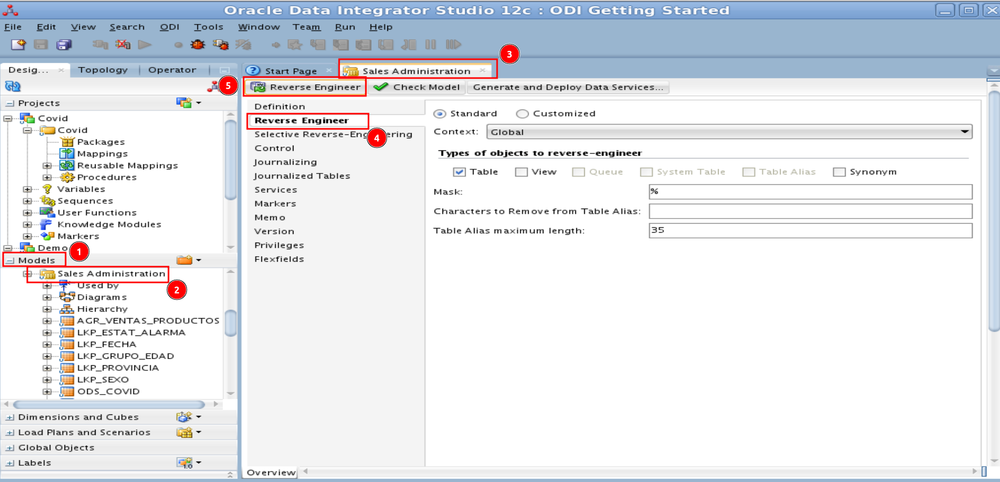

<h1>ODI: Oracle Data Integrator</h1>

<div align="center">
    
</div>

<h3>Tabla de contenidos</h3>

# Introducción a `Oracle Data Integrator`. `ODI`

La base es que todo lo guarda en repositorios.

WebManual de ODI en oracle:  [Integrating Oracle Data Integrator 12c (ODI) and Oracle GoldenGate 12c (OGG) ](https://www.oracle.com/webfolder/technetwork/tutorials/obe/fmw/odi/odi_12c/ogg_odi_12c_int/index.html#overview)


# Demo de uso con `ODI`

Los puntos 2 y 3 hacen una introducción de lo que se va a hacer.

El punto 4 y 5 ya tienen cómo se implementa un ETL en ODI.

## Maquina virtual

Hay un fichero que indica donde esta todo: `Information about this machine`. Aquí tenemos todo lo que esta instalado así como usuarios y contraseñas de cada unos de los elementos que hay en el sistema.

- `ODI 12c Getting Started Guide.pdf`, fichero donde esta la demo que nos explica paso a paso un ejemplo de utilización de ODI.
- `SQL Developer`, el IDE de acceso a la base de datos
  - Se debe probar. Al abrir el IDE, veremos que muestra todas las bases de datos
  - Le damos a crear nuevo conexión, utilizando la plantilla existente y le metemos como nombre y usuario: `ODI_DEMO`, así tenemos una conexión a la base de datos que solo tiene permisos sobre las tablas que a nosotros nos interesan.
  - Ahora tenemos una interfaz sobre la que vamos a trabajar

El propio ODI tiene por ejemplo un registro de errores que se guardar en la propia base de datos, por lo que es interesante poder visualizar y manipular los datos 
- `ODI studio`: Se entra con la password `welcome1`


# ODI Studio

Cuando le damos a entrar, tenemos el listado en el desplegable de las diferentes demos.

Si le damos al lápiz, podemos editar y podemos ver unos cuantos datos como por ejemplo que el usuario de la base de datos es `prod.odi_repo` y otros datos como . El usuario y el password de la conexión también se ve en el primer grupo de datos.

Cuando abrimos ODI, vemos una parte del entorno, en Window podemos ver el resto de ventanas ocultas, como por ejemplo en `security`, podemos también acceder a el `log`

- `Topología`: se divide en tres partes
  - Parte física, donde se definen todas las conexiones, por ejemplo en technologies->files, estan las ficheros de dónde estan las cosas
  - Parte lógica que corresponde con la física
  - Context: es el que relaciona la parte física con la lógica

En la parte superior de la ventana de Topología hay un botón con icono de fábrica donde podemos ver por ejemplo todas las tecnologías (de conexión a diferentes sistemas de datos) 


En la parte de `Projects` tenemos 
- Paquetes
- Mappings: tienen 


# Ejercicio de demo de `ODI 12c Getting Started Guide.pdf`

Aqui tenemos una demo guiada que nos explica cómo hacer un par de mappings y ponerlos en macha, en concreto los puntos a realizar en clase son los siguientes

## Ejercicio 4.1 

En la parte física. del elemento final le pone un `TRUCATE` a `true`, que al parecer lo que hace es que cada vez que vamos a ejecutar elimina todo lo que hay en el destino para rehacerlo de nuevo.
También el `FLOW_CONTROL` a `false`. Esto lo que hace es verificar las claves primarias y si esta a true, fallará.

Tal y como esta hecho en clase, no llegamos a crear el paquete, (LOAD_SALES_ADMINISTRATION), por lo que al ejecutar puede fallar, Así porque antes de ejecutar el TRG_CUSTOMER se tiene que ejecutar los TRG_COUNTRY, REGION y CITY, por eso en clase pasamos directamente al 6.2 para hacer un paquete añadiendo los mapping hasta TRG_CUSTOMER. Bueno en clase hace el CITY, COUNTRY y ya el CUSTOMER.

Una vez hecho esto, seleccionamos el paquete y le damos al *play* para ejecutar.

## Ejercicio 4.2

Aquí se hace el mapping TRG_SALES

## Ejercicio 6.2.2

Aquí se hace el package que ejecuta todo el ETL completo


## Entregable 1 

Es la continuación del supuesto para generar un mapping “AGR_VENTAS_PRODUCTOS” 

Lo único reseñable esta en el punto *2. Importar la nova taula al model de dades de ODI, a la carpeta “Sales Administration”.*

Sobre modelos -> Sales Administration, click con botón derecho y hacemos click en ***Reverse Engineer***. Aparece una nueva pestaña y en la parte superior izquierda le damos el botón de ***Revese-Engeneer*** y busca tablas nuevas en el esquema de oracle y con esto lo tenemos.


<div align="center">
    
</div>

El resto ya es lo mismo de siempre.... 

En el punto 9 tenemos las modificaciones de la parte física del mapping:ç
- IKM : IKM Control Append (POST FLOW = False, TRUNCATE = TRUE). Esto es `FLOW CONTROL` y `TRUNCATE`


# Caso de uso: COVID-19

Se trata de un caso típico que se puede pedir en una empresa.

El diseño este año se da hecho, y el año pasado lo hicierón los alumnos, pero no salió bien así que se explican los pasos o fases del proyecto, pero este año se ha decidido reducirlo a la parte que se hace en ODI

## En la guia: 

Analisis de modelo:

Se hace sobre un fichero de provincias, una sql que se proporciona para obtención de la DATA y el fichero con los datos brutos de incidencia del covíd por día y localidad


ETL 

Crearemos unas base de datos y unas tablas source que empezarán por `SRC_`

Después tenemos lo catálogos: Provinicas, fechas, grupo de edad, fechas.. estas serán tablas lookup LKP

La estrega o hecho serán ....

Al final hacemos un paquete que lo hace todo y que lanzaremos.


## Sobre el enunciado


En el primer párrafo tenemos el acceso a los datos que vamos a utilizar como fuente.

En este enlace vemos 3 pestañas y básicamente estan hechas con PowerBI, es el objetivo de lo que vamos a hacer nosotros.


Requisitos.
Al final esta el PL/SQL para hacer todo los requirimientos de este punto

```
7. Sexe (a partir de les dades rebudes al fitxer font)
8. Grup edat (a partir de les dades rebudes al fitxer font)
9. Província (del fitxer al qual es fa referència dalt)
10. Temporal (Enllaç al SQL)
```

No vamos a hacer ni las Pruebas ni el diseño, nos centramos en el desarrollo de ODI.

Al final de todo hay una ampliación por si alguien llega.

En los anexos están: 
- Diagrama multidimensional de la extración: El año pasad lo hicierón los alumnos, este se facilita.

Están los datos que se extraen del COVID. Se tiene que tener encuenta el documento del primer enlace : `metadata_casos_hosp_uci_def_sexo_edad_provres.pdf`, porque ahí esta la interpretación.

Fechas
Provincias
Estat_Alarma: este fichero viene en l propio pdf de enunciado y se hará a mano.

Cuando acabemos con el diagrama, pasaremos a la estrella multidimensional


# Comenzamos:

- Nos leemos el enunciado,
- Descargamos todos los ficheros y los identificamos
- **SQL Developer** : Nos creamos las tablas según los diagramas. Podemos ir directamente a las tablas de la último diagrama de estrella. e ir creando todas las tablas. Nos guardamos los scripts.


A partir de los ficheros facilitados y los datos que queremos obtener, realizamos un análisis funcional y un diseño de la solución. En este caso, estos dos elementos se dan hecho y se facilitan los `diagramas multidimensionales` de la **extracción** y de la **estrella** para agilizar el proceso, ya que es tedioso.

A partir de aquí, seguimos los pasos indicados en la guía para la generación de las 3 capas del ETL:
1. Generamos los fichero fuente o SOURCE (SRC) que contienen los datos de los ficheros
2. Generamos los catálogos (LKP) (*lookups*) necesarios 
3. Generamos la capa de estrella o de hechos (ODS)

En primer lugar creamos las tablas de cada una de estas capas en Oracle mediante el SQL Developer y después dentro de ODI generamos los paquetes para la carga de todas estas capas.

Así pues en ODI tenemos los siguientes pasos:
1. Generar los paquetes SRC, LKP y ODS
2. Validar que no hay errores
3. Validar los datos de las tablas.

## Resumen Jorge:

1. Hacer *CREATES*
2. Importar tablas ODI
3. Carpeta ODI para ficheros
4. Ejecutar el SQL del dimensión FECHA pero en ODI para eu cada uno 
5. Ficheros de COVID, provincias, tramos fechas se deben importar a ODI
6. 


## Creación de tablas en Oracle

Abrimos el entorno de SQL Developer y creamos todas las tablas que tenemos más abajo

## Creación de paquetes en ODI

Vamos a ODI y en:
`Topology`->`Technologies`->`File`->`FILE_GENERIC` creamos un nuevo "repositorio de ficheros donde vamos a trabajar". Nos cogemos el `Directory Schema` del que ya hay, lo modificamos y copiamos en el nuevo. por ejemplo `/u01/Middleware/ODI12c/demo/covid`.

Después se debe crear una estructura lógica en `Logical Architecture` y también creamos un `FILE_COVID_SRC`


## SQL creación de tablas

Tablas necesarias para almacenar los datos **Source** (SRC), **catálogos** (LKP) y **hechos** (ODS)

```sql
-- SOURCE: COVID  *****************************

DROP TABLE SRC_COVID;

CREATE TABLE SRC_COVID (
  PROVINCIA_ISO VARCHAR2(150),
  FECHA VARCHAR2(150),
  SEXO VARCHAR2(150),
  GRUP_EDAT VARCHAR2(150),
  NUM_CASOS  VARCHAR2(150),
  NUM_HOSP  VARCHAR2(150),
  NUM_UCI VARCHAR2(150),
  NUM_DEF VARCHAR2(150),
  FECHA_ACT TIMESTAMP
);


-- Catálogo - SEXO
DROP TABLE LKP_SEXO;

CREATE TABLE LKP_SEXO (
  C_SEXO VARCHAR2(150),
  SEXO VARCHAR2(150),
  FECHA_ACT TIMESTAMP
);

-- Catálogo - GRUPO EDAD
DROP TABLE LKP_GRUPO_EDAD;

CREATE TABLE LKP_GRUPO_EDAD (
  C_GRUPO_EDAD VARCHAR2(150),
  GRUPO_EDAD VARCHAR2(150),
  FECHA_ACT TIMESTAMP
);


-- SOURCE : PROVINCIAS ********************
DROP TABLE SRC_PROVINCIA;

CREATE TABLE SRC_PROVINCIA (
  CAT_SUB VARCHAR2(150),
  CODIGO VARCHAR2(150),
  NOMBRE_SUBDIVISION VARCHAR2(150),
  VARIANTE_LOCAL VARCHAR2(150),
  COD_IDIOMA  VARCHAR2(150),
  SISTEMA_ROMANIZACION  VARCHAR2(150),
  SUB_SUPERIOR VARCHAR2(150),
  FECHA_ACT TIMESTAMP
);

-- Catálogo: PROVINCIAS
DROP TABLE LKP_PROVINCIA;

CREATE TABLE LKP_PROVINCIA (
  C_PROVINCIA VARCHAR2(150),
  PROVINCIA VARCHAR2(150),
  FECHA_ACT TIMESTAMP
);


-- SOURCE: ESTAT_ALARMA *************************** 
DROP TABLE SRC_ESTAT_ALARMA;

CREATE TABLE SRC_ESTAT_ALARMA (
  CODI_ESTAT_ALARMA VARCHAR2(150),
  ESTAT_ALARMA VARCHAR2(150),
  FECHA_ACT TIMESTAMP
);

-- Catálogo: Estados de alarma
DROP TABLE LKP_ESTAT_ALARMA;

CREATE TABLE LKP_ESTAT_ALARMA (
  C_ESTAT_ALARMA VARCHAR2(150),
  ESTAT_ALARMA VARCHAR2(150),
  FECHA_ACT TIMESTAMP
);


-- *************************************
-- Catálogo :  FECHA
DROP TABLE LKP_FECHA;

CREATE TABLE LKP_FECHA (
  C_DATA VARCHAR2(150),
  D_DATA VARCHAR2(150),
  C_DIA VARCHAR2(150),
  D_CURTA_DIA VARCHAR2(150),
  D_LLARGA_DIA VARCHAR2(150),
  C_DIA_SETMANA VARCHAR2(150),
  C_MES VARCHAR2(150),
  C_ANY_MES VARCHAR2(150),
  D_CURTA_MES VARCHAR2(150),
  D_LLARGA_MES VARCHAR2(150),
  C_SETMANA VARCHAR2(150),
  C_TRIMESTRE VARCHAR2(150),
  C_SEMESTRE VARCHAR2(150),
  C_ANY VARCHAR2(150),
  C_DIA_NATURAL VARCHAR2(150),
  C_DIA_FESTIU VARCHAR2(150),
  C_DIA_FEINA VARCHAR2(150),
  ID_CARREGA  VARCHAR2(150),
  FECHA_ACT TIMESTAMP
);


-- ESTRELLA - Hechos: COVID  *********************
DROP TABLE ODS_COVID;

CREATE TABLE ODS_COVID (
  C_DATA VARCHAR2(150),
  C_PROVINCIA VARCHAR2(150),
  C_SEXO VARCHAR2(150),
  C_GRUP_EDAT VARCHAR2(150),
  C_ESTAT_ALARMA VARCHAR2(150),
  F_NUM_CASOS  VARCHAR2(150),
  F_NUM_HOSP  VARCHAR2(150),
  F_NUM_UCI VARCHAR2(150),
  F_NUM_DEF VARCHAR2(150),
  FECHA_ACT TIMESTAMP
);
```


Pare rellenar la tabla del catálogo de fechas
```sql
SELECT * FROM(
with dimension_fechas as (
  SELECT
    to_date(19000101,'YYYYMMDD') + (LEVEL - 1) AS DT
  FROM DUAL
  CONNECT BY LEVEL <=
  /* End Date in here -> */ to_number(add_months(sysdate,36) - 1 -
  /* Start Date in here -> */ to_date(19000101,'YYYYMMDD')) +1
)
SELECT 
  to_number(to_char(DT,'YYYYMMDD')) as C_DATA,
  DT as D_DATA,
  TO_CHAR(DT,'DD') as C_DIA,
  TO_CHAR(DT,'DY','nls_date_language=CATALAN') as D_CURTA_DIA,
  TO_CHAR(DT,'DAY','nls_date_language=CATALAN') as D_LLARGA_DIA,
  1 + trunc(DT) - trunc (DT,'IW') as C_DIA_SETMANA,
  TO_CHAR(DT,'MM') as C_MES, 
  TO_CHAR(DT,'YYYYMM') as C_ANY_MES, 
  to_char(DT,'MON','nls_date_language=CATALAN') as D_CURTA_MES,
  to_char(DT,'month','nls_date_language=CATALAN') as D_LlARGA_MES,
  to_char(DT,'WW','nls_date_language=CATALAN') as C_SETMANA,
  TO_CHAR(DT,'YYYY') || 'T' ||
  case extract(month from DT)
    when 1 then 1
    when 2 then 1
    when 3 then 1
    when 4 then 2
    when 5 then 2
    when 6 then 2
    when 7 then 3
    when 8 then 3
    when 9 then 3
    else  4
  end  as C_TRIMESTRE,
  TO_CHAR(DT,'YYYY') || 'S' ||
  case 
    when extract(month from DT) < 7 then 1
    else  2
  end  as C_SEMESTRE,
  TO_CHAR(DT,'YYYY') as C_ANY,
  1 as C_DIA_NATURAL,
  DECODE (1 + trunc(DT) - trunc (DT,'IW'), 6, 1, 7, 1, 0) AS C_DIA_FESTIU,
  DECODE (1 + trunc(DT) - trunc (DT,'IW'), 6, 0, 7,0,1) AS C_DIA_FEINA,
  1 ID_CARREGA, 
  sysdate as DATA_ACT
FROM dimension_fechas
ORDER BY 2 DESC)

```