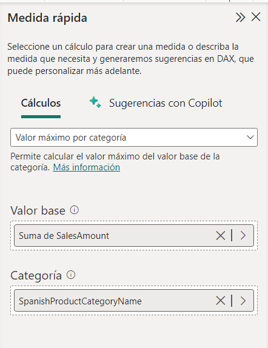
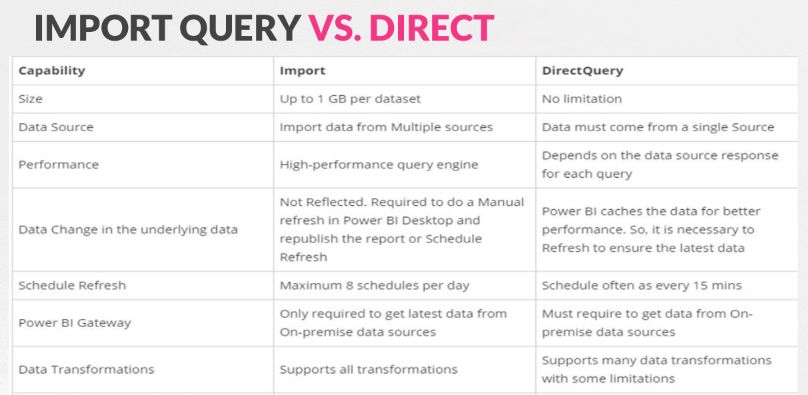
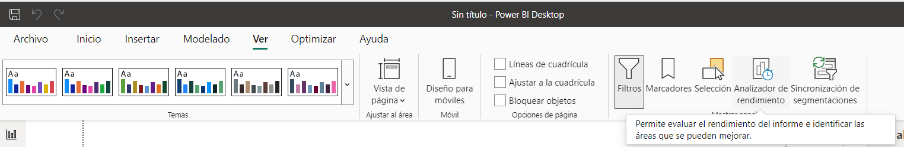

<h1>Bash Script</h1>

<h3>Tabla de contenidos</h3>

# 1. ¿Qué es PowerBI?

# 2. Bases de datos de Ejemplos:

## 2.1. *Contoso Sales Sample for PowerBI*

Esta base de datos la proporciona Microsoft para poder hacer pruebas con PowerBI.

La encontramos en la web de (Microsoft)[https://www.microsoft.com/en-us/download/details.aspx?id=46801]

## 2.2. *AdventureWorks sample databases* para *SQL Server (Express)*

También podemos encontrar esta base de datos en la Web de (Microsoft Learn)[https://learn.microsoft.com/en-us/sql/samples/adventureworks-install-configure?view=sql-server-ver15&tabs=ssms]

# Preparación de datos

## DatasSource de tipo Database: SQL Server

### `Import Query`

Los datos los extrae de SQL y los mete en PowerBI. 
Cualquier cambio se hace solo en PowerBI, no en SQL server.
Se puede actualizar hasta 8 veces al día, no más.
Tiene Limitación de 1GB, no se puede más.

Se hace el ejercicio:ç
1. Meter una tabla con los valors de Ventas de internet y la Categoria de product Category. 
2. A continuación se va a SQL Server y se modifican las cantidades... podemos ver que se han modificado en SQL Server pero no en PowerBI.
3. Ser hace una actualización de los valores de la tabla. Con '`Home->Actualizar`' podemos actualizar todas las tablas. Esto es excesivo, porque sabemos que solo se han modificado una tabla. Hacemos sobre la parte de `Datos` en los tres botones de la tabla y le damos a `actualizar datos` y se actualizan y ahora ya salen los datos nuevos de la tabla
4. Todo esto se puede automatizar, para hacer refresco cada tiempo en el Schedules. Se puede hacer a nivel de tabla o de toda la BBDD.

Recordar que se han actualizado, porque lo hemos hecho manual.

### `Direct Query`

En este caso los datos no estan en la memoria de PowerBI.
Constantemente se están lanzando Querys sobre la BBDD. Cada vez que detecta datos nuevos, los actualiza en los reports que tenemos.

Esta es la opción que debemos elegir si queremos **Reportes en Vivo**

Desventajas:
- No se pueden manipular los datos en PowerBI
Ventajas:
- La actualización es en vivo y no cuando lo ordenemos.

En las opciones Avanzadas, tenemos un `timeout`, tal vez es adecuado si lo conectamos de forma Directa, asignar un *timeout* para que un problema con una tabla no deje todo congelado.

Para hacer una prueba, conectamos de nuevo las mismas tablas que en el caso anterior:
- DimDate
- DimProduct
- DimProductCategory
- DimProductSubCategory
- FactInternetSales

Pero ahora de forma directa y seguimos los siguientes pasos:
1. Creamos una medida rápida. 

    

2. Lo anterior, parece que antes daba problemas y solo se podía hacer por ImporQuery, pero ahora parece que ya va sin problemas
   1. En la parte inferior, en la barra de status, tenemos la opción de cambiar de Direct a Import (no se puede al revés).
   2. Realmente, lo que pasa es que esta haciendo una copia tipo `import` de la tabla para poder hacer esta *medida*. Esto se verá mas tarde, porque si intentamos utilizar este campo, no se actualizarán los datos, y si no lo utilizamos se actualizarán.
3. Hacemos el mismo ejemplo que antes y mostramos las ventas por categoría.
4. Ahora modificamos de nuevo los datos de SQL Server.
5. Como se ha comentado, los datos se actualizan directamente, salvo que se utilicen datos como el de *medida* creado anteriormente.

Veamos las difernecias ente los dos sistemas:

    

### Fichero Excel

Tenemos ejemplos para hacer pruebas que proporciona (Microsoft en GitHub)[https://github.com/microsoft/powerbi-desktop-samples/tree/main/powerbi-service-samples]

### Web

Es reseáble cuando la fuentes es Web, porque coge una página y es capaz de leer las tablas y poder incorporar esas tablas a PowerBI.

Por ejemplo la demo se hace con la web de la Wikipedia [Wikipedia: Anexo: Comunidades y Ciudades autónomas de España](https://es.wikipedia.org/wiki/Anexo:Comunidades_y_ciudades_aut%C3%B3nomas_de_Espa%C3%B1a)

## Optimización de la carga de datos

HAy ciertos aspectos que puede mejorar la fluidez del sistema, por ejemplo:
- Utilizar una query donde obtenemos todos los datos, en lugar de importar un montón de tablas. Ahorramos tiempo y espacio
- Si tenemos columnas o datos de más, eliminarlos.
- Asegurarnos de que los tipos de datos de las columnas son las correctas.
- Evitar tener filtros en los informes, ya que al final ralentiza. Si tenemos muchos filtros, al intentar aplicar uno, PowerBI lo que va a hacer es revisar todos los filtros; perdemos eficiencia.
- Optimizar funcionalidades mediante DAX, donde también hay filtrados y en este caso hay ciertos filtros que permiten optimizar, esto es porque para ejecutar una función, primero coge todos los datos una vez filtrados y a partir de ahí comienza a calcular; si antes filtramos, el cálculo es más rápido.
- Intentar mostrar información con la granularidad necesaria, o sea, no mostrar información de más o tablas con muchos registros

Por último, si todo lo anterior no funciona, PowerBI tiene un analizador de rendimiento, que una vez activada, ejecutamos un informe y analiza los tiempos que precisa cada una de sus partes, así a partir de ahí podemos ver dónde tenemos un uso excesivo de tiempo

    

# `Power Query Editor`

Se abre en varios casos.

Un ejercicio es importar datos y revisar
- Cambio de datos
- Pasar mayúsculas a minúsculas
- Split o dividir celdas
- Añadir una *columna condicional*

El ejercicio que hace lo hace con una base de dato desconocida, pero esta bien hacer el ejercicio con la base de datos de las comunidades autónomas de la opción de Web, hay que reemplazar unos valores (&) y dividir columnas, y cambiar tipos.

Muy interesante la web de [Wikipedia: Anexo:Evolución demográfica de los municipios de España](https://es.wikipedia.org/wiki/Anexo:Evoluci%C3%B3n_demogr%C3%A1fica_de_los_municipios_de_Espa%C3%B1a) para incorporar todas las tablas que tiene y trabajar con ellas

## Power BI Dataflow

Solo esta disponible en la versión Desktop

Utiliza todos los datos y los almacena como si fueran entidades o tabla y son gestionados por el Power BI Service (aunque no se pueden hacer en el).

Toda la parte de ETL se podría sustituir por Power BI Dataflow

## Power BI DataSet

Un PBIX hacían que un DataSet fuera como un DataSource.

Dentro del Power BI Service, se pueden acceder a todos los DataSets que tenemos, y descargarlos como `pbix` o cualquier otro formato