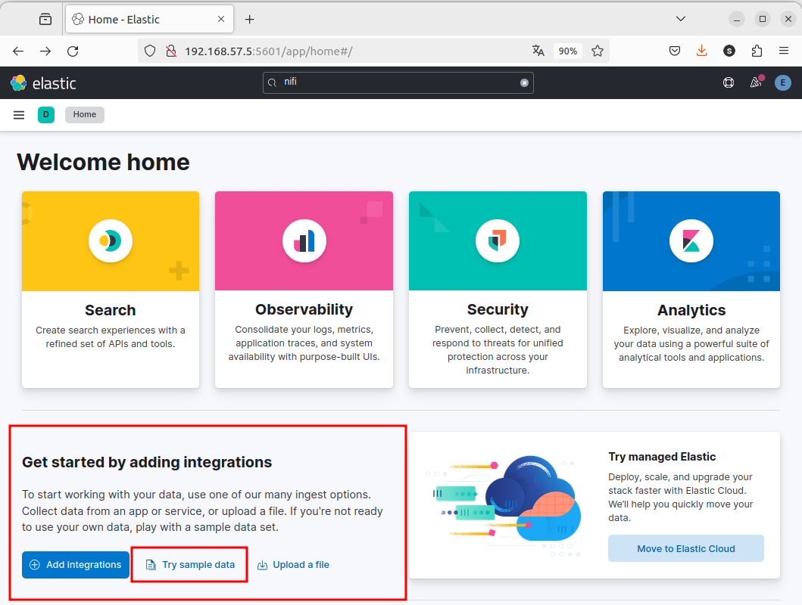

# Interactuando con datos en Elasticsearch

Vamos a ver cómo interacturar con los datos Elasticsearch. para ello, vamos a importar la base de datos de demo que nos proporciona el propio sistemas. 

A partir del interface de Kibana, podemos incorporar los datos de ejemplo:

<div align="center">
    
    
</div>

Añadimos los datos del **Sample flight data**


## Métodos HTTP más importantes en Elasticseach

Los métodos HTTP más importantes de Elasticsearch:

1. **GET**:
   - **Descripción**: Recupera información de Elasticsearch, como documentos, metadatos de índices, estadísticas del clúster, etc.
   - **Ejemplo**: `GET /<índice>/<tipo>/<identificador>`

2. **PUT**:
   - **Descripción**: Agrega o actualiza un documento en un índice de Elasticsearch.
   - **Ejemplo**: `PUT /<índice>/<tipo>/<identificador>`

3. **POST**:
   - **Descripción**: Agrega un nuevo documento a un índice de Elasticsearch o realiza otras operaciones como buscar documentos, crear índices, etc.
   - **Ejemplo**: `POST /<índice>/<tipo>`

4. **DELETE**:
   - **Descripción**: Elimina un documento específico de un índice de Elasticsearch.
   - **Ejemplo**: `DELETE /<índice>/<tipo>/<identificador>`

5. **HEAD**:
   - **Descripción**: Realiza una solicitud similar a GET pero devuelve solo los encabezados de respuesta, sin el cuerpo de la respuesta.
   - **Ejemplo**: `HEAD /<índice>/<tipo>/<identificador>`

6. **OPTIONS**:
   - **Descripción**: Proporciona información sobre las opciones de comunicación disponibles para un recurso o el servidor en general.
   - **Ejemplo**: `OPTIONS /<índice>/<tipo>/<identificador>`

Estos son algunos de los métodos HTTP más importantes utilizados en Elasticsearch para interactuar con los datos y la configuración del motor de búsqueda. Cada uno de estos métodos se utiliza para realizar operaciones específicas, como agregar, actualizar, recuperar o eliminar datos de Elasticsearch, y son fundamentales para interactuar con el sistema de manera efectiva.

Más información detallada : [Query DSL (*Domain Specific Language*)](https://www.elastic.co/guide/en/elasticsearch/reference/current/query-dsl.html)

## `GET` - Consulta de datos

Lo primero que vamos a hacer es consultar los `shards` del nuevo indice siguiendo lo visto anteriormente.

```bash
curl --cacert http_ca.crt -u elastic:$ELASTIC_PASSWORD -XGET 'https://localhost:9200/_cat/shards/kibana_sample_data_flights'
```

Desde este punto en adelante, vamos a utilizar la interfaz ***Management*** -> ***Dev Tools*** que proporciona `Kibana`.

Veamos usos mediante los siguientes ejemplos:

- Listado completo de todos los indices
```yml
GET /_cat/indices
```

- Explorar un índex un índice en concreto
```yml
GET /kibana_sample_data_flights/_mapping
```

- Contar total de registros de un índice: 
```yml
GET /kibana_sample_data_flights/_count
```

- Primera búsqueda en el índice. Acotamos a solo dos registros. Esto nos permite revisar cómo es el índice.
```yaml
GET /kibana_sample_data_flights/_search
{
  "size": 2,
  "query": {
    "match_all": {}
  }
}
```

- Búsqueda de un registro por el valor de un campo determinad

```yml

GET /kibana_sample_data_flights/_search
{
  "query": {
    "query_string": {
      "default_field": "Dest",
      "query": "Sydney"
    }
  }
}
```

- Otra forma diferente
```yaml
GET /kibana_sample_data_flights/_search
{
  "query": {
    "match": {
      "FlightNum": "EXEMPLE"
    }
  }
}
```

- Ídem anterior, pero filtrando los campos de salida:
```yml
GET /kibana_sample_data_flights/_search
{
  "query": {
    "match": {
      "FlightNum": "EXEMPLE"
    }
  },
  "_source": false,
  "fields": [
    "FlightNum", "Dest", "Origin"
  ]
}
```

Simplificando también es posible: 

- Buscando un dato
```yml
GET /kibana_sample_data_flights/_search?q="EXEMPLE"
```

- Recuperar documentos con filtro por campo:

```http
GET /kibana_sample_data_flights/_search?q="FlightNum" "EXEMPLE"
```

- Recuperar documentos con paginación
```yml
GET /kibana_sample_data_flights/_search?size=1&from=3
```

- Recuperar documentos con ordenación:

```http
GET /kibana_sample_data_flights/_search?sort=OriginCountry:ASC
```

### 6. Recuperar solo los campos especificados de los documentos:

```http
GET /kibana_sample_data_flights/_search?_source=<field1>,<field2>,...
```

Estos son solo algunos ejemplos de cómo puedes utilizar el método HTTP GET para interactuar con los datos del índice `kibana_sample_data_flights` en Elasticsearch. Puedes combinar diferentes parámetros de consulta para realizar consultas más avanzadas según tus necesidades específicas de análisis y recuperación de datos.


## `POST` - Agregando registros

Para crear nuevos documentos

```yml
POST /kibana_sample_data_flights/_doc
{
    "FlightNum": "EXEMPLE",
    "DestCountry": "IT",
    "OriginWeather": "Clear",
    "OriginCityName": "Cape Town",
    "AvgTicketPrice": 882.9826615595518,
    "DistanceMiles": 5482.606664853586,
    "FlightDelay": false,
    "DestWeather": "Sunny",
    "Dest": "Venice Marco Polo Airport",
    "FlightDelayType": "No Delay",
    "OriginCountry": "ZA",
    "dayOfWeek": 0,
    "DistanceKilometers": 8823.40014044213,
    "timestamp": "2023-01-30T18:27:00",
    "DestLocation": {
        "lat": "45.505299",
        "lon": "12.3519"
    },
    "DestAirportID": "VE05",
    "Carrier": "Logstash Airways",
    "Cancelled": false,
    "FlightTimeMin": 464.3894810759016,
    "Origin": "Cape Town International Airport",
    "OriginLocation": {
        "lat": "-33.96480179",
        "lon": "18.60169983"
    },
    "DestRegion": "IT-34",
    "OriginAirportID": "CPT",
    "OriginRegion": "SE-BD",
    "DestCityName": "Venice",
    "FlightTimeHour": 7.73982468459836,
    "FlightDelayMin": 0
}
```

- Modificamos el registro anterior
```yml
POST  /kibana_sample_data_flights/_update_by_query
{
  "query": {
    "match": {
      "FlightNum": "EXEMPLE"
    }
  },
  "script": {
    "source": "ctx._source.Dest = params.dest",
    "lang": "painless",
    "params": {"dest": "Foo"}
  }
}
```


https://github.com/InnocenceAllen/AENA_Info_Vuelos_V2


## Consulta relacionales en SQL

También podemos realizar consultas tradiciones de bases de datos relacionales utilizando SQL


- Query Sencillo

```yaml
GET _sql
{
"query": "SELECT * FROM kibana_sample_data_flights LIMIT 10"
}
```

- Query con un filtror

```yaml
GET _sql
{
"query": """
SELECT FlightNum as FlightNumber,
OriginCountry,
Origin,
DestCountry as DestinationCountry,
Dest as Destination
FROM kibana_sample_data_flights
WHERE FlightNum = 'EXEMPLE'
"""
}
```

- Formato de la salida tipo texto

```yaml
GET _sql?format=txt
{
"query": """
SELECT FlightNum as FlightNumber,
    OriginCountry,
    Origin,
    Dest as DestinationAirport
FROM kibana_sample_data_flights
WHERE FlightNum = 'EXEMPLE'
"""
}
```


# Uso de Apache NiFi con docker-compose y ejemplos de uso con MongoDB

https://aitor-medrano.github.io/iabd2223/dataflow/04nifi1.html


 Ejemplo de uso con [Twitter + Nifi](https://github.com/vichargrave/tweet-nifi/blob/master/README.md)

 Visualización de las plantillas introducidas con el script: 

```bash
sudo curl --cacert http_ca.crt -u elastic:$ELASTIC_PASSWORD https://localhost:9200/_index_template/tweets-template?pretty
```

Para darse de alta con Twitter, lo tenemos que hacer en la sección de [developer.twitter.com](https://developer.twitter.com/en/docs/authentication/oauth-1-0a/api-key-and-secret)

Una vez dado de alta, necesito:

Consumer Key (API key):
Consumer Secret (API key secret fields):
Access Token:
Access Token Secret field values. 


API Key
wmivmNCcayIv4leWH0v8KM5J7

API Key Secret
cJ2sfQI6idv8fb3caSSz3P7unPZ5sCOoryoXPFnQfyalsvf7Qc

Bearer Token: 
AAAAAAAAAAAAAAAAAAAAAFoQsQEAAAAAQ9TlGdu0VvmZglffTnSorJTBj50%3DNxRNq7HdGKktOTAwGN4dBQkw0AlcQ9VHFQqNlS5b4tqXHHMPk9

Access Token
1754939681395945472-A0cFmE1ffJNcIb7WeiHA96JO8UBppn

Access Token Secret
ypcHzdXJGTYPCJ9MaNuDwsz3cwJqGBmKIBVMQaOA9kJl6


