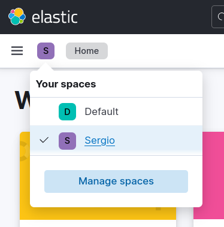

<h1>Kibana</h1>

    

<h3>Tabla de contenidos</h3>

- [1. ¿Qué es `kibana`?](#1-qué-es-kibana)
- [2. Primera visualización de datos en Kibana. `data view` y `discover`](#2-primera-visualización-de-datos-en-kibana-data-view-y-discover)
- [3. Visualizaciones en `kibana`](#3-visualizaciones-en-kibana)
- [4. Dashboards en `kibana`](#4-dashboards-en-kibana)
  - [Creación y gestión de `dashboards`](#creación-y-gestión-de-dashboards)
  - [Espacios de trabajo](#espacios-de-trabajo)

# 1. ¿Qué es `kibana`?

`Kibana` es una herramienta de visualización de datos y análisis para Elasticsearch. Forma parte del Elastic (Elasticsearch, Logstash, Kibana) y se utiliza comúnmente para explorar, visualizar y analizar datos almacenados en Elasticsearch.

Algunas características principales de Kibana son:

- **Exploración de Datos:** Kibana permite a los usuarios explorar grandes volúmenes de datos almacenados en Elasticsearch mediante la realización de consultas y filtros de búsqueda avanzados.

- **Visualizaciones Interactivas:** Proporciona una variedad de opciones de visualización, como gráficos de barras, gráficos circulares, mapas, series de tiempo, etc., que pueden ser personalizados y configurados para mostrar datos de manera clara y comprensible.

- **Dashboards Personalizados:** Permite a los usuarios crear dashboards personalizados que combinan múltiples visualizaciones en una sola página para obtener una visión general completa de los datos.

- **Herramientas de Análisis:** Kibana ofrece herramientas de análisis como agregaciones, métricas y filtros que permiten a los usuarios realizar análisis de datos avanzados para descubrir patrones, tendencias y anomalías en los datos.

- **Gestión de Usuarios y Permisos:** Proporciona capacidades de autenticación y autorización para gestionar el acceso de los usuarios a los datos y las funcionalidades de Kibana.

- **Integración con Elasticsearch:** Está estrechamente integrado con Elasticsearch, lo que facilita la visualización y el análisis de los datos almacenados en los índices de Elasticsearch.

    

Para nosotros en concretos, Kibana representa el framework visual de elasticsearch que nos permitirá: 
- Dar forma a los datos almacenados en Elasticsearch
- Crear objetos visuales a partir de los índices llamados **indexPattern**
- Crear *Visualizaciones*
- Crear **Dashboards** a partir de las *Visualizaciones*

# 2. Primera visualización de datos en Kibana. `data view` y `discover`

Para visualizar datos en Kibana, en primer lugar debemos habilitar un índice de elasticsearch (en nuestro caso el de *restaurantes*) para poder ser tratado desde kibana. Esto se hace creando un **Data View** (anteriormente *index pattern*)

Un **Data View** en Kibana se refiere al proceso de explorar, visualizar y manipular datos almacenados en Elasticsearch utilizando las herramientas y funcionalidades proporcionadas por la plataforma. Esto incluye la configuración de index patterns, la creación de visualizaciones y dashboards, y la realización de análisis de datos para extraer información significativa de los datos.

Para gestionar los **Data Views**, vamos en la interface de Kibana a buscar la entrada de `Stack Management` dentro de la sección `Management` (parte inferior del menú)

    

Desde este punto podemos administrar nuestras instalación de Elastic y Kibana, por ejemplo en la sección de `Data` podemos ver la gestión de todos los índices en `Index Management`

En las sección de `kibana`, tenemos como primera opción `Data Views` donde podemos crear un nuevo *Data View* seleccionando sobre el botón de ***Create Data View*** y aparece una ventana para la creación del *Data View* o ***Index Patern***.

Completamos el nombre del *Data View*, indicamos el índice y si este índice tiene un campo de tipo fecha, lo seleccionamos:

    

Este ***Data View*** o ***Index Partern*** es un mapeo de nuestro índice que lo prepara para poder trabajar con el desde Kibana.

    

Llegados a este punto, ya podemos hacer una primera visualización de los datos de nuestro índice, para ello, volvemos sobre el menú principal y pulsamos sobre el ítem `Discover` de la sección de `Analitics`.

    

En nuestro caso, como solo tenemos este *Index Pattern* directamente ya nos salen datos del índice. En caso de que no saltan, entonces deberemos cambiar el intervalo de fechas (**4**)en los cuales buscar, puesto que por defecto solo muestra los últimos 15 minutos.

Una vez ya visualizamos datos, podemos crear vistas seleccionando los datos o filtros que aparecen a la izquierda, se puede reordenar estas vistas e incluso guardar.

También podemos exportar los datos del reporte seleccionando `share` y `CSV Reports`, entonces nos generará un fichero *csv* al que podemos acceder desde el menú general, `stack management` y `reporting`

# 3. Visualizaciones en `kibana`

Antes de crear un cuadro de mandos o ***dashboard*** necesitamos crear **visualizadores** que son los elementos que después incrustaremos en los cuadros de mando.

Para acceder a los **visualizadores** debemos ir al menú principal, después `Analytics` y seleccionamos `Visualize library`.

A partir de aquí crear visualizadores.

En la documentación de `kibana` tenemos un tutorial: [Create your first dashboard](https://www.elastic.co/guide/en/kibana/current/create-a-dashboard-of-panels-with-web-server-data.html).

Respecto a nuestro ejemplo de *restaurantes* podemos crear varios visualizadores.

Para crearlo, al pulsar el botón de "Create Visualization" nos aparece una pantalla donde podemos elegir el tipo visualización. Tradicionalmente se ha utilizado la opción de `Aggregation Based`, aunque la última versión a añadido la opción de `Lens`

    

Una vez ahí, silenciamos el tipo de visualizador a realizar: 

    

Veamos varios ejemplos.

- **Tipo Métrica**, que nos cuenta la cantidad de reseñas (entre las fechas seleccionadas)

    

- **Tipo Barra**: Creamos un visualizador que muestra la cantidad de reseñas según el rango de precios. Para ello seleccionamos en ***Buckets*** (divisiones) una agrupación por un termino (***terms***) sobre el campo *PRECIO*

    

Cuando guardamos el visualizador, nos pregunta si lo queremos añadir a un *dashboard* existente o lo dejamos en la librería.

    

- Gráfico tipo **area**

Seleccionamos el tipo *data histagram* y a partir de ahi jugamos con los elementos que queramos. Nos mostrará una gráfica de las reviews por fecha

    

- Horizontal bar afectado por un **Filtro**.

Seleccionamos termino, especialidad y después aplicamos un filtro.

    

# 4. Dashboards en `kibana`

Una vez visto cómo crear visualizaciones, el siguiente paso es crear *dashboards* para agruparlas.

## Creación y gestión de `dashboards`

En el menú principal, sección `Analytics` tenemos el acceso a `Dashboards`. Seleccionando la opción nos permite crear un nuevo panel y a su vez crear una visualización o seleccionar una de las creadas anteriormente.

El proceso es muy intuitivo, se trata de añadir los visualizadores o crearlos nuevo. Una vez en el Dashboard se pueden mover, redimensionar, acceder al editor de visualizadores para cambiar lo que creamos necesarios.

    

El Dashboard se puede guardar asignando un nombre y estableciendo o no el intervalo de tiempo por defecto.

Observar que si pulsamos sobre cualquier elementos visualizado podemos crear filtros de la misma forma que podemos ir cambiando los rangos de fechas.

## Espacios de trabajo

Los dashboards se organizan en lo que se llama **Spaces**. Lo habitual es que cada usuario o grupo de usuarios tiene su espacio de trabajo y ahí tiene los *dashboards* con lo que trabaja cada día. Así creamos tantos **spaces** como tipos de usuarios tengamos en nuestro sistema. 

Para acceder a los diferentes **spaces** lo podemos hacer desde el botón verde de la parte superior izquierda: 

    

Inicialmente, nuestro primer espacio es el *default*, podemos cambiar el nombre, y crear nuevos espacios de trabajo.

Cuando creamos un nuevo **space** además de asignar nombre, descripción, etc.. podemos asignar qué elementos son accesibles desde este espacio de trabajo. 

    

Observar que también se puede acceder desde el menú principal, desde `kibana` y después `Spaces`.

Una vez vez creados los espacios, ya podemos acceder a los mismo. Veremos que cada **Space** es como un perfil de `Kibana` totalmente diferente.

    

