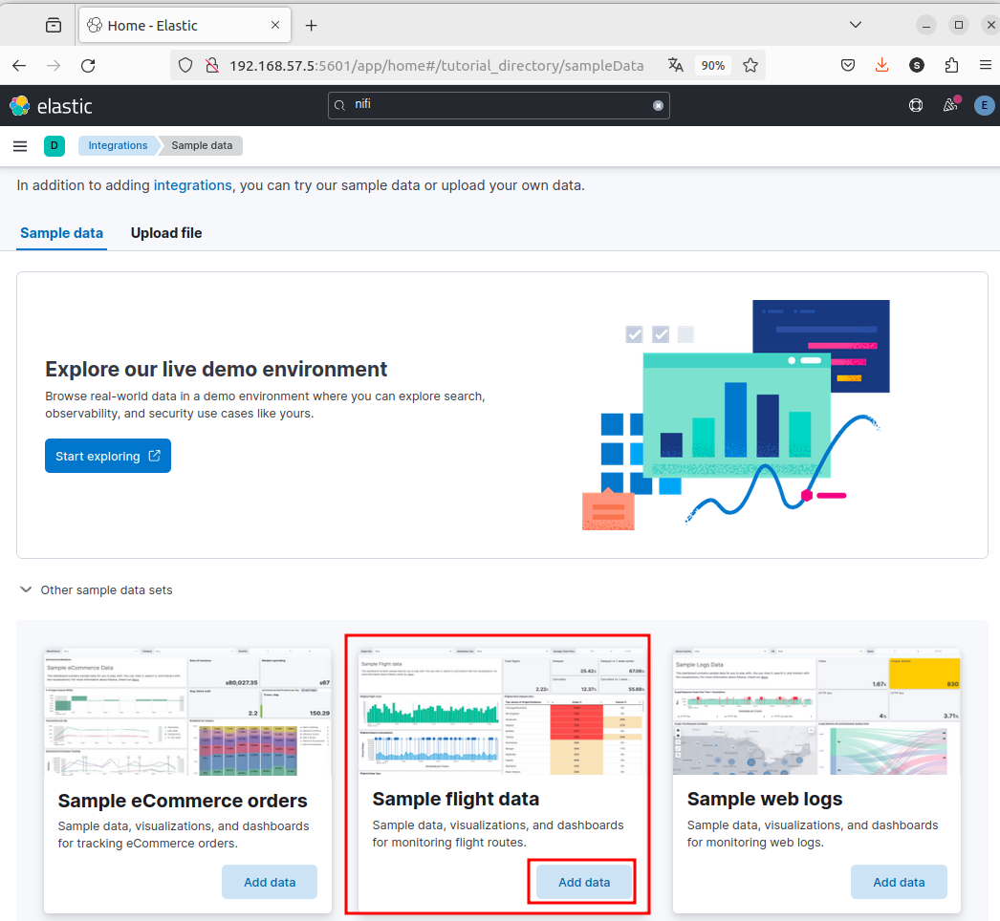
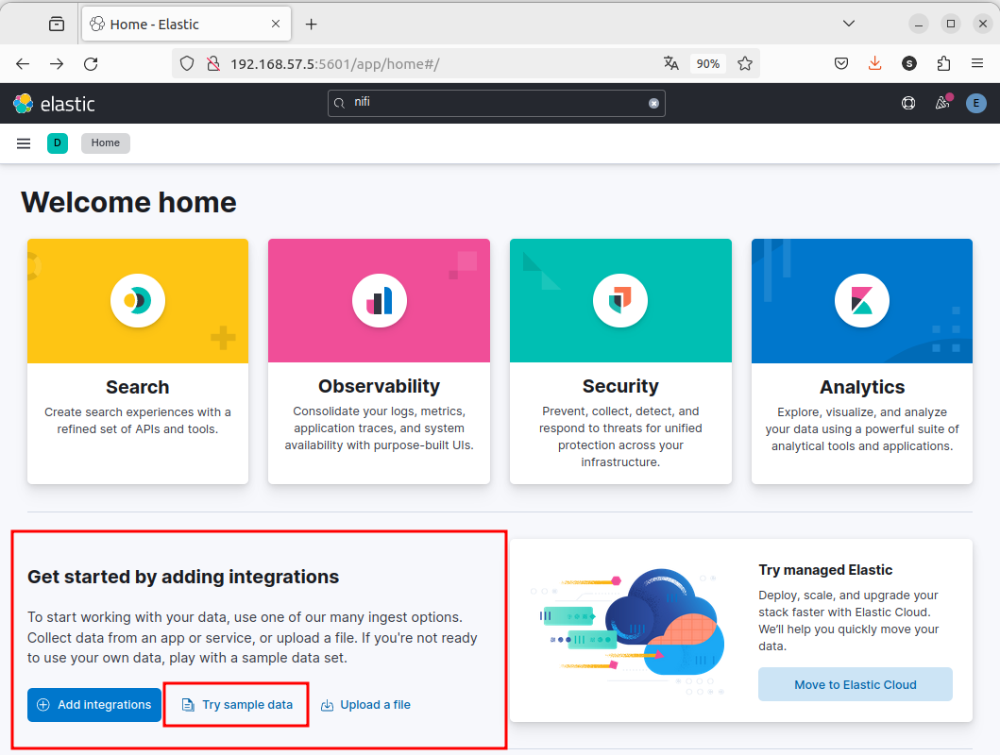

# 5. Enlaces interesantes: 

 - [Cluster ElasticSearch con Docker Paso a Paso](https://www.albertcoronado.com/2020/10/01/cluster-elasticsearch-con-docker-paso-a-paso/)
Blog que monta un cluster con 3 dockers

- [Elasticsearch paso a paso 2023 - youtube](https://www.youtube.com/watch?v=dl8DSgq0y3Y&list=PLlNuLwK_vaGND4FMd7E55kM8JG7JpCgA0&index=3)

- [Ejemplo de terremotos](https://github.com/elastic/examples/tree/master/Exploring%20Public%20Datasets/earthquakes)

- [Instalar Docker compose](https://www.digitalocean.com/community/tutorials/how-to-install-and-use-docker-compose-on-ubuntu-22-04)

- [Youtube: Montar un sistema docker-compose](https://www.youtube.com/watch?v=cC3spQXQKcQ)
- [YouTube: Elasticsearch and Kibana Installation with Docker Compose | How to install Elasticsearch in docker](https://www.youtube.com/watch?v=UiJF5KFXE7U) 

- [Kibana: Get up and running with sample data](https://www.elastic.co/guide/en/kibana/8.12/get-started.html#gs-get-data-into-kibana)

- [Beginner's Crash Course to Elastic Stack Series](https://github.com/LisaHJung/Beginners-Crash-Course-to-Elastic-Stack-Series-Table-of-Contents)

- [Generador de datos aleatorios](https://mockaroo.com/)

# Interactuando con datos en Elasticsearch

Vamos a ver cómo interacturar con los datos Elasticsearch. para ello, vamos a importar la base de datos de demo que nos proporciona el propio sistemas. 

A partir del interface de Kibana, podemos incorporar los datos de ejemplo:

<div align="center">
    
    
</div>

Añadimos los datos del **Sample flight data**


## Métodos HTTP más importantes en Elasticseach

Los métodos HTTP más importantes de Elasticsearch:

1. **GET**:
   - **Descripción**: Recupera información de Elasticsearch, como documentos, metadatos de índices, estadísticas del clúster, etc.
   - **Ejemplo**: `GET /<índice>/<tipo>/<identificador>`

2. **PUT**:
   - **Descripción**: Agrega o actualiza un documento en un índice de Elasticsearch.
   - **Ejemplo**: `PUT /<índice>/<tipo>/<identificador>`

3. **POST**:
   - **Descripción**: Agrega un nuevo documento a un índice de Elasticsearch o realiza otras operaciones como buscar documentos, crear índices, etc.
   - **Ejemplo**: `POST /<índice>/<tipo>`

4. **DELETE**:
   - **Descripción**: Elimina un documento específico de un índice de Elasticsearch.
   - **Ejemplo**: `DELETE /<índice>/<tipo>/<identificador>`

5. **HEAD**:
   - **Descripción**: Realiza una solicitud similar a GET pero devuelve solo los encabezados de respuesta, sin el cuerpo de la respuesta.
   - **Ejemplo**: `HEAD /<índice>/<tipo>/<identificador>`

6. **OPTIONS**:
   - **Descripción**: Proporciona información sobre las opciones de comunicación disponibles para un recurso o el servidor en general.
   - **Ejemplo**: `OPTIONS /<índice>/<tipo>/<identificador>`

Estos son algunos de los métodos HTTP más importantes utilizados en Elasticsearch para interactuar con los datos y la configuración del motor de búsqueda. Cada uno de estos métodos se utiliza para realizar operaciones específicas, como agregar, actualizar, recuperar o eliminar datos de Elasticsearch, y son fundamentales para interactuar con el sistema de manera efectiva.

Más información detallada : [Query DSL (*Domain Specific Language*)](https://www.elastic.co/guide/en/elasticsearch/reference/current/query-dsl.html)

## `GET` - Consulta de datos

Lo primero que vamos a hacer es consultar los `shards` del nuevo indice siguiendo lo visto anteriormente.

```bash
curl --cacert http_ca.crt -u elastic:$ELASTIC_PASSWORD -XGET 'https://localhost:9200/_cat/shards/kibana_sample_data_flights'
```

Desde este punto en adelante, vamos a utilizar la interfaz ***Management*** -> ***Dev Tools*** que proporciona `Kibana`.

Veamos usos mediante los siguientes ejemplos:

- Listado completo de todos los indices
```yml
GET /_cat/indices
```

- Explorar un índex un índice en concreto
```yml
GET /kibana_sample_data_flights/_mapping
```

- Contar total de registros de un índice: 
```yml
GET /kibana_sample_data_flights/_count
```

- Primera búsqueda en el índice. Acotamos a solo dos registros. Esto nos permite revisar cómo es el índice.
```yaml
GET /kibana_sample_data_flights/_search
{
  "size": 2,
  "query": {
    "match_all": {}
  }
}
```

- Búsqueda de un registro por el valor de un campo determinad

```yml

GET /kibana_sample_data_flights/_search
{
  "query": {
    "query_string": {
      "default_field": "Dest",
      "query": "Sydney"
    }
  }
}
```

- Otra forma diferente
```yaml
GET /kibana_sample_data_flights/_search
{
  "query": {
    "match": {
      "FlightNum": "EXEMPLE"
    }
  }
}
```

- Ídem anterior, pero filtrando los campos de salida:
```yml
GET /kibana_sample_data_flights/_search
{
  "query": {
    "match": {
      "FlightNum": "EXEMPLE"
    }
  },
  "_source": false,
  "fields": [
    "FlightNum", "Dest", "Origin"
  ]
}
```

Simplificando también es posible: 

- Buscando un dato
```yml
GET /kibana_sample_data_flights/_search?q="EXEMPLE"
```

- Recuperar documentos con filtro por campo:

```http
GET /kibana_sample_data_flights/_search?q="FlightNum" "EXEMPLE"
```

- Recuperar documentos con paginación
```yml
GET /kibana_sample_data_flights/_search?size=1&from=3
```

- Recuperar documentos con ordenación:

```http
GET /kibana_sample_data_flights/_search?sort=OriginCountry:ASC
```

### 6. Recuperar solo los campos especificados de los documentos:

```http
GET /kibana_sample_data_flights/_search?_source=<field1>,<field2>,...
```

Estos son solo algunos ejemplos de cómo puedes utilizar el método HTTP GET para interactuar con los datos del índice `kibana_sample_data_flights` en Elasticsearch. Puedes combinar diferentes parámetros de consulta para realizar consultas más avanzadas según tus necesidades específicas de análisis y recuperación de datos.


## `POST` - Agregando registros

Para crear nuevos documentos

```yml
POST /kibana_sample_data_flights/_doc
{
    "FlightNum": "EXEMPLE",
    "DestCountry": "IT",
    "OriginWeather": "Clear",
    "OriginCityName": "Cape Town",
    "AvgTicketPrice": 882.9826615595518,
    "DistanceMiles": 5482.606664853586,
    "FlightDelay": false,
    "DestWeather": "Sunny",
    "Dest": "Venice Marco Polo Airport",
    "FlightDelayType": "No Delay",
    "OriginCountry": "ZA",
    "dayOfWeek": 0,
    "DistanceKilometers": 8823.40014044213,
    "timestamp": "2023-01-30T18:27:00",
    "DestLocation": {
        "lat": "45.505299",
        "lon": "12.3519"
    },
    "DestAirportID": "VE05",
    "Carrier": "Logstash Airways",
    "Cancelled": false,
    "FlightTimeMin": 464.3894810759016,
    "Origin": "Cape Town International Airport",
    "OriginLocation": {
        "lat": "-33.96480179",
        "lon": "18.60169983"
    },
    "DestRegion": "IT-34",
    "OriginAirportID": "CPT",
    "OriginRegion": "SE-BD",
    "DestCityName": "Venice",
    "FlightTimeHour": 7.73982468459836,
    "FlightDelayMin": 0
}
```

- Modificamos el registro anterior
```yml
POST  /kibana_sample_data_flights/_update_by_query
{
  "query": {
    "match": {
      "FlightNum": "EXEMPLE"
    }
  },
  "script": {
    "source": "ctx._source.Dest = params.dest",
    "lang": "painless",
    "params": {"dest": "Foo"}
  }
}
```


https://github.com/InnocenceAllen/AENA_Info_Vuelos_V2


## Consulta relacionales en SQL

También podemos realizar consultas tradiciones de bases de datos relacionales utilizando SQL


- Query Sencillo

```yaml
GET _sql
{
"query": "SELECT * FROM kibana_sample_data_flights LIMIT 10"
}
```

- Query con un filtror

```yaml
GET _sql
{
"query": """
SELECT FlightNum as FlightNumber,
OriginCountry,
Origin,
DestCountry as DestinationCountry,
Dest as Destination
FROM kibana_sample_data_flights
WHERE FlightNum = 'EXEMPLE'
"""
}
```

- Formato de la salida tipo texto

```yaml
GET _sql?format=txt
{
"query": """
SELECT FlightNum as FlightNumber,
    OriginCountry,
    Origin,
    Dest as DestinationAirport
FROM kibana_sample_data_flights
WHERE FlightNum = 'EXEMPLE'
"""
}
```


# Uso de Apache NiFi con docker-compose y ejemplos de uso con MongoDB

https://aitor-medrano.github.io/iabd2223/dataflow/04nifi1.html


 Ejemplo de uso con [Twitter + Nifi](https://github.com/vichargrave/tweet-nifi/blob/master/README.md)

 Visualización de las plantillas introducidas con el script: 

```bash
sudo curl --cacert http_ca.crt -u elastic:$ELASTIC_PASSWORD https://localhost:9200/_index_template/tweets-template?pretty
```

Para darse de alta con Twitter, lo tenemos que hacer en la sección de [developer.twitter.com](https://developer.twitter.com/en/docs/authentication/oauth-1-0a/api-key-and-secret)

Una vez dado de alta, necesito:

Consumer Key (API key):
Consumer Secret (API key secret fields):
Access Token:
Access Token Secret field values. 


API Key
wmivmNCcayIv4leWH0v8KM5J7

API Key Secret
cJ2sfQI6idv8fb3caSSz3P7unPZ5sCOoryoXPFnQfyalsvf7Qc

Bearer Token: 
AAAAAAAAAAAAAAAAAAAAAFoQsQEAAAAAQ9TlGdu0VvmZglffTnSorJTBj50%3DNxRNq7HdGKktOTAwGN4dBQkw0AlcQ9VHFQqNlS5b4tqXHHMPk9

Access Token
1754939681395945472-A0cFmE1ffJNcIb7WeiHA96JO8UBppn

Access Token Secret
ypcHzdXJGTYPCJ9MaNuDwsz3cwJqGBmKIBVMQaOA9kJl6


# demo de los terremotos.

Siguiendo lo especificado en Openwebinars: [ELK](https://openwebinars.net/academia/aprende/elasticsearch/2118/#) en la parte de kibana para la inserción de registros de terremotos.

Pasos que sigo.

siguiendo el blog de elastic para instalar todo [elastic stack mediante docker-compose](https://www.elastic.co/es/blog/getting-started-with-the-elastic-stack-and-docker-compose).

Creo la carpeta y el fichero necesario y le damos permisos a cascoporro

```bash
sergio@elastic:~$ mkdir logstash_ingest_data
sergio@elastic:~$ chmod 777 logstash_ingest_data/
sergio@elastic:~$ mkdir templates
sergio@elastic:~$ chmod 777 templates/
sergio@elastic:~$ touch logstash.conf
sergio@elastic:~$ chmod +r+w logstash.conf 
```

para este ejemplo, hacer falta

En ejemplo: /home/openweb/Documents/dataset/all_month.json 
Montado   : /usr/share/logstash/ingest_data/
En real   : ./logstash_ingest_data

Se traduce a: 


En ejemplo: /etc/logstash/templates/earthquake-template.json
Montado   : /usr/share/logstash/templates/
En real   : ./templates
Este no hace falta, se crea el fichero y se sube


Para meter el template, lo hacemos directamente desde Kibana: 

```json
DELETE _index_template/earthquake

PUT _index_template/earthquake
{
  "index_patterns" : "earthquake*",
  "template" : {
    "settings" : {
      "index.refresh_interval" : "20s",
      "index.number_of_shards" : 3,
      "index.number_of_replicas" : 2,
      "index.routing.allocation.total_shards_per_node" : 3,
      "index.auto_expand_replicas": false,
      "index.requests.cache.enable": true
    },
    "mappings" : {
        "dynamic_templates" : [
          {
            "string_fields": {
              "match": "*",
              "match_mapping_type": "string",
              "mapping": {
                "type": "text"
              }
            }
          }
        ],
        "properties" : {
          "@timestamp": { "type": "date" },
          "time": { "type": "date" },
          "@version": { "type": "text", "index": "false" },
          "depth": { "type": "double","doc_values" : true },
          "mag": { "type": "double","doc_values" : true },
          "nst": { "type": "double","doc_values" : true },
          "gap": { "type": "double","doc_values" : true },
          "felt": { "type": "double","doc_values" : true },
          "cdi": { "type": "double","doc_values" : true },
          "horizontalError": { "type": "double","doc_values" : true },
          "magError": { "type": "double","doc_values" : true },
          "magNst": { "type": "double","doc_values" : true },
          "latitude": { "type": "double","doc_values" : true },
          "longitude": { "type": "double","doc_values" : true },
          "location": { "type" : "geo_point" }
        }

    }
  }
}
```


Datos de terremotos: 
- Web : https://earthquake.usgs.gov/earthquakes/feed/v1.0/csv.php
- Acceso directo Todos terremotos último mes: https://earthquake.usgs.gov/earthquakes/feed/v1.0/summary/all_month.csv

Guardamos el CSV y lo convertimos con el siguiente Script: 

Tal y como se puede comprobar, el formato es [.csv](https://earthquake.usgs.gov/earthquakes/feed/v1.0/summary/all_month.csv) el cual se convertirá en JSON para una carga en Elasticsearch más sencilla. Para ello será necesario eliminar la primera línea donde se definen los campos y se podrá hacer uso del script que a continuación se aporta.

```py
#!/usr/bin/env python

import os
import json
import sys
import urllib
import fileinput
import csv
import json

def convert_csv2json():
  csvfile = open('./all_month.csv', 'r')
  jsonfile = open('./all_month.json', 'w')
  fieldnames = ("time","latitude","longitude","depth","mag","magType","nst","gap","dmin","rms","net","id","updated","place","type","horizontalError","depthError","magError","magNst","status","locationSource","magSource")
  reader = csv.DictReader( csvfile, fieldnames)
  for row in reader:
    json.dump(row, jsonfile)
    jsonfile.write('\n')

if __name__ == "__main__":

  convert_csv2json()
```

Guardamos el script en la misma carpeta que el fichero de datos por ejemplo con el nombre `csv2json.py` y lo ejecutamos: 

```bash
python3 csv2json.py
```

y tenemos el JSON preparado para su ingesta.


# Mini Beginner's Crash Course to Elasticsearch & kibana

Blog y videos que esplican como montar un [Beginner's guide to building a full stack app (Node.js & React) with Elasticsearch ](https://dev.to/lisahjung/beginners-guide-to-building-a-full-stack-app-nodejs-react-with-elasticsearch-5347)


# Examen `Curso de Elasticsearch y Kibana para desarrolladores` de openwebinar


1. Tienes una base de datos. ¿Qué componente del Elastic Stack puedes usar para ingestar datos dentro de Elasticsearch?
- Logstash.  `<--`
- Beats.
- Kibana.
- Elasticsearch.


2. Si con los datos anteriores ya ingestados en Elasticsearch. ¿Cómo podriamos visualizarlos?
- Kibana  `<--`
- Beats
- Elasticsearch
- Logstash


3. ¿Sobre qué plataforma se apoya Elasticsearch para indexar y buscar datos?
- Solr.
- No se apoya sobre ninguna plataforma.
- Apache Lucene.   `<--`
- Google.


4. ¿Qué pasa si indexamos un documento en el un índice con un ID repetido?
- Ninguna es correcta.
- Elasticsearch sobrescribe el documento. Lo actualiza.   `<--`
- Duplica el documento porque Elasticsearch no tiene en cuenta ID para indexar.
- Devuelve un error de query porque el documento ya existe.


5. Elasticsearch tiene la posibilidad de desplegarse por medio de docker, kubernetes o Ansible.
- Falso
- Verdadero  `<--`


6. ¿Cómo puede Elasticsearch repartir las peticiones a los nodos del clúster?
- Definiendo roles de datos, master e ingestar a los nodos.    `<--`
- Todo lo anterior es correcto.
- Exponiendo solo el puerto de un nodo.
- Usando un reverse proxy.


7. Si estamos teniendo problemas con el clúster de Elasticsearch, ¿Dónde podemos encontrar el problema o la incidencia que está reportando?
- Directorio de configuración.
- Directorio modules.
- Directorio de logs.   `<--`
- Directorio de datos .


8. ¿Cuáles eran los dos objetivos principales de Elasticsearch?
- Definir procesos y procedimientos.
- Búsquedas rápidas y sencillas
- Mejorar todo.
- Ser un sistema distribuido desde cero y que sea de fácil uso por otros lenguajes de programación como python, php, ruby…  `<--`


9. Si queremos ingestar una cantidad grande de datos ¿Qué servicio vamos a usar de Elasticsearch?
- POST con _update
- Cualquiera de las anteriores sería valida
- POST simple
- POST con _bulk    `<--`


10. Verdadero o falso. Si un índice no existe cuando indexamos un documento. Elasticsearch lo genera automáticamente.
- **Verdadero**
- Falso


11. Elasticsearch solo se usa como buscador de datos para páginas web...
- **Falso**
- Verdadero


12. ¿Cómo se puede comunicar una aplicación con Elasticsearch?
- Comunicación Transport por el puerto 9300
- Todo lo anterior es correcto
- Le envía eventos XML
- **Mediante comunicación HTTP por el puerto 9200**


13. ¿Cuál es el número mínimo de hits que devuelve una query por defecto?
- **10**
- 1000
- 100
- Todos los documentos del índice.


14. Un clúster de Easticsearch es la colección de nodos de Elasticsearch...
- **Verdadero**
- Falso


15. Si queremos monitorizar los datos estadísticos de unos servidores. ¿Cómo podríamos recolectar los datos e ingestarlos en Elasticsearch?
- Logstash
- **Beats y Logstash**
- Logstash y Kibana
- Elasticsearch y Kibana


16. ¿Cómo se comunica un nodo del clúster con otro?
- Le envía eventos XML.
- Mediante comunicación HTTP por el puerto 9200.
- **Comunicación Transport por el puerto 9300.**
- Todo lo anterior es correcto.


17. ¿Dónde puedo configurar la memoria máxima y mínima que va a consumir mi servicio de Elasticsearch?
- Desde elasticsearch.yml
- Dentro de bin/elasticsearch
- Desde Kibana
- **jvm.options**


1.  ¿Cómo distribuye Elasticsearch los documentos?
- Ninguna es correcta.
- Los almacena en ficheros virtuales .db
- Mediante Shards dentro del nodo master.
- **En los nodos mediante Shards, que es la unidad mínima en la que un índice se divide por los nodos del clúster.**


19. Como podemos comprobar la primera vez que el estado del clúster está correctamente levantado y accesible. (Multirrespuesta). 
- Desplegando Kibana y ver si reconoce el servicio de Elasticsearch
- **Mirando el fichero de logs**
- **Lanzando un Curl contra https://localhost:9200**
- Poniendo la dirección http://localhost:9200 en un navegador

20. ¿Dónde puedo configurar el puerto por el que expongo el servicio Rest de Elasticsearch?
- Desde Kibana.
- jvm.options
- Dentro de bin/elasticsearch
- **Desde elasticsearch.yml**


