<h1>Elastic stack. Operaciones</h1>

<div align="center">
    
</div>

<h3>Tabla de contenidos</h3>

- [1. Primeros pasos](#1-primeros-pasos)
  - [1.1. Operaciones básicas](#11-operaciones-básicas)
  - [1.2. El método `_bulk`](#12-el-método-_bulk)
    - [1.2.1. Ingestión de documentos masiva](#121-ingestión-de-documentos-masiva)
    - [1.2.2. y mas cosas: añadir, actualizar y borrar](#122-y-mas-cosas-añadir-actualizar-y-borrar)
    - [1.2.3. Usando `_bulk` para operaciones masiva](#123-usando-_bulk-para-operaciones-masiva)
  - [1.3. El método `GET`](#13-el-método-get)
- [2. Consulta de datos.](#2-consulta-de-datos)
  - [2.1. Un poco de teoría](#21-un-poco-de-teoría)
  - [2.2. Consultas DSL](#22-consultas-dsl)
    - [2.2.1. `match`](#221-match)
    - [2.2.2. `match_phrase`](#222-match_phrase)
    - [2.2.3. `range`](#223-range)
  - [2.3. Búsquedas combinadas y buenas prácticas](#23-búsquedas-combinadas-y-buenas-prácticas)
- [3. Definiendo un índice: Mappings y Analizadores](#3-definiendo-un-índice-mappings-y-analizadores)
  - [3.1. Mappings](#31-mappings)
    - [3.1.1. Dynamic Mapping](#311-dynamic-mapping)
    - [3.1.2. Explicit mapping](#312-explicit-mapping)
  - [3.2. Analizadores de textos](#32-analizadores-de-textos)
    - [3.2.1. Analizadores en Elasticsearch](#321-analizadores-en-elasticsearch)
    - [3.2.2. Analizadores personalizados](#322-analizadores-personalizados)
  - [3.3. Definiendo un índice con mapping y analizador](#33-definiendo-un-índice-con-mapping-y-analizador)


# 1. Primeros pasos

<div align="center">
    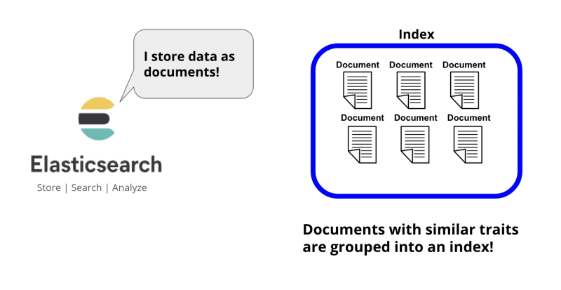
</div>

Como hemos visto anteriormente, un índice esta compuesto por diversos documentos. Cada elemento o registro que se inserta en un índice es considerado un documento, y en ellos se representan los datos almacenados sobre los que más tarde realizaremos operaciones.

Nosotros para comenzar a conocer las operaciones o posibilidades de elasticserach, tendremos en cuenta los siguientes conceptos.:

- Los datos introducidos en un índice tienen el mismo formato que un fichero JSON.
- Este fichero es lo que se llama un **documento**, que se indexa dentro de un índice
- Los **indices** son independiente uno de otros, no se pueden hace ***joins*** entre diferentes índices.
- Para indexar un documento, se hace mediante una API de índice, mediante un `PUT`o un `POST`
- Cuando hacemos la primera ingesta en un indice, elastic define automáticamente si no la hemos definido previamente.


## 1.1. Operaciones básicas

- **Creación de un índice con `PUT`**

```js
PUT mi_indice
```

o especificando *shards* y réplicas
```js
PUT mi_indice 
{ 
  "settings": { 
    "number_of_shards": 2, 
    "number_of_replicas":2 
  }
}
```

- **Eliminar un índice con `DELETE`**

```js
DELETE mi_indice
```

- **Creación de un índice con `POST`**

```js
POST mi_indice/_doc
{
  "Nombre": "Julian",
  "Apellido": "Juli Joli",
  "Edad": 25
}
```
La creación de un indice así como la inserción o actualización de documentos en el mismo se puede realizar mediante `PUT` o mediante `POST`. En los ejemplos anteriores, con `PUT` simplemente se crea un índice y con `POST` se introduce in documento en un índice, y en el caso de que el índice no exista, se crea.

La principal diferencia entre `PUT` y `POST` en Elasticsearch radica en cómo manejan la identificación de documentos y la indexación. `PUT` se utiliza para operaciones de indexación o reindexación específicas con una *ID* explícita, mientras que `POST` se utiliza para operaciones de indexación más flexibles donde Elasticsearch puede generar automáticamente la *ID* del documento si no se especifica. Esto se traduce en que `PUT` es *idempotente*, mientras que `POST` no lo es.

En todo caso, `PUT` se suele utilizar normalmente para la creación de índices y `POST` para la inserción y actualización de documentos.

- **Consulta de los datos de un índice**

```js
GET mi_indice/_search
```
Obtenemos todos los ***hits*** (registros) del índice. Posteriormente profundizaremos sobre esta opción que es la más potente de elastic


- **Introducimos un documento con un índice concreto**

```js
POST mi_indice/_doc/1
{
  "Nombre": "Pedro",
  "Apellido": "Pedrito Pedrete",
  "Edad": 24
}
```
Asignamos un `id` específico a este documento

- **Modificación de un documento por índice**

```js
POST mi_indice/_doc/1
{
  "Nombre": "Juan",
  "Apellido": "Juanito Juante",
  "Edad": 26
}
```
En este caso, machacamos el registro anterior con esta nuevo.

- **Actualización mediante `_update`**

```js
POST mi_indice/_update/1
{
  "doc" : 
  {
    "edad": "62"
  }
}
```
Utilizando `_update` podemos actualizar un campo del documento, en este caso referenciado por un `id`

```js
POST mi_indice/_update/1
{
  "doc" : 
  {
    "Localidad": "Xativa"
  }
}
```
Observar el resultado, añadimos un nuevo campo sobre el documento existente.

- **Eliminar un documento concreto por `id`**
```js
DELETE mi_indice/_doc/1
```
Eliminamos selectivamente el documento. Observar el `_doc`

## 1.2. El método `_bulk`

### 1.2.1. Ingestión de documentos masiva

Este método nos permite ingestar mas de un documento de una única vez

```js
POST mi_indice/_bulk
{"index":{"_id":3}}
{"Nombre":"Evaristo","Apellido":"Evarist Evaristate","Edad":16}
{"index":{"_id":4}}
{"Nombre":"Dorotea","Apellido":"Dori Dorita","Edad":19}
{"index":{"_id":5}}
{"Nombre":"Hortensia","Apellido":"Hori Hortensi","Edad":26}
```
Introduce los tres registros simultáneamente. Observar que se especifica el `id` y que se omite el `_doc`

```js
POST mi_indice/_bulk
{"index":{}}
{"Nombre":"Lola","Apellido":"Lolita Loleira","Edad":20}
{"index":{}}
{"Nombre":"Silvino","Apellido":"Silva Silvando","Edad":21}
{"index":{}}
{"Nombre":"Torcuato","Apellido":"Torcu Torcu","Edad":22}
```
En este caso, se inserta, pero ahora el `id` se genera automáticamente.

y esto que viene a continuación, también funciona:

```js
POST mi_indice/_bulk
{ "index":{"_id":10} }
{ "name":"john doe","age":25 }
{ "index":{"_id":11} }
{ "name":"mary smith","age":32 }
```
Otros campos, y sin problemas

### 1.2.2. y mas cosas: añadir, actualizar y borrar

Veamos el siguiente ejemplo, donde `_bulk` realiza varias operaciones de una única vez:

```js
POST mi_indice/_bulk
{ "index":{"_id":3}}
{ "Apellidos":"Evar Eviris","age":26}
{ "delete":{"_id":4}}
{ "update":{"_id":10}}
{ "doc": {"name":"John Doe","age":26}}
{ "create":{"_id":8}}
{ "Nombre":"Gervasio","Apellidos":"Ger Gervi","age":22}
{ "create":{}}
{ "Nombre":"Tomasa","Apellidos":"Tomi Toma","age":23}
```

Como se puede ver, en una misma ejecución, hemos realizado
- Una actualización del `id` 3 (porque ya existía)
- Un borrado del `id` 4
- Una actualización del `id` 10
- Una inserción del `id` 8
- Una inserción con un `id` automático
Observar que cada uno de estos elementos tiene una respuesta en su ejecución.

### 1.2.3. Usando `_bulk` para operaciones masiva

Podemos tener fichero tipo `json` con un listado de operaciones como las anteriores y lanzarlos directamente sobre elastic, de forma que realizará todas las operaciones simultáneamente:

Dado un fichero llamado [vehiculos_aux.json](../files/vehiculos_aux.json), su ingesta se realizaría desde la línea de comandos, ya que no hay forma de hacerlo desde la interface de `kibana`.

El comando para tal efecto sería: 

```bash
curl --cacert http_ca.crt -u elastic:$ELASTIC_PASSWORD https://localhost:9200/_bulk -H "Content-type: application/json" --data-binary @vehiculos_aux.json 
```
<div align="center">
    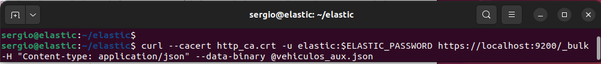
</div>

Volvemos a la interfaz y si tecleamos 

```js
GET vehiculos_test/_search
```
Obtendremos un resultado similar al siguiente, donde podemos ver que se ha creado un índice con más de 10000 registros, llamado *vehiculos_test", tal y como se especificaba en el fichero

<div align="center">
    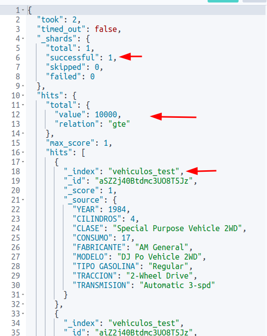
</div>

Para mas información en [documentación oficial de elastic del API de Bulk](https://www.elastic.co/guide/en/elasticsearch/reference/current/docs-bulk.html)

También existen implementaciones en *python*, *perl*, *javascript* y otro lenguajes para pasar un fichero JSON a un fichero preparado para ser tratado con `_bulk`ç

## 1.3. El método `GET`

El método `GET` en Elasticsearch se utiliza principalmente para realizar operaciones de lectura y recuperación de datos. 

En apartados anteriores hemos visto como la API `GET` también se puede utilizar para obtener información sobre el estado del ***cluster***, ahora veremos cómo recuperar documentos individuales, realizar búsquedas, obtener información sobre los mappings de índice y otros fines de lectura.

A continuación, se presentan algunos ejemplos de cómo se puede utilizar el método GET en Elasticsearch:

- **Listado de los índices del cluster**
```js
GET _cat/indices/?v
```

- **Recuperar un documento por su ID:**
```js
GET mi_indice/_doc/1
```
Esta solicitud recupera un *hit* (documento) específico de un índice por su ID.

- **Obtener información sobre un índice:**
```js
GET mi_indice
```
Esta solicitud devuelve información sobre un índice específico, incluidos los mappings, la configuración y la cantidad de documentos.

- **Realizar una búsqueda:**
```js
GET mi_indice/_search
```
Esta solicitud realiza una búsqueda en un índice específico y devuelve los *hits* (documentos) que coinciden con los criterios de búsqueda especificados.

Más información sobre el [API `_search` en la documentación oficial de elastic](https://www.elastic.co/guide/en/elasticsearch/reference/current/search-search.html)

Observar el encabezado donde se muestran por ejemplo la cantidad de registro con `value` y la exactitud de este valor mediante `relation`, así un `eq` indica un valor exactos, `gte` más de las indicadas... 

Así, en el ejemplo del apartado anterior, al ejecutar la consulta del índice importado

```js
GET vehiculos_test/_search
```
el resultado es el siguiente, donde indica que hay más de 10.000 *hits*, y cómo podemos ver en el resultado si lo ejecutamos, sólo nos muestra unos 10 *hits*, o sea, no los muestra todos. Esto se hace por cuestiones de optimización.

<div align="center">
    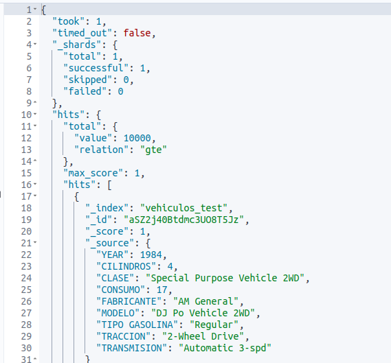
</div>

Si dentro de la búsqueda incluimos el siguiente JSON indicando `track_total_hits`, entonces nos indicará exactamente la cantidad de registros. Ahora Elastic se tomará su tiempo, para calcular la cantidad exacta de *hits*, cosa que antes no ha hecho 

```js
GET vehiculos_test/_search
{
  "track_total_hits": true,
  "size": 5000
}
```

En el caso anterior, hemos añadido que nos muestre 5000 *hits*.

<div align="center">
    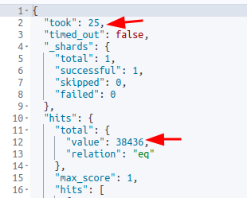
</div>

En este caso, se obtienen 5000 *hits*, pero por contra se han utilizado 25ms para obtener estos datos. Por este motivo, elastic esta preparado para ofrecer como máximo 10.000 documentos. Existe otra [API llamada `scroll`](https://www.elastic.co/guide/en/elasticsearch/reference/current/scroll-api.html) que permite recuperar todos los documentos, pero en bloques limitados, de forma que cada petición nos ofrece una cantidad de todos ellos.


- **Obtener información sobre el cluster:**
```js
GET /_cluster/state
```
Esta solicitud devuelve información sobre el estado actual del cluster, incluidos los nodos, los shards y la configuración.


- **Obtener información sobre nodos individuales:**
```js
GET /_nodes
```
Esta solicitud devuelve información sobre todos los nodos en el cluster, incluyendo estadísticas de uso de recursos y configuración.

- **Obtener información sobre mappings de índice:**
```js
GET mi_indice/_mapping
```
Esta solicitud devuelve el mapping de un índice específico, que describe la estructura de los documentos en el índice.

O sea, vemos los campos y la tipificación de datos establecida.

<div align="center">
    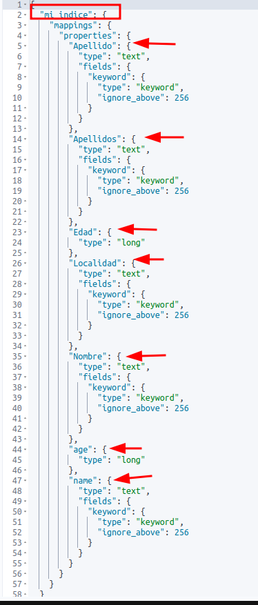
</div>

Como se puede ver en la captura anterior aparecen todos los campos introducidos en los diferentes documentos de introducidos en el índice, y su tipificación básica.

# 2. Consulta de datos. 

## 2.1. Un poco de teoría

Elastic hace una búsqueda indexada de los elementos, por lo que a la hora de responde puede devolver respuesta ordenadas de forma más o menos acertada

<div align="center">
    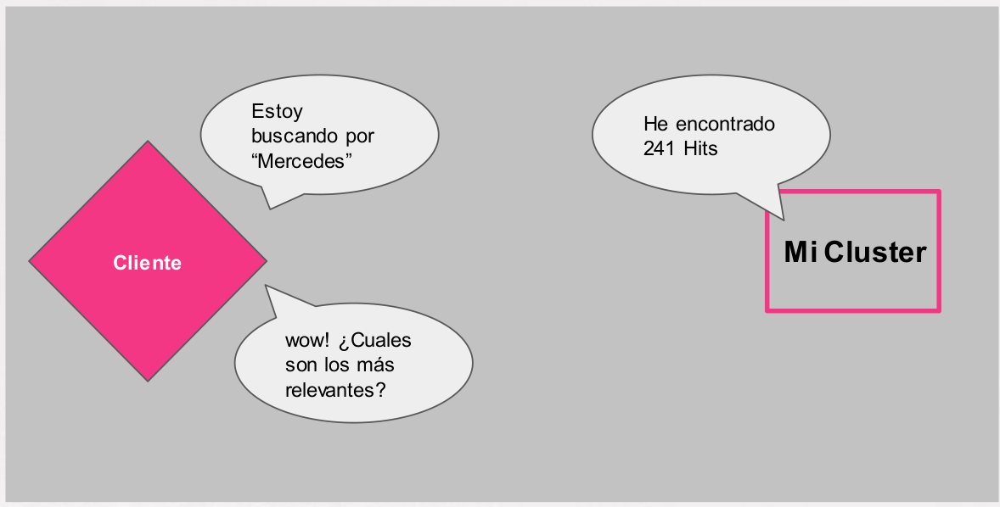
</div>


En Elasticsearch, al igual que en otros motores de búsqueda, se utilizan varios conceptos importantes para evaluar y medir el rendimiento de las consultas. Estos conceptos incluyen la relevancia, la precisión y el recall. Aquí tienes una descripción de cada uno de ellos:

1. **Relevancia:**
   - La relevancia se refiere a la medida en que los resultados devueltos por una consulta son pertinentes o adecuados para la intención del usuario.
   - En el contexto de Elasticsearch, la relevancia se determina mediante un algoritmo de puntuación que asigna una puntuación de relevancia a cada documento en función de su similitud con los términos de búsqueda y otros factores como la frecuencia de los términos, la longitud del documento, etc.
   - Elasticsearch utiliza el modelo de puntuación TF-IDF (Term Frequency-Inverse Document Frequency) como uno de los factores para calcular la relevancia de los documentos.

2. **Precisión:**
   - La precisión se refiere a la proporción de documentos relevantes entre todos los documentos devueltos por una consulta.
   - En otras palabras, la precisión mide qué tan útiles son los resultados devueltos por una consulta en relación con la cantidad total de resultados.
   - Una alta precisión significa que la mayoría de los documentos devueltos son relevantes para la consulta, mientras que una baja precisión indica que muchos de los documentos devueltos son irrelevantes.

3. **Recall:**
   - El recall, también conocido como exhaustividad, se refiere a la proporción de documentos relevantes recuperados por una consulta en relación con todos los documentos relevantes en la colección.
   - En otras palabras, el recall mide qué tan bien una consulta recupera todos los documentos relevantes en el conjunto de datos.
   - Un alto recall significa que la mayoría de los documentos relevantes se recuperan en la consulta, mientras que un bajo recall indica que muchos documentos relevantes se pierden.


<div align="center">
    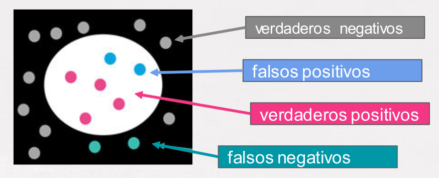
</div>

Elasticsearch utiliza una puntuación (***score***) para determinar la clasificación de documentos coincidentes


## 2.2. Consultas DSL

Elasticsearch posibilita usar JSON para definir consulta DSL (Lenguaje de Dominio Específico).

Vamos a ver cómo podemos lanzar diferentes tipos de Query para obtener los *hits* que mas relevancia tienen para nosotros, para ello vamos a utilizar el índice que obtendremos de la ingesta del fichero [restaurantes_es.json](../files/restaurantes_es.json) 

```bash
curl --cacert http_ca.crt -u elastic:$ELASTIC_PASSWORD https://localhost:9200/_bulk -H "Content-type: application/json" --data-binary @restaurantes_es.json 
```

Una vez introducidos los datos, verificamos y revisamos su estructura:

```js
GET restaurantes/_search
```


### 2.2.1. `match`

El primer tipo de consulta que vamos a utilizar es el `match query`

<div align="center">
    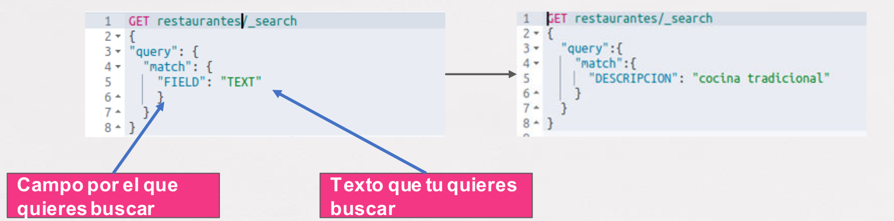
</div>

Así pues, al ejecutar la siguiente consulta para buscar "*Cocina Tradicional*", obtendremos los siguientes registros:

```js
GET restaurantes/_search
{
  "size":50,
  "query":{
    "match": {
      "DESCRIPCION": "cocina tradicional"
    }
  }
}
```
Como se puede observar, la consulta ha tenido éxito, ha obtenido un total de 17 registros y podemos observar en los registros del resultado que contiene en la *descripción* el literal buscado.

> **Nota**: se ha especificado un `"size":50` porque como por defecto solo muestra los 10 primeros documentos, para que los muestre todo, en este caso serán 17

<div align="center">
    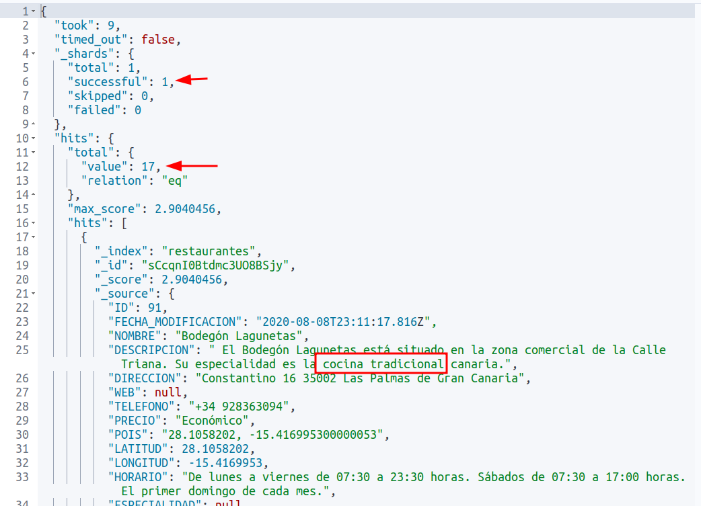
</div>

En los últimos registros podremos ver que exactamente no obtenemos el literal "*Cocina Tradicional*"

Esto es porque realmente ha hecho un ***or lógico*** entre *cocina* y *tradicional*.

Si queremos afinar más la búsqueda y queremos exigir que existan los dos terminos, entonces necesitamos el ***operador lógico and*** de la siguiente manera

```js
GET restaurantes/_search
{
  "size":50,
  "query":{
    "match": {
      "DESCRIPCION": {
        "query": "cocina tradicional",
        "operator": "and"
      }
    }
  }
}
```

Ahora nos responde 8 registros y veremos que en todos exige las dos palabras, aunque puede que no se encuentren de forma consecutiva.

Otra forma de obligar a la consulta a un mínimo de coincidencia es mediante el operador `minimum_should_match` donde es especifica que como mínimo de todas las palabras a buscar, se deben encontrar una cantidad mínima de ellas. 

Veamos el ejemplo buscando "*cocina tradicional canaria*"

```js
GET restaurantes/_search
{
  "query":{
    "match": {
      "DESCRIPCION": {
        "query": "cocina tradicional canaria",
        "minimum_should_match": 2
      }
    }
  }
}
```

En este caso, nos devuelve 8 registros. 

Observar que tenemos una puntuación para cada uno de los documentos obtenidos en la búsqueda identificada por el campo `max_score`

<div align="center">
    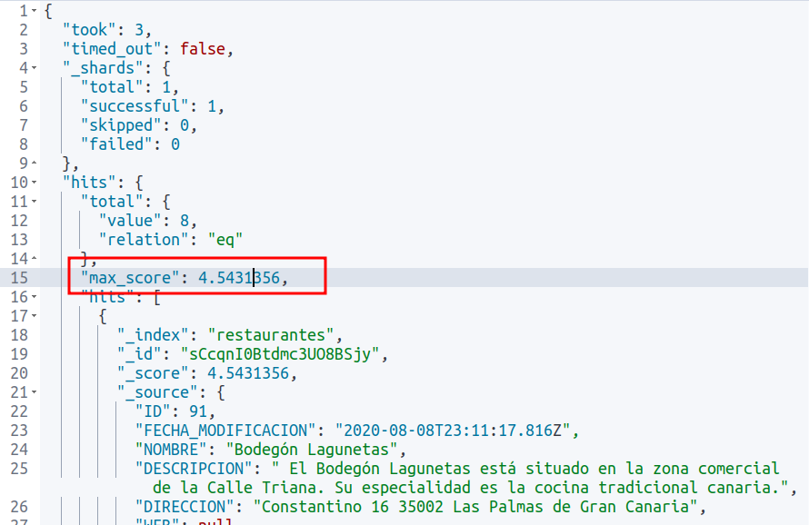
</div>

Así pues, `max_score` es un campo que se devuelve en los resultados de una consulta de búsqueda y que indica la puntuación máxima de relevancia entre todos los documentos recuperados por esa consulta. Este campo se utiliza para proporcionar una medida relativa de la relevancia de los documentos devueltos en comparación con otros documentos en el conjunto de resultados.

El valor de `max_score` es útil para los usuarios y los desarrolladores de aplicaciones para comprender la distribución de relevancia en los resultados de la búsqueda y para determinar la importancia relativa de los documentos devueltos. También puede ser utilizado para normalizar las puntuaciones de relevancia de otros documentos en el conjunto de resultados, si es necesario.

Básicamente depende de 3 factores:

- **Frecuencia del termino**: Cuanto más aparece un termino en un campo, más puntúa.
- **Frecuencia inversa del documento**: Cuanto más documentos contienen el termino, menos importante es.
- **Longitud del campo**: Los campo más cortos son más relevantes que los largos.

### 2.2.2. `match_phrase`

Para **buscar frase** y no términos separados utilizamos el operados `match_phrase`

<div align="center">
    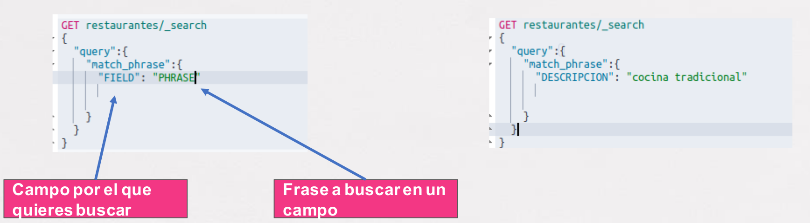
</div>

Entonces, si buscamos el literal exacto

```js
GET restaurantes/_search
{
  "query":{
    "match_phrase": {
      "DESCRIPCION": {
        "query": "cocina tradicional"
      }
    }
  }
}
```

En este caso nos devuelve solo 7 registros. Si buscamos la canaria, nos reduce la cantidad de elementos encontrados.

De las misma forma que el `minimum_should_match` nos introducía una variación sobre una búsqueda normal con `match`, ahora tenemos el parámetro de `slop` que nos indica el número de términos que esperamos encontrar mínimo de entre todos los términos indicados. 

O sea, con la siguiente búsqueda:

```js
GET restaurantes/_search
{
  "query":{
    "match_phrase": {
      "DESCRIPCION": {
        "query": "cocina tradicional",
        "slop": 10
      }
    }
  }
}
```

Permitimos que haya hasta **10 palabras** entre "*cocina*" y "*tradicional*" puesto que el `slot` tiene un valor de 10. Si lo cambiamos a 1 por ejemplo, permitiría encontrar el literal "*cocina canaria tradicional*" pero no el de "*cocina procedente de canarias tradicional*" puesto que tiene más términos entre los dos indicados.

### 2.2.3. `range`

Las **consultas de rangos** son adecuadas para hacer consultas numéricas y especialmente de fechas.

Elastic permit el uso de **Date math** que es un lenguage *user fiendly* que nos permite especificar fechas una forma más lógica y sencilla de entender.

Per ejemplo, la siguiente consulta:

```js

GET restaurantes/_search
{
  "query":{
    "range": {
      "FECHA_MODIFICACION": {
        "gte": "2024-02-11",
        "lte": "2024-08-11"
      }
    }
  }
}
```

es similar a 

```js
GET restaurantes/_search
{
  "query":{
    "range": {
      "FECHA_MODIFICACION": {
        "gte": "now-6M"
      }
    }
  }
}
```

Ejemplo de uso de **Date math** usando la fecha de hoy:

- **Búsqueda de documentos desde la fecha de hoy hasta hace una semana:**

```js
{
  "query": {
    "range": {
      "fecha": {
        "gte": "now-1w/d",
        "lte": "now/d"
      }
    }
  }
}
```

Esto buscará documentos con un campo "fecha" dentro del rango de hace una semana hasta la fecha actual.

- **Búsqueda de documentos desde el comienzo del mes actual hasta la fecha de hoy:**

```js
{
  "query": {
    "range": {
      "fecha": {
        "gte": "now/M",
        "lte": "now/d"
      }
    }
  }
}
```

Esto buscará documentos con un campo "fecha" dentro del rango desde el primer día del mes actual hasta la fecha actual.

- **Búsqueda de documentos desde la fecha de hoy hasta hace tres meses:**

```js
{
  "query": {
    "range": {
      "fecha": {
        "gte": "now-3M/d",
        "lte": "now/d"
      }
    }
  }
}
```

Esto buscará documentos con un campo "fecha" dentro del rango de hace tres meses hasta la fecha actual.

Si buscamos estrictamente el formato de las fechas en elastic, podemos simplificar en la siguiente imagen:

<div align="center">
    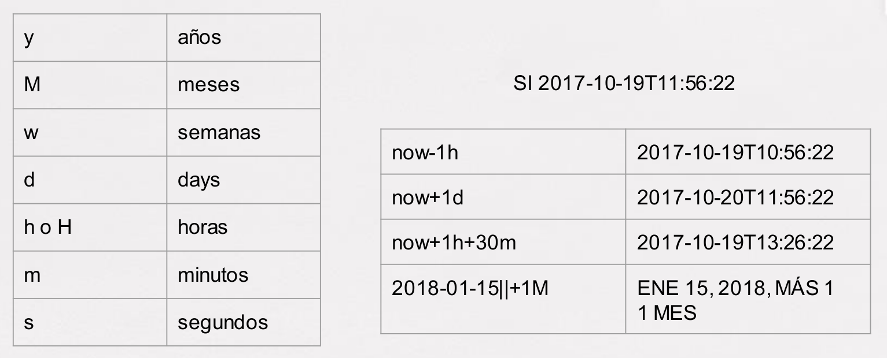
</div>

Más información sobre **Date Math** en la documentación de elastic: [Date math expressions](https://www.elastic.co/guide/en/elasticsearch/client/net-api/7.17/date-math-expressions.html)


## 2.3. Búsquedas combinadas y buenas prácticas

Veamos como podemos operar con todo lo visto anteriormente media su combinación. 

Para ello utilizaremos las **bool query** que están compuestas de varias clausulas como son: 
- **must**, que establece condiciones que son de obligado cumplimiento
- **must_not**, que es lo contrario del anterior. Elementos que no queremos encontrarnos.
- **should**, clausula permisiva que abre la consulta a textos o números que pueden estar o no, o incluso que se asemejen a una condición ***or***. En este caso no se excluyen documentos y se pueden aplicar todas las clausulas vistas anteriormente.
- **filter**, donde filtramos y ordenamos los documentos obtenidos. Esta clausula no afecta al `score` y se aplica una vez obtenidos los resultados. Es suele filtrar por fecha, números... 

<div align="center">
    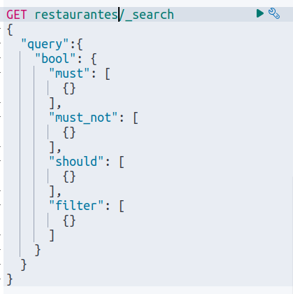
</div>

Por ejemplo:

Hacemos una búsqueda donde se encuentre el literal "*cocina*" o "*tradicional*" y además queremos aplicar un filtro para que nos muestre solo los resultados entre unas fechas dadas.

```js
GET restaurantes/_search
{
  "query":{
    "bool": {
      "must": [
        {
          "match": {
            "DESCRIPCION": "cocina tradicional."
          }
        }
      ],
      "filter": [
        {
          "range": {
            "FECHA_MODIFICACION": {
              "gte": "2024-02-01",
              "lte": "now"
            }
          }
        }
      ]
    }
  }
}
```

Recordad que si cambiamos `match` por `match_phrase`, entonces exigiremos el literal.

En el siguiente ejemplo, buscamos un restaurante de precio *gourmet* donde puede ser que sirvan o **carne** o **pescado** o ninguna de las dos cosas;

```js
GET restaurantes/_search
{
  "query":{
    "bool": {
      "must": [
        {
          "match": {
            "PRECIO": "gourmet"
          }
        }
      ],
      "should": [
        {
          "match": {
            "DESCRIPCION": "carne"
          }
        },
        {
          "match": {
            "DESCRIPCION": "pescado"
          }
        }
      ]
    }
  }
}
```

Si queremos que se cumpla alguna de las condiciones del parámetro `should`, debemos introducir el `minimun_should_match`, y ahora deberá cumplirse obligatoriamente la cantidad que se especifique.

```js
GET restaurantes/_search
{
  "query":{
    "bool": {
      "must": [
        {
          "match": {
            "PRECIO": "gourmet"
          }
        }
      ],
      "should": [
        {
          "match": {
            "DESCRIPCION": "carne"
          }
        },
        {
          "match": {
            "DESCRIPCION": "pescado"
          }
        }
      ],
      "minimum_should_match": 1
    }
  }
}
```

En este caso solo se obtiene un resultado, mientras que en el primero obtenemos 7.

Realicemos una nueva búsqueda de un restaurante que abra los lunes, que sea cocina canaria o portuguesa

```js
GET restaurantes/_search
{
  "query":{
    "bool": {
      "must": [
        {
          "match": {
            "HORARIO": "lunes"
          }
        }
      ],
      "should": [
        {
          "match": {
            "DESCRIPCION": "canaria"
          }
        },
        {
          "match": {
            "DESCRIPCION": "portuguesa"
          }
        }
      ],
      "minimum_should_match": 1
    }
  }
}
```

Al final se trata de ir buscando y revisando los resultado obtenidos, por ejemplo los últimos registros, para en caso de no ser deseados añadir restricciones para que no aparezcan estos documentos.

En general, estas son las búsquedas que podemos realizar. Se podrían optimizar pero esto ya es cuestión de analizar y afinar tal y como hemos comentado.


# 3. Definiendo un índice: Mappings y Analizadores

## 3.1. Mappings

El **mapping** es la definición de cómo se estructuran los datos dentro de un índice. Especifica qué campos existen en los documentos, el tipo de datos de cada campo y cómo se indexan y almacenan los datos. 

Cuando creamos un índice sin especificar nada, elastic crea automáticamente el **mapping** en función de los datos introducidos en los documentos, pero si queremos optimizar, entonces podría ser adecuado definir nosotros los **mappings** para después obtener mejor resultado de nuestras consultas.

Así pues, en el mapping definimos 
- Nombre de los campos
- Tipos de datos de los campos
- Como los campos tienen que guardar los datos.


Aquí tienes una descripción general de los conceptos relacionados con el mapping en Elasticsearch:

**Campos:**
Los campos son los componentes individuales de un documento en Elasticsearch. Cada documento está compuesto por múltiples campos que representan diferentes atributos o propiedades de los datos.

Por ejemplo, en un índice de documentos de productos, los campos pueden incluir "nombre", "precio", "descripción", etc.

**Tipos de datos:**
Elasticsearch admite una variedad de tipos de datos, incluyendo texto, numérico, fecha, booleano, geo, y más.
Por ejemplo, el tipo de datos "texto" se utiliza para campos que contienen texto libre, mientras que el tipo de datos "numérico" se utiliza para campos que contienen valores numéricos.

Tipos de datos más comunes

| Tipo de Datos | Tipo en Mapping | Descripción                                     | Ejemplo                                     |
|---------------|-----------------|-------------------------------------------------|---------------------------------------------|
| Texto         | "text"          | Cadena de texto analizada token a token         | "description": "Lorem ipsum dolor sit amet" |
| Keyword       | "keyword"       | Cadena de texto no analizada a base de tokens separados | "category": "electronics"                   |
| Numérico      | "integer", "float", "double", "long", etc. | Datos numéricos                   | "age": 30                                   |
| Fecha         | "date"          | Fecha y/u hora                                 | "timestamp": "2023-11-16T12:00:00"         |
| Booleano      | "boolean"       | Valor booleano                                 | "is_active": true                           |
| Binario       | "binary"        | Datos binarios, como imágenes o archivos       | "avatar": <Base64 encoded data>             |
| Geo Point     | "geo_point"     | Punto geográfico                               | "location": {"lat": 40.7128, "lon": -74.0060} |
| Geo Shape     | "geo_shape"     | Forma geoespacial compleja                     | "area": { "type": "Polygon", "coordinates": [ [ [100.0, 0.0], [101.0, 0.0], [101.0, 1.0], [100.0, 1.0], [100.0, 0.0] ] ] } |
| Nested        | "nested"        | Objeto anidado                                 | "comments": [ {"user": "John", "comment": "Great post!"}, {"user": "Alice", "comment": "Nice article!"} ] |
| Object        | "object"        | Objeto JSON                                    | "address": { "street": "123 Main St", "city": "New York", "zip": "10001" } |
| IP            | "ip"            | Dirección IP IPv4 o IPv6                       | "client_ip": "192.168.0.1"                  |


También podemos a encontrarnos con campos que puedan tener multi-tipado, se llaman **multi-fields**.

Com puedes ver, se pueden definir tipos de datos especiales como, coordenadas, figuras, iso países...

### 3.1.1. Dynamic Mapping 

Elasticsearch genera automáticamente el mapping de campos cuando se indexa un documento por primera vez si se habilita el mapeo dinámico.

Para ver el mapping generado por nuestro ejemplo de restaurantes:

```js
GET restaurantes/_mapping
```

Como se puede ver, el mapeo se ha creado automáticamente aunque puede no ser muy eficiente y en ocasiones nos suele interesar especificar donde van textos (`text`) con descripciones largas o campos con claves (`keyword`) donde posteriormente habrá búsquedas.  

> Los campos de tipo `text` **se analizan durante el proceso de indexación**. Esto significa que se descomponen en términos individuales (tokens) para permitir búsquedas parciales y coincidencias.

> Los campos de tipo `keyword` **no** se analizan durante la indexación. Se almacenan tal como están.Son ideales para búsquedas exactas. Puedes buscar valores exactos sin descomponerlos en tokens.

El mapeo dinámico permite que Elasticsearch detecte automáticamente la estructura de los datos cuando se indexa un documento por primera vez y genere el mapping en función de los campos encontrados en el documento. Esto puede ser conveniente, pero puede llevar a mapping no deseado o inconsistente si los documentos tienen diferentes estructuras.

###  3.1.2. Explicit mapping

El **mapeo explícito** implica definir manualmente el mapping de un índice antes de indexar cualquier documento. Esto proporciona un control preciso sobre la estructura de los datos.
 
Por ejemplo, para crear el mapping de nuestro índice de restaurantes, primero borramos el índice y después lo volvemos a crear. Comúnmente lo que se hace es que se importa un conjuntos de datos, se obtienen el **mapeo dinámico** y a partir de este, se analiza y optimiza generando un **mapeo explicito**


```js
DELETE restaurantes                 // primer borramos el índice existente

PUT restaurantes
{
  "mappings": { 
    "properties": {
      "DESCRIPCION":{
        "type": "text"              // Se ha dejado solo texto 
      },
      "DIRECCION":{
        "type": "keyword"           // Lo dejamos como palabras clave
      },
      "ESPECIALIDAD": {
        "type": "keyword"           // Lo dejamos como palabras clave
      },
      "FECHA_MODIFICACION": {
        "type": "date"
      },
      "HORARIO": {
        "type": "text",
        "fields": {
          "keyword": {
            "type": "keyword",
            "ignore_above": 256
          }
        }
      },
      "ID": {
        "type": "long"
      },
      "LATITUD": {
        "type": "float"
      },
      "LONGITUD": {
        "type": "float"
      },
      "NOMBRE": {
        "type": "text",
        "fields": {
          "keyword": {
            "type": "keyword",
            "ignore_above": 256
          }
        }
      },
      "POIS": {
        "type": "geo_point"         // punto geodesico
      },
      "PRECIO": {
        "type": "text",
        "fields": {
          "keyword": {
            "type": "keyword",
            "ignore_above": 256
          }
        }
      },
      "TELEFONO": {
        "type": "text",
        "fields": {
          "keyword": {
            "type": "keyword",
            "ignore_above": 256
          }
        }
      },
      "WEB": {
        "type": "text",
        "fields": {
          "keyword": {
            "type": "keyword",
            "ignore_above": 256
          }
        }
      },
      "uri": {
        "type": "text",
        "fields": {
          "keyword": {
            "type": "keyword",
            "ignore_above": 256
          }
        }
      }  
    }
  }
}
```


También podemos crear el índice y después añadir al mapping, la sintaxis cambia un poco

```js
DELETE restaurantes               // primer borramos el índice existente

PUT restaurantes                  // creamos el índice

PUT restaurantes/_mapping         // añadimos el mapping
{
  //  "mappings": {                 // esto ahora se quita   
  "properties": {
    "DESCRIPCION":{
      "type": "text"              
    },
  ...                             // resto del mapping
  }
}
```


Puede haber problemas con los datos de fechas y similares. En caso de problema, el documento no se insertará por lo tanto revisamos si hay algún problema tras la ingesta para verificar que todo es correcto.

**No se puede modificar un mapping una vez creado**, como mucho podemos modificar el mapping creando campos nuevos y pasando los datos de los viejos a los nuevos e ir eliminando campos viejos, pero esto no suele ser viable. Algunos cambios, como cambiar el tipo de un campo existente, pueden ser restrictivos y requerir reindexación de los datos existentes, o sea, que para cambiar un tipo de un campo, debemos reintroducir todos los datos del índice.

Lo adecuado es analizar los datos y crear el mapping antes de su ingesta. Podemos ir cambiado campo a campo y realizar la ingesta de una parte pequeña de los campos tras cada modificación para verificar que todo funciona correctamente. 

Por otra parte, es posible actualizar el mapping de un índice existente para agregar nuevos campos, cambiar tipos de datos, ajustar propiedades de campo, etc.


## 3.2. Analizadores de textos

Cuando realizamos una búsqueda, podemos ver que en ocasiones dos consultas muy parecidas tiene un `score`idéntico: 

<div align="center">
    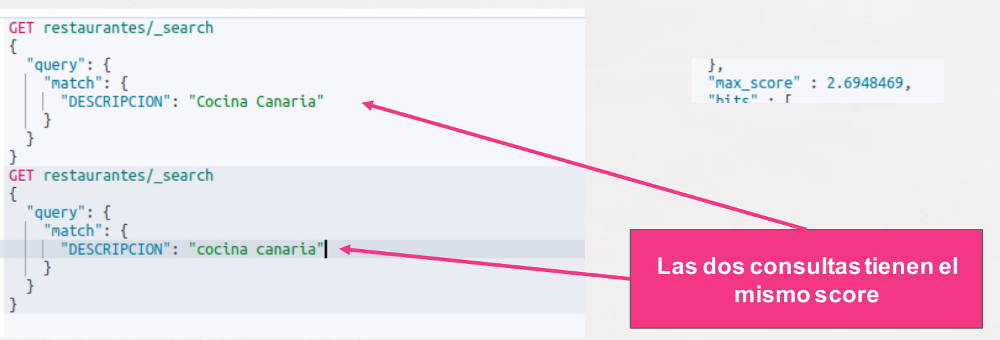
</div>

Esto ocurre porque hay un proceso de análisis que ocurre cuando se ingestan los datos. En este proceso, por ejemplo, se pasa todo a *minúsculas*, por lo que realmente no importa si las consulta se realizan con mayúsculas o minúsculas. 

Este análisis de datos proporciona la generación de unos **tokens** que son las *palabras principales* que podemos extraer de cualquier texto:

<div align="center">
    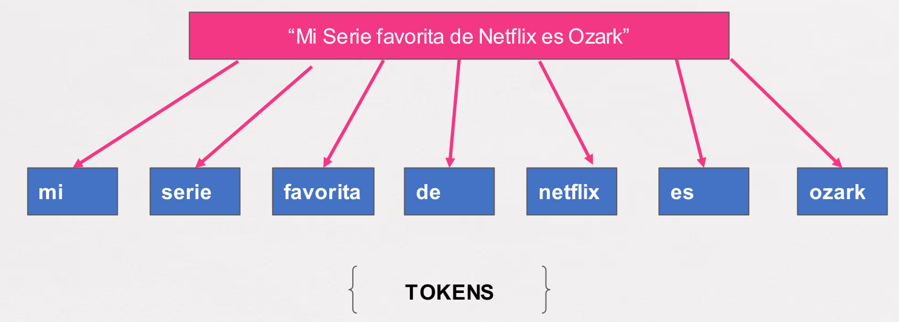
</div>

De esta manera, para que el análisis se se hace hace de los textos grandes sean mejor “searchables” se parte el texto en TOKENS, los cuales se indexan como un único documento asociados al ID.

### 3.2.1. Analizadores en Elasticsearch

Los analizadores en Elasticsearch se componen de varios componentes que trabajan juntos para procesar y normalizar el texto durante la indexación y la búsqueda. Los componentes principales de un analizador en Elasticsearch:

- **Tokenizer (Tokenizador):** Divide el texto en unidades más pequeñas llamadas "tokens" o "tokens". Estos tokens son las unidades básicas de procesamiento en Elasticsearch.Elasticsearch proporciona varios tokenizadores predefinidos, como `standard`, `whitespace`, `keyword`, `letter`, etc., cada uno de los cuales divide el texto de diferentes maneras.
- **Token Filters (Filtros de Tokens):** Procesan los tokens generados por el tokenizador para realizar transformaciones adicionales, como eliminar caracteres especiales, convertir letras a minúsculas, eliminar palabras vacías (stop words), realizar stemming (reducción de palabras a su forma base), etc. Existe una varios filtros de tokens predefinidos y además se pueden crear filtros personalizados según sea necesario.
- **Character Filters (Filtros de Caracteres):** Se aplican antes del tokenizador y permiten realizar transformaciones en el texto en bruto antes de que se divida en tokens. Permiten realizar operaciones como eliminar caracteres especiales, convertir caracteres a minúsculas o mayúsculas, reemplazar caracteres por otros, etc.
- **Analyzer (Analizador):** Que encapsula el tokenizador, los filtros de tokens y los filtros de caracteres en una configuración coherente que se puede aplicar a un campo durante la indexación y la búsqueda. Los analizadores son la unidad central de procesamiento de texto en Elasticsearch y se pueden configurar y personalizar para satisfacer las necesidades específicas de indexación y búsqueda de una aplicación.
- **Analyzer Chains (Cadenas de Analizadores):** Secuencias de analizadores, tokenizadores y filtros que se aplican en orden al texto durante la indexación y la búsqueda. Es común configurar cadenas de analizadores personalizadas que incluyan una combinación específica de tokenizadores y filtros para adaptarse a los requisitos de análisis de texto de una aplicación.

<div align="center">
    
</div>


### 3.2.2. Analizadores personalizados

Podemos crear un analizador personalizado a partir de una analizador estándar para optimizar las búsquedas en nuestro índice.

Por ejemplo, los analizadores estándar tipo `stop` (que eliminan ciertos términos), están muy desarrollados para el idioma inglés en elasticsearch, pero no tanto para nuestro idioma., por lo que podemos definir un analizador personalizado para nuestro índice.

Para crear un analizador personalizado, se realizará dentro de la sección `settings` en la definición del índice.

No vamos a profundizar mucho en el tema, pero un ejemplo sería el siguiente:

```js
PUT restaurantes
{
  "settings": {
    "analysis": {
      "filter": {             // definición de filtro
        "spanish_stop": {
          "type": "stop",
          "stopwords": [ "en", "mi", "a", "y", "de", "contra", "para"]
        }
      },    
      "analyzer": {           // definición de analizador
        "mi_analizador": {
          "type": "custom",
          "char_filter": [],
          "tokenizer": "standard",
          "filter": [ "lowercase", "spanish_stop"]
        }
      }
    }
  }
}
```

## 3.3. Definiendo un índice con mapping y analizador

Visto que podemos definir un mapping especificando los datos de los campos que nos interesen y posteriormente podemos indicar el ***tokenizador***, todo esto, nos permite crear índices optimizados para las búsquedas que vamos a diseñar sobre el índice en cuestión.

Así pues, para la creación de un índice, podemos especificar las dos partes:

```js
PUT restaurantes
{
  "settings": {
                    // aqui definimos el tokenizador
  },
  "mappings": {
                    // aquí cremos el mapeo del índice
  }
}
```

> Nota: Recordad que **NO SE PUEDE CAMBIAR UN MAPPING** y que por ellos se debe probar las veces necesaria hasta alinear la definición con nuestra necesidades y poner un índice en producción.