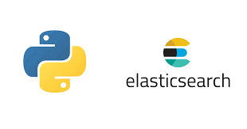
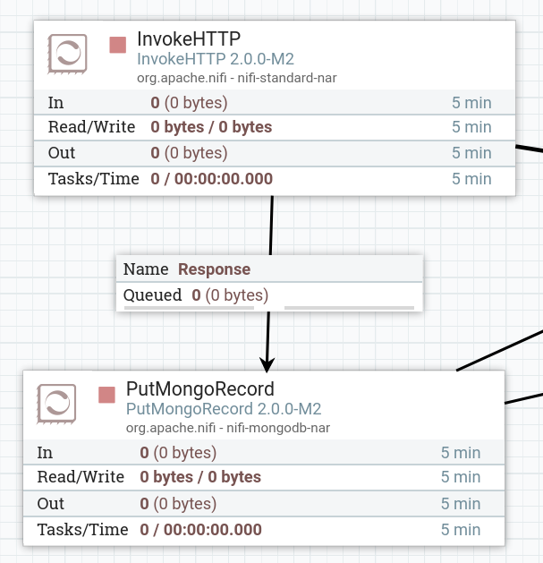
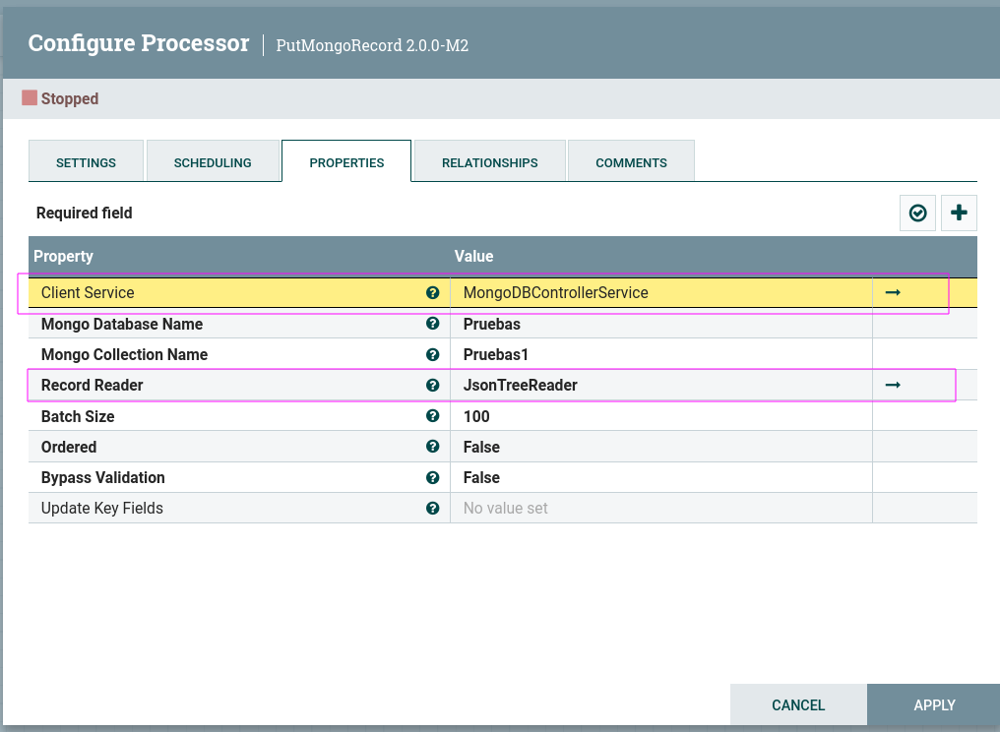
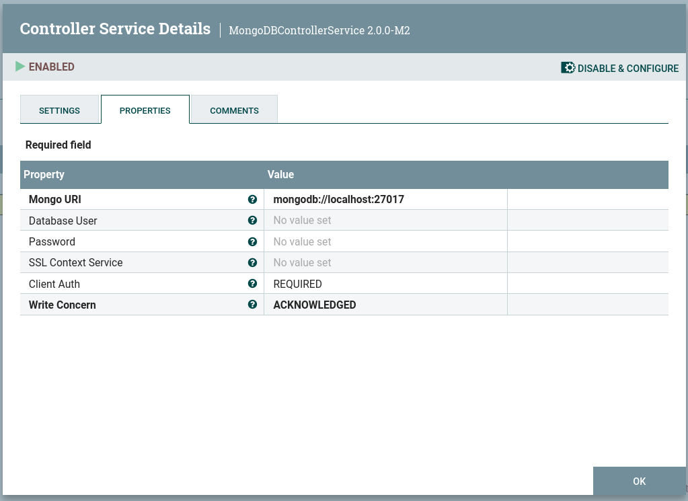
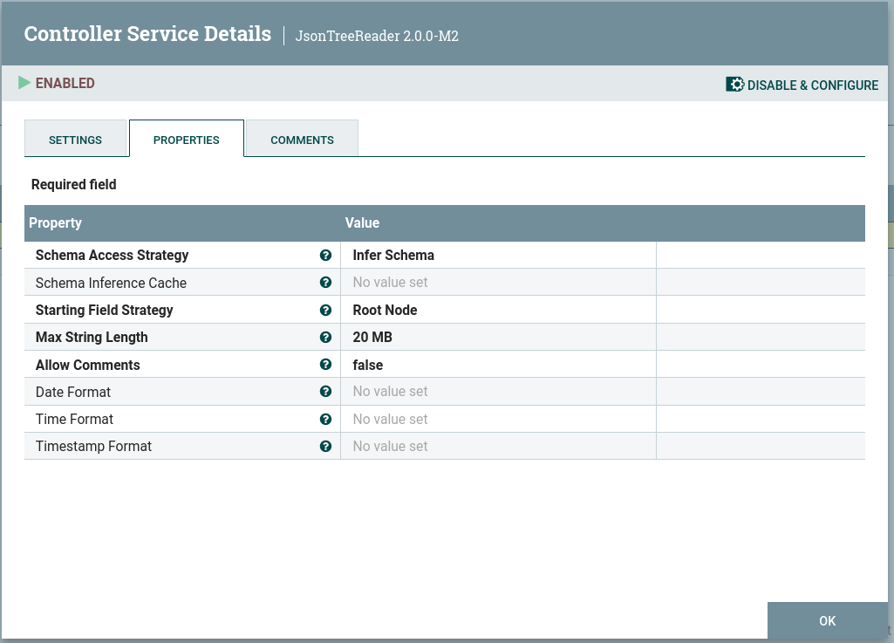

<h1>Acceso a Elasticsearh desde cliente python</h1>

<div align="center">
    
</div>

<h3>Tabla de contenidos</h3>

- [1. Introducción](#1-introducción)
- [2. Uso de Elasticsearch desde cliente en python](#2-uso-de-elasticsearch-desde-cliente-en-python)
- [3. Ejemplo de uso guiado: Restaurantes de Nueva York](#3-ejemplo-de-uso-guiado-restaurantes-de-nueva-york)
- [4. Caso de uso: Accidentes en Nueva York](#4-caso-de-uso-accidentes-en-nueva-york)
- [Uso de `MongoDB` con `Apache Nifi`](#uso-de-mongodb-con-apache-nifi)


# 1. Introducción 

La interacción con Elasticsearch no se limita únicamente a utilizar las herramientas que nos proporciona, como pueden ser `logstash` o `filebeats` para realizar ingestas de datos, si no que también podemos hacer uso de elastic desde cualquier aplicación cliente sea en el lenguaje que sea: *java*, *javascript*, *perl*, *python*, etc...

En este sentido, vamos a ver cómo acceder a Elastic desde *python*. No se ha elegido este lenguaje por nada en especial, simplemente es muy utilizado en la actualidad, es eficiente y esta bien documentado con un gran número de documentos y ejemplos.

Si alguien domina cualquier otro lenguaje, como puede ser *javascript* puede intentar transformar todos los ejemplos a realizar a continuación a su lenguaje predilecto.

Sobre python tenemos muchos recursos en la red para conocer un podo más:
- [Web oficial de python](https://www.python.org/)
- [Python españa: Aprender python.](https://es.python.org/aprende-python/)
- [W3schools: Python tutorial](https://www.w3schools.com/python/)


# 2. Uso de Elasticsearch desde cliente en python

Información oficinal de Elastic de cómo utilizar Elasticsearch desde python:

-  [Elastic Docs - Elasticsearch Python Client](https://www.elastic.co/guide/en/elasticsearch/client/python-api/current/overview.html)

# 3. Ejemplo de uso guiado: Restaurantes de Nueva York

En el siguiente enlace tenemos un ejemplo práctico de cómo hacer la ingesta de un dataset que contiene el listado de restaurantes de Nueva York.

Los pasos a a seguir por el ejemplo son :
1. Acceso a API y descarga del fichero con datos de restaurantes
2. Acceso a Elastic
3. Creación de índice y mapping
4. Ingesta de datos

Aquí tienes el enlace al [ejemplo de ingestión de datos usando python; Bulk Ingest](https://github.com/elastic/elasticsearch-py/blob/main/examples/bulk-ingest/README.md)

> **Nota**: Observa que por defecto tenemos instalado `python3` en los sistemas actuales como Ubuntu, por lo que debes reemplazar el comando `python` por `python3`

> **Nota**: si no tienes la herramienta `pip` instalada en tu sistema, por ejemplo para instalarla en Ubuntu lo haremos mediante el siguiente comando
> ```bash
> sudo apt install python3-pip
> ```

Una vez introducidos los datos, los analizaremos desde el interface de Kibana.


# 4. Caso de uso: Accidentes en Nueva York

Vamos a utilizar la misma fuente de datos, para obtener otro conjunto de datos: [los accidente de tráfico en Nueva York](https://data.cityofnewyork.us/Public-Safety/Motor-Vehicle-Collisions-Crashes/h9gi-nx95/about_data)


# Uso de `MongoDB` con `Apache Nifi`

Otros de los usos típicos que podemos tener es el almacenamiento de un ETL utilizando `Apache Nifi` y `MongoDB`

Veamos la configuración de `Nifi` para poder almacenar datos en `MongoDB`

En primer lugar para la ingesta de datos en MongoDB, utilizamos el Processor `PutMongoRecord` o `PutMongo`

<div align="center">
    
</div>

Dentro del processor, debemos configurar dos servicios: 

<div align="center">
    
</div>

Los cuales quedan configurados como sigue:

<div align="center">
    
    
</div>

El servicio `JsonTreeReader` no es necesario modificarlo, y el `MongoDBControllerService` simplemente asignamos la propiedad de **Mongo URL**

