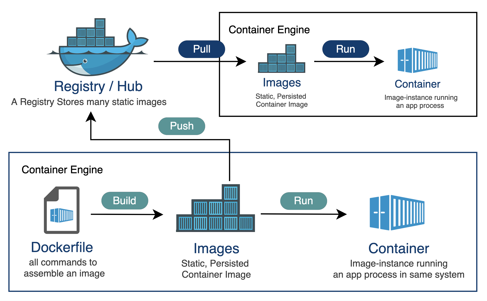

<h1>Elastic stack</h1>

<div align="center">
    
</div>

<h3>Tabla de contenidos</h3>

- [1. Introducción](#1-introducción)
  - [1.1. ¿Qué es Elastic Stack?](#11-qué-es-elastic-stack)
  - [1.2. ¿ Por qué *Elastic Stack* en Sistemas Big Data?](#12--por-qué-elastic-stack-en-sistemas-big-data)
- [2. Elasticsearch](#2-elasticsearch)
  - [2.1. Características](#21-características)
  - [2.2. Almacenamiento de la información](#22-almacenamiento-de-la-información)
  - [2.3. Tipos de nodos](#23-tipos-de-nodos)
  - [2.4. Arquitectura: Lógica de funcionamiento:](#24-arquitectura-lógica-de-funcionamiento)
- [3. Instalación de elastic](#3-instalación-de-elastic)
  - [3.1. Preparación para la instalación.](#31-preparación-para-la-instalación)
  - [3.2. Instalación de `docker`, `docker-compose` y `curl`](#32-instalación-de-docker-docker-compose-y-curl)
    - [3.2.1. Un poco de `docker`](#321-un-poco-de-docker)
    - [3.2.2. y un poco de `docker-compose`](#322-y-un-poco-de-docker-compose)
  - [3.3. Instalación de `Elasticsearch` en Ubuntu mediante `Docker`](#33-instalación-de-elasticsearch-en-ubuntu-mediante-docker)
    - [3.3.1. Instalando `ElasticSearch` en `docker`](#331-instalando-elasticsearch-en-docker)
    - [3.3.2. Comprobando la instalación](#332-comprobando-la-instalación)
    - [3.3.3. y ahora qué, ¿más nodos?, ¿añadimos `kibana`?](#333-y-ahora-qué-más-nodos-añadimos-kibana)
  - [3.4. Instalación de un cluster `elasticsearch` y `kibana` utilizando `docker-compose`](#34-instalación-de-un-cluster-elasticsearch-y-kibana-utilizando-docker-compose)
    - [3.4.1. Accediendo desde el terminal para verificar el estado del cluster](#341-accediendo-desde-el-terminal-para-verificar-el-estado-del-cluster)
    - [3.4.2. Accediendo desde la interface de `Kibana`](#342-accediendo-desde-la-interface-de-kibana)
  - [3.5. Instalación de `Elasticsearch` en un servidor línux](#35-instalación-de-elasticsearch-en-un-servidor-línux)
    - [3.5.1. Instalación de `Elastic`](#351-instalación-de-elastic)
    - [3.5.2. Instalación de `Kibana`](#352-instalación-de-kibana)
    - [3.5.3. instalación de `Logstash`](#353-instalación-de-logstash)
    - [3.5.4. Instalación de `Filebeat`](#354-instalación-de-filebeat)
- [4. Comprendiendo los conceptos de cluster, indices y shards](#4-comprendiendo-los-conceptos-de-cluster-indices-y-shards)


# 1. Introducción

Los sistemas **NoSQL** son una categoría de bases de datos diseñadas para manejar grandes volúmenes de datos no estructurados o semiestructurados en entornos distribuidos y escalables. Estos sistemas proporcionan flexibilidad en el modelado de datos y están optimizados para casos de uso que requieren alta disponibilidad, escalabilidad horizontal y baja latencia de acceso a los datos.

***Elastic Stack*** puede ser un ejemplo muy representativo de bases de datos *NoSQL* con características muy beneficiosas para gestionar y analizar datos en entornos donde se necesite trabajar con grandes volúmenes de datos no tradicionales. 


## 1.1. ¿Qué es Elastic Stack?

**Elastic Stack**, anteriormente conocido como ***ELK Stack***, es un conjunto de herramientas de código abierto desarrolladas por Elastic para la búsqueda, análisis y visualización de datos. El nombre *Elastic Stack* refleja la ampliación del conjunto de herramientas más allá de las tres herramientas originales (*Elasticsearch*, *Logstash* y *Kibana*) para incluir una variedad de productos adicionales que complementan y amplían la funcionalidad del conjunto.

<div align="center">
    
</div>

El *Elastic Stack* consta de los siguientes componentes principales:

1. **Elasticsearch**: Es un motor de búsqueda y análisis distribuido basado en *Lucene*. *Elasticsearch* se utiliza para indexar, buscar y analizar grandes volúmenes de datos en tiempo real. Proporciona capacidades de búsqueda a escala, incluyendo búsqueda de texto completo, agregaciones, geolocalización y más.

2. **Logstash**: Es una herramienta de ingestión de datos que se utiliza para recopilar, procesar y enviar datos de log y otros tipos de datos desde múltiples fuentes a *Elasticsearch* para su almacenamiento y análisis. Logstash ofrece una amplia gama de filtros y complementos para procesar datos de diferentes formatos y fuentes.

3. **Kibana**: Es una plataforma de visualización de datos y análisis que se utiliza para visualizar y explorar los datos almacenados en *Elasticsearch*. Kibana ofrece una variedad de herramientas de visualización y paneles de control que permiten a los usuarios crear gráficos, tablas y mapas interactivos para analizar y comprender los datos.

4. **Beats**: Beats es una familia de agentes ligeros que se utilizan para enviar datos a *Elasticsearch* o Logstash desde una variedad de fuentes, incluidos logs, métricas del sistema, datos de red y más. Beats simplifica la recopilación y envío de datos, proporcionando una forma eficiente y escalable de enviar datos a la Elastic Stack.

5. **Apm-server**: Apm-server es un servidor de recolección de datos de rendimiento de aplicaciones (APM) que se utiliza para recopilar y enviar datos de rendimiento de aplicaciones a *Elasticsearch*. Ayuda a monitorear y analizar el rendimiento de las aplicaciones y a identificar problemas de rendimiento en tiempo real.

6. **Elasticsearch SQL**: Es una capa de SQL que se ejecuta sobre *Elasticsearch*, lo que permite a los usuarios ejecutar consultas SQL sobre datos indexados en Elasticsearch.

Estos son algunos de los componentes principales del *Elastic Stack*, pero *Elastic* también ofrece una variedad de otros productos y soluciones que complementan el conjunto, como *Elasticsearch* Security, *Elasticsearch* Machine Learning, Elastic Enterprise Search, Elastic Observability, entre otros.

<div align="center">
    
</div>

*Elastic Stack* es especialmente popular en entornos de desarrollo de software, operaciones de sistemas (DevOps), análisis de seguridad, monitoreo de infraestructura y análisis de registros de aplicaciones. La combinación de *Elasticsearch*, *Logstash* y *Kibana* proporciona una solución completa y escalable para la recopilación, almacenamiento, análisis y visualización de datos.

Más concretamente **Elasticsearch** es un motor de búsqueda diseñado para escalar horizontalmente, de forma que se puedan ir añadiendo más nodos al clúster a medida que aumente el volumen de datos requerido.

Su base es una librería de indexación y búsqueda de información textual conocida como ***Apache Lucene***, desarrollada inicialmente en Java aunque disponible también para otros lenguajes.

El surgimiento de **Elasticsearch** se debió a problemas de escalabilidad detectados en otro motor de búsqueda que también se basa en ***Apache Lucene***, **Apache Solr**. En el siguiente [vídeo](https://youtu.be/MMWBdSdbu5k?si=5i2jwLVXsC2XoQnD) se resumen las diferencias principales entre ambos buscadores, que pueden consultarse en detalle en el siguiente [enlace](https://sematext.com/blog/side-by-side-with-elasticsearch-and-solr-performance-and-scalability/)


## 1.2. ¿ Por qué *Elastic Stack* en Sistemas Big Data?

Existen varias razones que nos aconsejan dar un vistazo a *Elastic Stack* (Elasticsearch, Logstash, Kibana) para comprender los Sistemas de Big Data: 

1. **Escalabilidad y rendimiento**: *Elasticsearch*, como parte de ELK, está diseñado para ser altamente escalable y eficiente en términos de rendimiento. Estudiar cómo *Elasticsearch* maneja grandes volúmenes de datos y consultas en tiempo real proporciona una comprensión práctica de cómo los sistemas de Big Data pueden escalar y procesar datos de manera eficiente.

2. **Ingestión de datos**: *Logstash*, otra parte de ELK, se utiliza para la ingestión de datos, que es un aspecto crítico en los sistemas de Big Data. Aprender sobre Log*stash y sus capacidades para recopilar datos de diferentes fuentes, procesarlos y enviarlos a *Elasticsearch* para su almacenamiento y análisis proporciona una comprensión sólida de cómo se manejan los datos en sistemas de Big Data.

3. **Análisis y visualización de datos**: *Kibana*, la tercera parte de ELK, es una herramienta poderosa para la visualización y el análisis de datos. Estudiar *Kibana* te permite aprender cómo crear visualizaciones interactivas, tablas de datos y paneles de control para analizar y comprender datos almacenados en *Elasticsearch*. Esto es fundamental en los sistemas de Big Data para extraer información significativa de conjuntos de datos masivos.

4. **Casos de uso prácticos**: ELK se utiliza en una amplia variedad de casos de uso, incluyendo monitoreo de infraestructura, análisis de logs, observabilidad de aplicaciones, análisis de seguridad, análisis de registros de aplicaciones y más. Estudiar cómo se implementa ELK en estos casos de uso proporciona una comprensión práctica de cómo se utilizan los sistemas de Big Data en entornos del mundo real.

5. **Herramientas de código abierto**: ELK es una suite de herramientas de código abierto ampliamente utilizada en la industria. Estudiar ELK te expone a tecnologías de código abierto populares y te proporciona habilidades que son altamente valoradas en el mercado laboral de la tecnología.

En resumen, estudiar ELK te proporciona una comprensión práctica de cómo funcionan y se utilizan los sistemas de Big Data en entornos del mundo real, desde la ingestión de datos hasta el almacenamiento, análisis y visualización de datos. Esto puede ser valioso para aquellos que desean desarrollar habilidades en el campo del análisis de datos y Big Data.

# 2. Elasticsearch

**Elasticsearch** es un potente motor de búsqueda y análisis distribuido que se utiliza para buscar, analizar y visualizar grandes volúmenes de datos en tiempo real. En su núcleo, **Elasticsearch** organiza y almacena la información utilizando un enfoque de búsqueda y recuperación de información, similar a un motor de búsqueda web, pero optimizado para una amplia gama de casos de uso y tipos de datos.

## 2.1. Características

Es una colección de información organizada para un
posterior aprovechamiento de la misma.

Esta información debe:

- Ser accesible
- Se pueda gestionar
- Se pueda actualizar

Las características principales son: 

- **Distribuido y escalable**. Permite crecer conforme lo hagan las necesidades de forma horizontal.
- **Datos en tiempo real**. Los datos están disponibles para su análisis segundos después de haber sido indexados (real time).
- **Alta disponibilidad**. Datos replicados a lo largo de distintos nodos permite el fallo de alguno de estos dentro del clúster sin que se vea afectado el funcionamiento.
- **Multi-tenancy**. Los índices donde se almacenan la información pueden ser consultados de manera independiente.
- **Búsquedas full-text**. Usa ***Apache Lucene*** aprovechando sus capacidades de búsqueda de texto, soportando geolocalización, autocompletado, expresiones regulares…
- **API Restful**. Proporciona una API sobre **JSON** para realizar consultas e interactuar con Elasticsearch.

## 2.2. Almacenamiento de la información

La información se organiza dentro de elasticsearch en: 

- **Índice**: Colección de documentos con características similares (catálogo de productos, clientes, pedidos…).
Identificado por un nombre (minúsculas) usado para realizar operaciones como indexado, búsqueda, actualización y borrado de los documentos que contiene.

- **Documento**: Unidad básica de información que puede ser indexada (documento por producto, cliente o pedido) en formato [JSON](https://www.w3schools.com/js/js_json_intro.asp). 
En un *índice* se pueden almacenar todos los documentos que se requiera.

- **Shards**: Cuando se almacena gran cantidad de información puede exceder los límites hardware de un nodo. *Elasticsearch* proporciona la posibilidad de subdividir un índice en distintas partes denominadas **shards**.
  - Permite subdividir/escalar la información almacenada.
  - Permite distribuir y paralelizar operaciones.

**Réplica**: *Elasticsearch* permite realizar una o más copias de los shards. Su importancia recae en:
  - Proporciona alta disponibilidad en el caso de que un shard/nodo falle. Importante que las réplicas no se encuentren en el mismo nodo.
  - Permite el escalado del volumen de búsquedas ya que estas pueden ejecutarse en paralelo en las réplicas.

<div align="center">
    
</div>

Una vez replicado, cada ***índice*** tendrá un ***shard*** primario y las réplicas (copias exactas del primario).
Los ***shards*** y ***réplicas*** se pueden definir por índice a la hora de creación de los mismos. Las réplicas podrán cambiarse en caliente al contrario que los shards.

La información se almacena en diferentes sitios de la red (físicamente) pero lógicamente es una única base de datos.

- Transparente para un usuario final.
- Independencia respecto al sistema operativo.
- Procesamiento distribuido de consultas.
- Información fragmentada.
- Réplicas = Alta disponibilidad.

<div align="center">
    
</div>

## 2.3. Tipos de nodos

En *Elasticsearch*, los nodos son las instancias individuales que forman parte de un clúster y que almacenan, indexan y procesan los datos. Existen varios tipos de nodos en *Elasticsearch*, cada uno con un propósito específico. A continuación, se describen los tipos principales de nodos:

1. **Nodos de datos (Data Nodes)**:
   - Los nodos de datos son responsables de almacenar y gestionar los datos indexados en Elasticsearch.
   - Estos nodos almacenan los shards (fragmentos) de los índices en el clúster.
   - Cada nodo de datos contiene una parte del conjunto completo de datos en el clúster.
   - Los nodos de datos participan en la indexación y búsqueda de datos.

2. **Nodos de maestro (Master Nodes)**:
   - Los nodos maestro son responsables de coordinar las actividades en el clúster y de gestionar los metadatos.
   - Controlan las operaciones de indexación, búsqueda, asignación de shards y recuperación en el clúster.
   - Los nodos maestro no almacenan datos de índices, pero mantienen un seguimiento del estado del clúster y de la topología.
   - Los clústeres de *Elasticsearch* deben tener al menos un nodo maestro para funcionar correctamente.

3. **Nodos de coordinación (Coordinating Nodes)**:
   - Los nodos de coordinación actúan como puntos de entrada para las solicitudes de clientes y distribuyen las solicitudes a los nodos adecuados.
   - Ayudan a equilibrar la carga de trabajo y a distribuir las consultas de búsqueda y recuperación en el clúster.
   - Estos nodos no almacenan datos de índices y no participan en la indexación o búsqueda directa de datos.

4. **Nodos de ingestión (Ingest Nodes)**:
   - Los nodos de ingestión se utilizan para procesar y transformar datos antes de que se almacenen en Elasticsearch.
   - Pueden aplicar transformaciones, análisis de texto y enriquecimiento de datos antes de indexarlos en el clúster.
   - Estos nodos son útiles para la preparación y limpieza de datos antes de su almacenamiento en el índice.

5. **Nodos de cliente (Client Nodes)**:
   - Los nodos de cliente son nodos dedicados exclusivamente a recibir solicitudes de clientes y reenviarlas al nodo adecuado para su procesamiento.
   - Ayudan a distribuir la carga de trabajo al actuar como intermediarios entre los clientes y los nodos de datos, coordinación o ingestión.

<div align="center">
    
</div>

## 2.4. Arquitectura: Lógica de funcionamiento: 

La arquitectura de funcionamiento de un sistema elastic stack sería el representado por la siguiente imagen.
<div align="center">
    
</div>

Y en cuanto a las comunicaciones entre los diferentes elementos, debemos tener en cuenta : 

<div align="center">
    
</div>

Elasticsearch incluye 2 protocolos de comunicación:
1. Protocolo nativo en binario llamado **Transport Client**. Puerto **9300** por defecto
   - Sólo pensado para el lenguaje Java.   
   - Se utiliza para comunicar Elastic con el resto de aplicaciones del Stack
2. Protocolo HTTP: *API REST*. Puerto **9200** por defecto
   - Forma más común de conexión
   - REST es un protocolo de uso general de operaciones y herramientas de test conocidas
   - Posibilidad de implementar clientes en cualquier lenguaje de programación: *java*, *python*, *javascript* ...

# 3. Instalación de elastic 

Tenemos diferentes opciones para la instalación de elastic stack, de hecho no es necesario instalar todo el sistema completo, si no que podemos instalar elementos separados de ellos, por ejemplo **Elasticsearch** y **Kibana** por separado.

Además podemos realizar instalación de diferentes nodos en diferentes equipos para que funcionen de forma connjunta o podemos instalarlos mediante **docker** en mismo sistema.

## 3.1. Preparación para la instalación.

Nosotros vamos a utilizar un equipo Ubuntu Desktop, aunque realmente sería más eficiente un Ubuntu Server o similar. Si embargo, para que sea más sencillo y poder acceder posteriormente desde mismo equipo, instalaremos un máquina con experiencia de usuario.

Una configuración de esta máquina en ***Oracle VM VirtualBox*** podría ser la siguiente:

<div align="center">
    
</div>

Observar que se ha incluido una cantidad elevada de memoria: 10GB (en un equipo de 16GB), se ha asignado más de un procesador y un mínimo de 50GB de disco duro.

Una vez instalado el sistema, es aconsejable instalar los VirtualBox Guest Additions.

Seleccionamos su instalación y abrimos un terminal en el medio que lo contiene: 

```bashp
sudo apt update
sudo apt upgrade                # opcional. Puede tardar mucho
sudo apt install gcc make perl  # opcional y aconsejable, para poder recompilar el núcleo 
sudo ./VBoxLinuxAdditions.run   # instalación
```
Antes de seguir, también es aconsejable hacer una copia de seguridad o una instantánea, por si algo sale mal.

<hr>

También es interesante habilitar el usuario *root* y trabajar con este usuario 

Una vez preparado nuestro sistema, vamos a ver diferentes instalaciones. Realizaremos dos: en primer lugar instalaremos *Elasticsearch* sobre un **docker** sobre la máquina, y posteriormente instalaremos un cluster aprovechando la tecnología **docker-compose**. Por supuesto también podemos realizar una instalación directa sobre nuestra máquina, pero en este caso, como la finalidad es montar un cluster para ver su comportamiento, optaremos por obviar esta variante. 

## 3.2. Instalación de `docker`, `docker-compose` y `curl`

<div align="center">
    
</div>

**Docker** es una plataforma de código abierto diseñada para facilitar la creación, implementación y ejecución de aplicaciones en contenedores. Un contenedor es una unidad ligera de software que contiene todo lo necesario para ejecutar una aplicación, incluidas las bibliotecas, las herramientas del sistema, el código y las dependencias. **Docker** proporciona una forma estandarizada de empaquetar y distribuir aplicaciones, lo que facilita la creación de entornos de desarrollo consistentes y portátiles.

<div align="center">
    
</div>

**Docker Compose**, por otro lado, es una herramienta que permite definir y gestionar aplicaciones ***multi-contenedor***. Con Docker Compose, se puede definir la configuración de una aplicación en un archivo YAML, especificando los servicios, imágenes de contenedor, volúmenes, redes y otros detalles necesarios para ejecutar tu aplicación. Docker Compose simplifica la gestión de aplicaciones complejas al permitirte definir y controlar todos los componentes de tu aplicación desde un solo lugar.

<div align="center">
    
</div>

Para instalar Docker y Docker Compose en Ubuntu 22.04, puedes seguir estos pasos:

1. Actualiza el índice de paquetes de Ubuntu:

```bash
sudo apt update
```

2. Instala los paquetes necesarios para permitir que apt utilice un repositorio sobre HTTPS:

```bash
sudo apt install apt-transport-https ca-certificates curl software-properties-common
```

3. Descarga e importa la clave GPG oficial de Docker:

```bash
curl -fsSL https://download.docker.com/linux/ubuntu/gpg | sudo gpg --dearmor -o /usr/share/keyrings/docker-archive-keyring.gpg
```

4. Agrega el repositorio de Docker al sistema:

```bash
echo \
  "deb [arch=amd64 signed-by=/usr/share/keyrings/docker-archive-keyring.gpg] https://download.docker.com/linux/ubuntu \
  $(lsb_release -cs) stable" | sudo tee /etc/apt/sources.list.d/docker.list > /dev/null
```

5. Actualiza el índice de paquetes nuevamente:

```bash
sudo apt update
```

6. Instala la versión de Docker que prefieras. Puedes elegir entre la versión comunitaria (Docker CE) o la versión empresarial (Docker EE). Para instalar la versión comunitaria, ejecuta:

```bash
sudo apt install docker-ce docker-ce-cli containerd.io
```

7. Instala docker-compose, ejecuta:

```bash
sudo apt install docker-compose
```


8. Verifica que Docker se haya instalado correctamente ejecutando el siguiente comando para verificar la versión:

```bash
docker --version
docker-compose --version
```

9. Para permitir que tu usuario actual ejecute comandos de Docker sin necesidad de usar `sudo`, agrega tu usuario al grupo `docker`:

```bash
sudo usermod -aG docker $USER
```

10. Cierra la sesión actual y vuelve a iniciarla para que los cambios surtan efecto.


<div align="center">
    
</div>

Ya que nos estamos preparando, podemos instalar también `curl`, que nos permitirá contactar desde la línea de comandos con el servidor Elasticsearh.

Para ello :

```bash
sudo apt install curl
```

Más información sobre `curl` en la [Wikipedia](https://es.wikipedia.org/wiki/CURL) o en la red


### 3.2.1. Un poco de `docker`

Aquí tienes una tabla que muestra algunas opciones típicas del comando `docker`:


| Comando y Opción | Descripción |
|-------------------|-------------|
| `docker run <imagen>` | Crea y ejecuta un nuevo contenedor basado en la imagen especificada. |
| `docker ps` | Muestra una lista de los contenedores en ejecución. |
| `docker images` | Lista las imágenes Docker descargadas en el sistema. |
| `docker pull <imagen>` | Descarga una imagen de Docker del registro público o privado. |
| `docker build <ruta>` | Construye una imagen Docker desde un Dockerfile ubicado en la ruta especificada. |
| `docker push <imagen>` | Sube una imagen de Docker al registro remoto. |
| `docker stop <contenedor>` | Detiene un contenedor en ejecución. |
| `docker start <contenedor>` | Inicia un contenedor detenido. |
| `docker rm <contenedor>` | Elimina uno o varios contenedores. |
| `docker rmi <imagen>` | Elimina una o varias imágenes de Docker del sistema. |
| `docker exec -it <contenedor> <comando>` | Ejecuta un comando dentro de un contenedor en ejecución. Ej. `docker exec --user='root' -it es01 /bin/bash` |
| `docker logs <contenedor>` | Muestra los registros de salida de un contenedor en ejecución. |
| `docker inspect <objeto>` | Muestra información detallada sobre un contenedor, imagen o red de Docker. |


<div align="center">
    
</div>

Ejemplos de uso de comando `docker`

 - listar contenedores activos
```bash
docker ps
```

- operaciones con contenedores
```bash
docker start es01       # inicia el contenedor es01
docker stop es01        # lo para
docker restart es01     # lo reinicia   
docker rm es01          # lo elimina
docker kill es01        # lo .... 
```

- entrar en el terminal de un contenedor 
```bash
docker exec -it es01 /bin/bash
```

- copiar desde y hacia un contenedor.
```bash
docker cp es01:/usr/share/elasticsearch/config/certs/http_ca.crt .
docker cp elasticsearch.yml es01:/usr/share/elasticsearch/config/elasticsearch.yml 
```

- eliminar y crear interfaces de red
```bash
docker network create elastic
docker network rm elastic
```

### 3.2.2. y un poco de `docker-compose`


Aquí tienes algunos usos típicos de comandos docker-compose:

| Comando | Descripción |
|---------|-------------|
| `docker-compose up` | Construye, crea y arranca todos los servicios definidos en el archivo `docker-compose.yml`. Si no existe, Docker Compose construirá las imágenes necesarias. |
| `docker-compose up -d` | Similar a `docker-compose up`, pero ejecuta los servicios en segundo plano (modo detached). Útil para ejecutar servicios en el fondo sin bloquear la terminal. |
| `docker-compose down` | Detiene y elimina todos los contenedores, redes y volúmenes creados por `docker-compose up`. |
| `docker-compose ps` | Muestra el estado de los servicios definidos en el archivo `docker-compose.yml`. Proporciona información sobre los contenedores en ejecución, sus puertos mapeados y el estado. |
| `docker-compose logs` | Muestra los logs de todos los servicios o de un servicio específico definido en `docker-compose.yml`. Puedes usar banderas adicionales para controlar el formato y la salida de los logs. |
| `docker-compose exec <servicio> <comando>` | Ejecuta un comando dentro de un contenedor de un servicio específico. Útil para ejecutar comandos en el contexto de un servicio en ejecución. |
| `docker-compose build` | Construye o reconstruye los servicios definidos en `docker-compose.yml`. Útil cuando se realizan cambios en Dockerfiles o archivos de configuración y se necesita actualizar las imágenes. |
| `docker-compose restart <servicio>` | Reinicia un servicio específico definido en `docker-compose.yml`. Esto detiene y vuelve a arrancar el contenedor del servicio. |
| `docker-compose stop` | Detiene los contenedores de los servicios definidos en `docker-compose.yml` sin eliminarlos. Útil para detener servicios sin eliminar los recursos asociados. |
| `docker-compose start` | Arranca todos los servicios previamente creados. Útil para volver a arrancar los contenedores del servicio. |

<div align="center">
   
</div>


## 3.3. Instalación de `Elasticsearch` en Ubuntu mediante `Docker`

Antes de nada, para evitar problemas con los contenedores, es recomendable cambiar los siguientes parámetros del sistema:

```bash
# Deshabilitar swapping
sudo swapoff -a
# Memória virtual
sudo sysctl -w vm.max_map_count=262144
# Number or threads
sudo sysctl -w fs.file-max=65536
```
podemos incluir todo esto en un fichero de configuración y ejecutar directamente. 


### 3.3.1. Instalando `ElasticSearch` en `docker`

Para instalar elastic en docker seguimos: 

```bash
# instalamos elacticseach sobre docker
sudo docker network create elastic
sudo docker pull docker.elastic.co/elasticsearch/elasticsearch:8.12.0
sudo docker run --name elasticsearch --net elastic -p 9200:9200 -p 9300:9300 -e "discovery.type=single-node" -it docker.elastic.co/elasticsearch/elasticsearch:8.12.0

sudo docker run --name elasticsearch --net elastic -p 9200:9200  -p 9300:9300 -e "discovery.type=single-node" -it -m 2GB docker.elastic.co/elasticsearch/elasticsearch:8.12.0

```

Al terminal la instalación nos aparece la siguiente información donde tenemos contraseña de acceso y tokens (claves) para poder unir `Kibana` u otros nodos de *Elasticsearch*. Esta información es importante retenerla.

<div align="center">
    
</div>


### 3.3.2. Comprobando la instalación

Una vez llegados a este punto, dejamos el contenedor funcionando y nos *abrimos un nuevo contenedor*. 

Nos preparamos para trabajar de creando una variable para guardar la contraseña anterior y copiando el certificado de autentificación en nuestro equipo.

```bash
export ELASTIC_PASSWORD="ar+cS5jc7JzL_AzppMrt"

# Copy the http_ca.crt SSL certificate from the container to your local machine.
docker cp es01:/usr/share/elasticsearch/config/certs/http_ca.crt .

# si no estamos en el root, debemos hacer que nuestro usuario tenga acceso al certificado
sudo chmod o+r http_ca.crt
```

y realizamos la comprobación de que *Elasticsearch* esta funcionando.

```bash
curl --cacert http_ca.crt -u elastic:$ELASTIC_PASSWORD https://localhost:9200
```

<div align="center">
    
</div>

Como podemos ver, obtenemos la respuesta mediante un JSON que nos indica que el servidor esta en marcha y nos muestra datos como el nombre de nodo y las versiones de elastic así como de `Lucene`.

> *Nota*: Cuando hacemos `export ELASTIC_PASSWORD=`, datos el valor a esta variable hasta el momento en que se reinicia el equipo. Para mantener esta variable siempre en el sistema, incluso después de reinicios, se debería incluir en el fichero `/etc/environment` 

También podemos consulta el estado del servidor o cluster de servidores: 

```bash
curl --cacert http_ca.crt -u elastic:$ELASTIC_PASSWORD https://localhost:9200/_cluster/health?pretty 
```

Como vemos en la siguiente imagen, realmente hemos creado un cluster con un solo nodo, que será el master.

<div align="center">
    
</div>

Además podemos ver el status del cluster: **green**. los posibles estados de un cluster son: 

| Estado del Cluster | Descripción |
|-------------------|-------------|
| Green | Todos los nodos en el clúster están activos y operativos. Todas las réplicas y shards primarios están presentes y asignados. El clúster está completamente funcional y no hay pérdida de datos incluso en el caso de la falla de un nodo. |
| Yellow | Todos los nodos en el clúster están activos y operativos, pero algunas réplicas de shards no están asignadas. Esto puede ocurrir cuando se agrega un nuevo nodo al clúster y las réplicas aún no se han asignado completamente, o si un nodo se ha caído y las réplicas no se han restaurado. A pesar de que algunas réplicas no están asignadas, la funcionalidad de búsqueda y recuperación no se ve afectada. |
| Red | Al menos un shard primario o una réplica está ausente o no asignada. Esto puede deberse a la pérdida de datos debido a la falta de réplicas suficientes o a la falta de asignación de un shard primario. El clúster puede seguir funcionando, pero la pérdida de datos es posible y se requiere intervención para restaurar la integridad del clúster. |
| Gray | Este estado puede indicar un error en el proceso de monitoreo del clúster o una incapacidad para determinar el estado real del clúster. Esto puede ocurrir cuando los nodos no pueden comunicarse entre sí o si hay problemas con el monitoreo y la recopilación de datos del estado del clúster. Se requiere una revisión para diagnosticar y resolver la causa del estado de clúster en gris. |

Estos son algunos de los estados comunes del clúster en *Elasticsearch* y sus descripciones asociadas. Es importante monitorear el estado del clúster regularmente para garantizar la disponibilidad y la integridad de los datos en Elasticsearch.

Otras consultas que podemos hacer sobre el cluster son : 

- Información detallada del cluster
```bash
sudo curl --cacert http_ca.crt -u elastic:$ELASTIC_PASSWORD -XGET 'https://localhost:9200/_cluster/stats?human&pretty'
```

- Listado de nodos del cluster
```bash
sudo curl --cacert http_ca.crt -u elastic:$ELASTIC_PASSWORD https://localhost:9200/_cat/health?pretty 
```

- Información sobre el listado de nodos

```bash
sudo curl --cacert http_ca.crt -u elastic:$ELASTIC_PASSWORD -XGET 'https://localhost:9200/_nodes?pretty'
```

También podemos introducir nuestro primer índice con algunos datos (o documentos).

Veamos cómo se insertaría un índice y cómo se consulta: 

- Añadir al indice test
```bash

curl --cacert http_ca.crt -u elastic:$ELASTIC_PASSWORD -XPOST https://localhost:9200/test/_bulk?pretty -d'
{ "index" : {} }
{ "num": "2015/56", "cliente": 13, "importe":189 }
{ "index" : {} }
{ "num": "2015/57", "cliente": 45, "importe":190 }
' -H 'Content-Type: application/json'

- obtener todo lo que hay en indice test
curl --cacert http_ca.crt -u elastic:$ELASTIC_PASSWORD -XGET https://localhost:9200/test/_search?pretty
```

### 3.3.3. y ahora qué, ¿más nodos?, ¿añadimos `kibana`?

Podríamos añadir más nodos, como se indica el manual con la siguiente instrucciones, pero nosotros de momento no lo vamos a hacer: 

```bash
docker run -e ENROLLMENT_TOKEN="<token>" --name es02 --net elastic -it -m 1GB docker.elastic.co/elasticsearch/elasticsearch:8.12.0
```

y podíamos añadir `kibana`, tal y como se especifica en las web de elastic.

```bash
# pull the Kibana Docker image.
docker pull docker.elastic.co/kibana/kibana:8.12.0

# Start a Kibana container.
docker run --name kib01 --net elastic -p 5601:5601 docker.elastic.co/kibana/kibana:8.12.0
```

Con esto, iniciamos el contenedor, si todo funciona bien, nos da un enlace desde el que acceder a kibana: 

<div align="center">
    
</div>

Si abrimos el enlace accedemos al punto de unión de Kibana con Elastic, donde nos solicita que introduzcamos el token para unirnos con elastic

<div align="center">
    
</div>

y ya tenemos funcionando elastic y kibana. Nos solicita la contraseña, que es la misma de elastic.

Si en un momento determinado perdemos la contraseña, o pasan mas de 30 minutos y tenemos que regenerar el token de unión de kibana, entonces ejecutamos: 

```bash
docker exec -it es01 /usr/share/elasticsearch/bin/elasticsearch-reset-password -u elastic
docker exec -it es01 /usr/share/elasticsearch/bin/elasticsearch-create-enrollment-token -s kibana
```

Sin embargo, pero las limitaciones de ejecución con muchas, por lo que vamos a continuar con una solución más completa


## 3.4. Instalación de un cluster `elasticsearch` y `kibana` utilizando `docker-compose`

Vamos a realizar una instalación de un cluster de 3 nodos elasticsearch mas un nodo kibana utilizando `docker-compose`

Par ello, seguimos con las indicaciones que nos ofrece la [web de elastic](https://www.elastic.co/guide/en/elasticsearch/reference/current/docker.html#docker-compose-file), con alguna mínima modificación.

Los pasos serán: 

- Creamos una carpeta donde vamos a alojar la "*composición*"
- Descargamos los ficheros 
  - [.env](https://github.com/elastic/elasticsearch/blob/8.12/docs/reference/setup/install/docker/.env)
  - [.docker-compose.yml](https://github.com/elastic/elasticsearch/blob/8.12/docs/reference/setup/install/docker/docker-compose.yml)
  - Editamos `.env` y realizamos los cambios indicados en la web de elastic
<div align="center">
    
</div>
Además se han realizado otros cambios, como asignar más memoria. En concreto en la imagen se ve una configuración con 1,5 GB por nodo. Es posible que funcione con 1 GB  o tal vez necesites 2GB, según versiones y equipos.

Ahora ya ejecutamos el comando para iniciar el sistema:

```bash
sudo docker-compose up -d # iniciamos el sistema. La opción -d permite una visualización sencilla 
sudo docker-compose ps    # mediante este comando, podemos ver si los diferentes contenedores están activos.
```
<div align="center">
    
</div>

Con el comando `docker-compose ps` comprobamos que todos los nodos están activos y con esto, ya podemos intentar entrar en kibana de nuevo, pero ahora con la nueva contraseña: *changeme*

<div align="center">
    
</div>

Por último, si queremos detener o eliminar  el sistema ejecutaremos

```bash
sudo docker-compose stop    # detiene los servicios 
sudo docker-compose down    # esta opción elimina los contenedores
sudo docker-compose down -v # además de eliminar los contenedores y los volúmenes de datos

sudo docker-compose start   # si hemos parado, si hemos eliminado: up

```

**Corespondencia de Volumenes de los contenedores y datos en local**

Mediante la definición del `volume`, podemos almacenar los datos de los nodos en local, con la finalidad de preservar los datos en caso de que los nodos tengan cualquier problema. Esto se aplica a este ejemplo tal como se puede ver en el fichero de configuración [.docker-compose.yml](https://github.com/elastic/elasticsearch/blob/8.12/docs/reference/setup/install/docker/docker-compose.yml). 

Podemos comprobar dónde se encuentran mediante el comando: 

```bash
docker volume ps                        # listamos todos los volúmenes
docker volume inspect elastic_esdata01  # inspeccionamos un volumen en concreto
```

<div align="center">
   
</div>


### 3.4.1. Accediendo desde el terminal para verificar el estado del cluster

Si queremos acceder al elastic desde la línea de comando, ejecutamos una secuencia similar a la anterior, pero **ojo**, ahora la ubicación del certificado ha cambiado, tal y como se puede observar en el fichero de configuración [`docker-compose.yml`](https://github.com/elastic/elasticsearch/blob/8.12/docs/reference/setup/install/docker/docker-compose.yml).

Así pues ejecutamos:

```bash
export ELASTIC_PASSWORD="changeme"

# Copy the http_ca.crt SSL certificate from the container to your local machine.
sudo docker cp elastic_es01_1:/usr/share/elasticsearch/config/certs/ca/ca.crt ./http_ca.crt

# si no estamos en el root, debemos hacer que nuestro usuario tenga acceso al certificado
sudo chmod o+r http_ca.crt
```

Ahora, podemos comprobar de nuevo el estado del cluster: 

```bash
sudo curl --cacert http_ca.crt -u elastic:$ELASTIC_PASSWORD https://localhost:9200/_cat/health?pretty 
```
y obtenemos la salida del estado:

<div align="center">
    
</div>

Observar que si en algún momento cae alguno de los elementos del cluster, el estado se verá comprometido, y podrá incluso estar en riesgo de perdida de datos, tal y como se puede ver en la siguiente captura:

<div align="center">
    
</div>


También podemos pregunta sobre el cluster de nodos: 

```bash
curl --cacert http_ca.crt -u elastic:$ELASTIC_PASSWORD https://localhost:9200/_cat/nodes?v
```
En esta captura podemos apreciar tatn los nodos que componen el cluster, las direcciones, ip, como porcentajes de memoria, cpu, de carga, los roles que tiene cada nodo y quién esta actuando de *nodo master*

<div align="center">
    
</div>

Otra forma para comprobar el estado de salud del cluster sería mediante 

```bash
curl --cacert http_ca.crt -u elastic:$ELASTIC_PASSWORD https://localhost:9200/_cat/health?v
```

Aquí obtenemos el estado, así como la cantidad de nodos destinados a datos, *shards*, etc... 

<div align="center">
    
</div>


### 3.4.2. Accediendo desde la interface de `Kibana`

Trabajar desde el terminal puede ser engorroso, por ello, podemos aprovechar el interface que nos ofrece `kibana` para poder realizar las mismas operaciones que estamos realizando desde la línea de comando, y por supuesto, en un futuro, nos facilitará la interacción con `Elasticsearch` gracias a su terminal.

Así pues entramos en `Kibana`, que nos pedirá usuario (*elastic*) y contraseña (*changeme*), y buscamos la opción de ***Dev Tools*** dentro de la sección  ***management***


<div align="center">
    
</div>


Aquí podemos lanzar nuestras peticiones sin necesidad de especificar todas las opciones de seguridad necesarias desde la línea de comandos, y además nos permite mantener un historial sencillo de utilizar.

<div align="center">
    
</div>


## 3.5. Instalación de `Elasticsearch` en un servidor línux

Por último, vamos a presentar otra opción para la instalación del sistema `Elastic stack` en un equipo tipo Ubuntu Server.

Para ello, como en las secciones anteriores, seguimos los pasos indicados por el propio fabricante: [Install *Elasticsearch* with Debian Package](https://www.elastic.co/guide/en/elasticsearch/reference/current/deb.html)

En primer lugar importamos claves y preparamos el sistema para instalar

```bash
wget -qO - https://artifacts.elastic.co/GPG-KEY-elasticsearch | sudo gpg --dearmor -o /usr/share/keyrings/elasticsearch-keyring.gpg
sudo apt-get install apt-transport-https
echo "deb [signed-by=/usr/share/keyrings/elasticsearch-keyring.gpg] https://artifacts.elastic.co/packages/8.x/apt stable main" | sudo tee /etc/apt/sources.list.d/elastic-8.x.list
```

### 3.5.1. Instalación de `Elastic`

Una vez realizados los pasos anteriores, para la instalación de elastic

```bash
sudo apt-get update && sudo apt-get install elasticsearch 
```

> **Nota**: para instalar elastic, kibana y logstash de una vez:
> ```bash
> sudo apt-get update && sudo apt-get install elasticsearch logstash kibana
> ```

Todo esto generará una salida donde tendremos una imagen similar a la obtenida en la [instalación de ElasticSearch con Docker](#331-instalando-elasticsearch)

Posteriormente, realizamos otros cambios, como por ejemplo el fichero `/etc/default/elasticsearch` que tiene variables internas de elastic

Es recomendable activar *autoindices*, editamos fichero de configuración

```bash
sudo nano /etc/elasticsearch/elasticsearch.yml
```
e incluyendo las línea: 

```js
action.auto_create_index: .monitoring*,.watches,.triggered_watches,.watcher-history*,.ml*
network.host: 0.0.0.0
```

Se debe habilitar el servicio: 

```bash
sudo systemctl daemon-reload
sudo systemctl enable elasticsearch.service
sudo systemctl start elasticsearch.service
```
y ya tenemos el sistema listo para comprobar que esta funcionando

```bash
curl --cacert /etc/elasticsearch/certs/http_ca.crt -u elastic:$ELASTIC_PASSWORD https://localhost:9200 
```

Las principales rutas del servicio Elasticse`arch son:
| Carpeta                         | Descripción                                        |
|--------------------------------|----------------------------------------------------|
| /etc/elasticsearch              | Contiene los archivos de configuración de *Elasticsearch* |
| /var/lib/elasticsearch          | Directorio principal de datos de *Elasticsearch*    |
| /var/log/elasticsearch          | Archivos de registro de *Elasticsearch*             |
| /usr/share/elasticsearch        | Directorio de instalación de *Elasticsearch*         |
| /usr/share/elasticsearch/bin    | Contiene los binarios y scripts de *Elasticsearch*   |
| /usr/share/elasticsearch/config | Contiene archivos de configuración predeterminados de *Elasticsearch* |
| /usr/share/elasticsearch/data   | Directorio de datos de *Elasticsearch*               |
| /usr/share/elasticsearch/logs   | Directorio de registros de *Elasticsearch*           |
| /usr/share/elasticsearch/plugins| Directorio de plugins de *Elasticsearch*             |


### 3.5.2. Instalación de `Kibana`

```bash
sudo apt-get update && sudo apt-get install kibana
``` 

Para la configuración de `Kibana`, según la misma web del fabricante, seguimos los pasos y después también tenemos que habilitar el acceso desde cualquier equipo. Esto se hace mediante el fichero: 

```bash
sudo nano /etc/kibana/kibana.yml
```
y de nuevo 

```js
server.host: "0.0.0.0"
```
y después habilitamos e iniciamos el servicio (o lo reiniciamos si ya esta activo)

```bash
sudo systemctl enable kibana.service 
sudo systemctl start kibana.service 
```

Una vez realizado esto ya podemos acceder al servicio mediante el puerto 5601

```bash
http://localhost:5601
```

La primera vez que lo ejecutemos, nos pide que enlacemos ELK, por lo tanto primero nos pide que introduzcamos el `token` que generamos mediante el comando: 

```bash
sudo /usr/share/elasticsearch/bin/elasticsearch-create-enrollment-token -s kibana
```
Posteriormente nos solicita un código de identificación de Kibana, que se genera al ejecutar: 

```bash
sudo /usr/share/kibana/bin/kibana-verification-code 

```

Al introducir estos datos, ya nos permite entrar en el sistema, para lo cual nos pide el usuario: `elastic` y la contraseña, la que hemos obtenido tras las instalación de `Elastisearch`

### 3.5.3. instalación de `Logstash`

Siguiendo lo realzado en los puntos anteriores: 

```bash
sudo apt-get update && sudo apt-get install logstash
``` 

para probar logstash, podemos hacerlo de la siguiente forma: básicamente, la entrada se replica en la salida:

```bash
sudo /usr/share/logstash/bin/logstash -e 'input { stdin { } } output { stdout {} }'
```

Con esto, nos sale un terminal que replica las teclas que pulsemos.


### 3.5.4. Instalación de `Filebeat`

Filebeat se encuenta dento de lo que sería `Beats`, y para enviar registros y datos a *Elasticsearch* o Logstash para su posterior indexación, análisis y visualización

[Quick start and installation](https://www.elastic.co/guide/en/beats/filebeat/current/filebeat-installation-configuration.html)

Para su instalación: 

```bash
curl -L -O https://artifacts.elastic.co/downloads/beats/filebeat/filebeat-8.12.0-amd64.deb
sudo dpkg -i filebeat-8.12.0-amd64.deb
```

Puede ser interesante su instalación para cierto tipo de ingestión de datos.


# 4. Comprendiendo los conceptos de cluster, indices y shards

En *Elasticsearch*, existen varios conceptos clave que son fundamentales para comprender su funcionamiento. Estos incluyen:

1. **Cluster:**
   - Un cluster de *Elasticsearch* consiste en un conjunto de uno o más nodos que trabajan juntos para almacenar y procesar datos.
   - Los nodos en un cluster de *Elasticsearch* se comunican entre sí para compartir información sobre el estado del cluster y coordinar las operaciones, como la indexación y la búsqueda de datos.
   - Los clusters están diseñados para ser altamente disponibles y escalables, lo que significa que pueden manejar grandes volúmenes de datos y continuar funcionando incluso si algunos nodos fallan.

2. **Índices:**
   - En *Elasticsearch*, un índice es una colección lógica de documentos que comparten características similares.
   - Cada documento en un índice es un objeto JSON que contiene datos.
   - Los índices se utilizan para almacenar y organizar datos de manera eficiente para su posterior búsqueda y análisis.
   - Los nombres de índice son únicos dentro de un cluster de *Elasticsearch* y se utilizan para identificar y acceder a los datos almacenados en ellos.

3. **Shards:**
   - Un shard es una parte de un índice de *Elasticsearch* que contiene una porción del conjunto total de datos.
   - *Elasticsearch* divide los datos de un índice en múltiples shards para distribuirlos y paralelizar las operaciones de indexación y búsqueda.
   - Los shards pueden ser primarios o réplicas. Cada índice tiene un conjunto de shards primarios y opcionalmente un conjunto de shards réplicas que proporcionan redundancia y alta disponibilidad.
   - La distribución de shards en un cluster de *Elasticsearch* permite escalar horizontalmente la capacidad de almacenamiento y la capacidad de procesamiento de datos.

<div align="center">
    
</div>

Podemos comprobar los diferentes **shards** de cada uno de los índices que hay en el sistema 

```bash
curl --cacert http_ca.crt -u elastic:$ELASTIC_PASSWORD -XGET 'https://localhost:9200/_cat/shards/'
```

Ahora vamos a crear un índice llamado *test*, especificando que queremos almacenar los datos en dos **shards** primarios y tener una replica por *shard*:

```bash
curl --cacert http_ca.crt -u elastic:$ELASTIC_PASSWORD -XPUT https://localhost:9200/test -d' { "settings": { "number_of_shards": 2, "number_of_replicas":1 }}' -H 'Content-Type: application/json'
```

Podemos comprobar la distribución del índice *test* dentro de los nodos con el comando:

```bash
curl --cacert http_ca.crt -u elastic:$ELASTIC_PASSWORD -XGET https://localhost:9200/_cat/shards/test?v
```
El resultado puede ser similar a :

<div align="center">
    
</div>

En esta imagen podemos ver que hemos utilizado tenemos dos shards primarios en dos de los nodos y que además en cada uno de estos nodos hay una replica. En este caso, como el cluster esta formado por los tres nodos, los datos de este índice distribuidos entre los 3 nodos de forma que tenemos shards primarios en los nodos 1 y 2 y tenemos replicas en los nodos 3 y 1, puesto que se indica que haya una replica de cada *shard*

Así pues 
- `number_of_shards` especifica el número de fragmentos en los que se dividirá el índice. Un fragmento es una parte de los datos de un índice y cada fragmento es un índice de *Lucene* independiente que puede estar alojado en un nodo diferente del clúster de Elasticsearch.
   - *Elasticsearch* distribuye los datos entre los fragmentos según una función hash del identificador del documento. Cuantos más fragmentos haya, mayor será la distribución de los datos y más capacidad de escalabilidad tendrá el índice.
   - Sin embargo, el exceso de fragmentos puede tener un impacto negativo en el rendimiento y en los recursos del clúster, por lo que es importante encontrar un equilibrio.

- `number_of_replicas` especifica el número de réplicas de cada fragmento que se crearán en el clúster. Las réplicas son copias idénticas de los fragmentos primarios que se utilizan para garantizar la disponibilidad y la tolerancia a fallos.
   - Las réplicas se distribuyen en los nodos del clúster de *Elasticsearch* de manera que estén balanceadas y garantizan que cada fragmento tenga sus réplicas en diferentes nodos.
   - Al tener réplicas, si un nodo falla, *Elasticsearch* puede continuar sirviendo las consultas utilizando las réplicas disponibles, lo que mejora la disponibilidad del sistema.
   - Sin embargo, el aumento del número de réplicas también aumenta el consumo de recursos, como almacenamiento y uso de CPU, por lo que es importante considerar estos aspectos al configurar las réplicas.

Para que quede más claro, vamos a generar un nuevo índice llamado *test_shards* donde vamos a repartir los datos entre 3 *shards* y además le pedimos dos replicas en cada uno de los *shards*.

El comando para generar el índice sería:

```bash
curl --cacert http_ca.crt -u elastic:$ELASTIC_PASSWORD -XPUT https://localhost:9200/test_shards -d' { "settings": { "number_of_shards": 3, "number_of_replicas":2 }}' -H 'Content-Type: application/json'
```

y el resultado obtenido sería como sigue:

<div align="center">
    
</div>

Se puede observar que estamos utilizando los 3 nodos para almacenar el índice, de forma que en todos ellos tenemos un *shard* principal (`p`) y otos dos de replica (`r`)

Ahora, si añadimos datos al índice, estos deben almacenarse en los 3 *shards*. Vamos a insertar datos y veremos que es así: 

Ejecutamos la orden siguiente que introduce dos documentos en el índice *test_shards*:

```bash
curl --cacert http_ca.crt -u elastic:$ELASTIC_PASSWORD -XPOST https://localhost:9200/test_shards/_bulk?pretty -d'
{ "index" : {} }
{ "num": "2015/56", "cliente": 13, "importe":189 }
{ "index" : {} }
{ "num": "2015/57", "cliente": 45, "importe":190 }
' -H 'Content-Type: application/json'
```

y el resultado que tenemos de la inserción nos indica que se ha incluido en 3 shards: 

<div align="center">
    
</div>

En la imagen anterior: 
1. Vemos que hay una sección de detalla dos datos de los *shards* de índice.
2. En nuestro caso nos indica que se han insertado de forma exitosa en 3 *shards*
3. **Pero** en esta imagen también podemos ver que tenemos una penalización en cuento a tiempo, puesto que ha tardado 31 ms en realizar la inserción. En teoría, el hecho de insertar en mas de un nodo beneficia la velocidad, sobre todo si se trata de una cantidad importante de datos puesto que se dividen entre todos ellos, pero en este caso real, recordemos que tenemos 3 nodos trabajando sobre la misma máquina y los datos son mínimos por lo tanto en este caso se puede ver perjudicado.

> El término "took" en las respuestas de *Elasticsearch* indica el tiempo total en milisegundos que tomó ejecutar la consulta. Esta métrica incluye el tiempo de procesamiento de la consulta en *Elasticsearch*, así como cualquier tiempo adicional dedicado a la comunicación de red, procesamiento en el cliente, etc.

Por último, si realizamos un búsqueda de los datos, también nos dirá que se encuentran en los 3 *shards*

```bash
curl --cacert http_ca.crt -u elastic:$ELASTIC_PASSWORD -XGET https://localhost:9200/test_shards/_search?pretty
```


