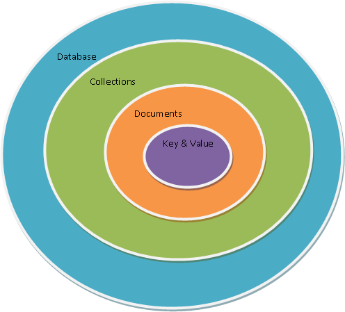
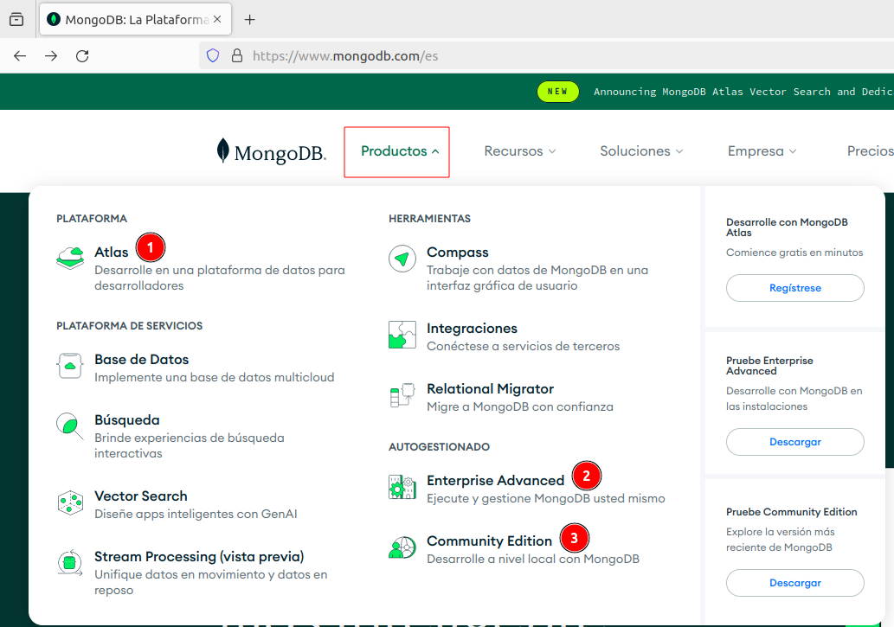
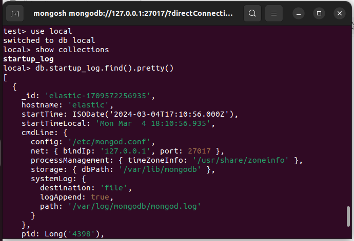

<h1>Almacenamiento de datos. NoSQL</h1>

<h3>Tabla de contenidos</h3>

- [1. Introducción](#1-introducción)
- [2. *MongoDB*](#2-mongodb)
  - [2.1. Características de *MongoDB*](#21-características-de-mongodb)
  - [2.2. Conceptos básicos](#22-conceptos-básicos)
  - [2.3. *BSON*](#23-bson)
  - [2.4. Bases de datos Relacionales vs *MongoDB*](#24-bases-de-datos-relacionales-vs-mongodb)
- [3. Instalación](#3-instalación)
- [4. Primeros pasos con *MongoDB*](#4-primeros-pasos-con-mongodb)
  - [4.1. Trabajando con *MongoDB* desde la consola](#41-trabajando-con-mongodb-desde-la-consola)
  - [4.2. Creación y gestión de Bases de Datos](#42-creación-y-gestión-de-bases-de-datos)
    - [4.2.1. Creación : `use`](#421-creación--use)
    - [4.2.2. Eliminación de base de datos: `db.dropDatabase()`](#422-eliminación-de-base-de-datos-dbdropdatabase)
    - [4.2.3. *MongoDB* Database Tools](#423-mongodb-database-tools)
  - [4.3. Tipos de datos](#43-tipos-de-datos)
- [5. Operaciones con datos CRUD](#5-operaciones-con-datos-crud)
  - [5.1. Insertar :](#51-insertar-)
  - [5.2. Leer:](#52-leer)
  - [5.3. Actualizar:](#53-actualizar)
  - [5.4. Eliminar:](#54-eliminar)
- [6. Diseño de modelado de bases de datos. ***schemaless***](#6-diseño-de-modelado-de-bases-de-datos-schemaless)
  - [6.1. Concepto de ***schemaless***](#61-concepto-de-schemaless)
  - [6.2. Documentos embebidos](#62-documentos-embebidos)
  - [6.3. Documentos referenciados](#63-documentos-referenciados)
- [7. Herramientas visuales para interactuar con *MongoDB*](#7-herramientas-visuales-para-interactuar-con-mongodb)
  - [7.1. *MongoDB* Compass](#71-mongodb-compass)
    - [7.1.1. Instalación](#711-instalación)
    - [7.1.2. Tabajando con *MongoDB* Compass](#712-tabajando-con-mongodb-compass)
  - [7.2. *MongoDB* for VSCode](#72-mongodb-for-vscode)
- [8. Operaciones con datos: Consultas y métodos](#8-operaciones-con-datos-consultas-y-métodos)
  - [8.1. Operadores *MongoDB*](#81-operadores-mongodb)
  - [8.2. Consultas con `.find`. Ejemplos prácticos.](#82-consultas-con-find-ejemplos-prácticos)
    - [8.2.1. Consultas básicas](#821-consultas-básicas)
    - [8.2.2. Consultas con operadores lógicos](#822-consultas-con-operadores-lógicos)
    - [8.2.3. Consultas sobre objetos anidados](#823-consultas-sobre-objetos-anidados)
    - [8.2.4. Consultas con expresiones regulares](#824-consultas-con-expresiones-regulares)
    - [8.2.5. Cursores](#825-cursores)
  - [8.3. Otros métodos interesantes.](#83-otros-métodos-interesantes)
    - [8.3.1. Método `.distinct`](#831-método-distinct)
    - [8.3.2. Método `.count`](#832-método-count)
    - [8.3.3. Método `.aggregate`](#833-método-aggregate)


# 1. Introducción

En el mundo del Big Data, donde la cantidad de datos generados y procesados continúa creciendo exponencialmente, la elección de la tecnología adecuada para almacenar, gestionar y analizar estos datos es fundamental. **MongoDB**, una base de datos NoSQL de código abierto y orientada a documentos, ha emergido como una solución poderosa y versátil en este panorama en constante evolución.

En este apartado exploraremos cómo *MongoDB* se integra perfectamente en los entornos de Big Data, ofreciendo capacidades escalables, flexibles y de alto rendimiento para abordar una variedad de desafíos y escenarios de datos a gran escala. Desde su modelo de datos flexible hasta su capacidad para manejar grandes volúmenes de datos en tiempo real, *MongoDB* se ha convertido en una herramienta indispensable para empresas y organizaciones que buscan aprovechar al máximo sus datos en el mundo del Big Data.

Ya sea que estés involucrado en el desarrollo de aplicaciones, la gestión de datos o el análisis de datos a gran escala, este curso te proporcionará los conocimientos y las habilidades necesarias para aprovechar el poder de *MongoDB* en el emocionante y desafiante mundo del Big Data.


# 2. *MongoDB* 

**MongoDB** es una base de datos NoSQL, de **código abierto** y **orientada a documentos**. En lugar de almacenar datos en tablas, como lo hace una base de datos relacional, **MongoDB** almacena datos en documentos similares a *JSON* con un formato llamado ***BSON*** (*Binary JSON*). *BSON* extiende el formato *JSON* para incluir tipos de datos adicionales como fechas y binarios, lo que lo hace más adecuado para representar datos complejos.

[**MongoDB**](http://www.mongodb.com) es una de las bases de datos NoSQL más conocidas. Sigue un modelo de datos documental,

<div align="center">
    
</div>

> Como curiosidad, su nombre viene de la palabra inglesa humongous, que significa gigantesco/enorme.

*MongoDB* **destaca** porque:

- Soporta **esquemas dinámicos**: diferentes documentos de una misma colección pueden tener atributos diferentes.
- Aunque inicialmente tenía un soporte limitado de **joins**, desde la versión 5.2 se pueden realizar incluso entre colecciones particionadas.
- Soporte de **transacciones** sólo a nivel de aplicación. Lo que en un RDMS puede suponer múltiples operaciones, con *MongoDB* se puede hacer en una sola operación al insertar/actualizar todo un documento de una sola vez, pero si queremos crear una transacción entre dos documentos, la gestión la debe realizar el driver.

*MongoDB* se utiliza ampliamente en una variedad de aplicaciones, incluidas aquellas con grandes volúmenes de datos, cargas de trabajo de alta velocidad y requisitos de flexibilidad de esquema. Es especialmente popular en aplicaciones web y móviles, así como en entornos de Big Data y análisis en tiempo real.


## 2.1. Características de *MongoDB*

Si tuviéramos que resumir a una la principal característica a destacar de *MongoDB*, sin duda esta sería la **velocidad**, que alcanza un **balance perfecto entre rendimiento y funcionalidad** gracias a su sistema de consulta de contenidos. Pero sus características principales no se limitan solo a esto, *MongoDB* cuenta, además, con otras que lo posicionan como el preferido de muchos desarrolladores.

Características principales:

- **Consultas ad hoc**. Con MongoDb podemos realizar todo tipo de consultas. Podemos hacer búsqueda por campos, consultas de rangos y expresiones regulares. Además, estas consultas pueden devolver un campo específico del documento, pero también puede ser una función JavaScript definida por el usuario.
- **Indexación**. El concepto de índices en *MongoDB* es similar al empleado en bases de datos relacionales, con la diferencia de que cualquier campo documentado puede ser indexado y añadir múltiples índices secundarios.
- **Replicación**. Del mismo modo, la replicación es un proceso básico en la gestión de bases de datos. *MongoDB* soporta el tipo de replicación primario-secundario. De este modo, mientras podemos realizar consultas con el primario, el secundario actúa como réplica de datos en solo lectura a modo copia de seguridad con la particularidad de que los nodos secundarios tienen la habilidad de poder elegir un nuevo primario en caso de que el primario actual deje de responder.
- **Balanceo de carga**. Resulta muy interesante cómo *MongoDB* puede escalar la carga de trabajo. *MongoDB* tiene la capacidad de ejecutarse de manera simultánea en múltiples servidores, ofreciendo un balanceo de carga o servicio de replicación de datos, de modo que podemos mantener el sistema funcionando en caso de un fallo del hardware.
- **Almacenamiento de archivos**. Aprovechando la capacidad de *MongoDB* para el balanceo de carga y la replicación de datos, Mongo puede ser utilizado también como un sistema de archivos. Esta funcionalidad, llamada GridFS e incluida en la distribución oficial, permite manipular archivos y contenido.
- **Ejecución de JavaScript del lado del servidor**. *MongoDB* tiene la capacidad de realizar consultas utilizando JavaScript, haciendo que estas sean enviadas directamente a la base de datos para ser ejecutadas.


## 2.2. Conceptos básicos

Hay una serie de conceptos que conviene conocer antes de entrar en detalle:

- *MongoDB* tienen el mismo concepto de base de datos que un RDMS. Dentro de una instancia de *MongoDB* podemos tener 0 o más bases de datos, actuando cada una como un contenedor de alto nivel.
- Una base de datos tendrá 0 o más colecciones. Una colección es muy similar a lo que entendemos como tabla dentro de un RDMS. *MongoDB* ofrece diferentes tipos de colecciones, desde las normales cuyo tamaño crece conforme lo hace el número de documentos, como las colecciones capped, las cuales tienen un tamaño predefinido y que pueden contener una cierta cantidad de información que se sustituirá por nueva cuando se llene.
- Las colecciones contienen 0 o más documentos, por lo que es similar a una fila o registro de un RDMS.
- Cada documento contiene 0 o más atributos, compuestos de parejas clave/valor. Cada uno de estos documentos no sigue ningún esquema, por lo que dos documentos de una misma colección pueden contener todos los atributos diferentes entre sí.

<div align="center">
    
</div>

Así pues, tenemos que una base de datos va a contener varias colecciones, donde cada colección contendrá un conjunto de documentos. Podemos hacer una correspondencia rápida entre bases de datos Relacionales y NoSQL:

<div align="center">
    
    
</div>

Además, *MongoDB* soporta índices, igual que cualquier RDMS, para acelerar la búsqueda de datos. Al realizar cualquier consulta, se devuelve un cursor, con el cual podemos hacer cosas tales como contar, ordenar, limitar o saltar documentos.


## 2.3. *BSON*

*MongoDB* almacena los documentos mediante *BSON* ([Binary JSON](https://bsonspec.org/spec.html)).

Repasemos el concepto de **JSON**: *JavaScript Object Notation*
- Formato de texto sencillo para el intercambio de datos.
- Subconjunto de la notación literal de objetos de JavaScript.
- Alternativa a XML como lenguaje de intercambio de datos. Mucho más sencillo de leer y escribir.
- Uso extendido en bases de datos noSQL, entre ellas *JSON*: JavaScript Object Notation
- Ampliamente soportado por multitud de lenguajes de programación.
- Un objeto *JSON* está formado por uno o varios pares string: value (cadena:valor).
- Soporta diferentes tipos de datos como cadenas de texto, números, fecha, hora, valores nulos y booleanos.

<div align="center">
    
</div>

Mediante JavaScript podemos crear objetos que se representan con *JSON*. Internamente, *MongoDB* almacena los documentos mediante *BSON* ([Binary JSON](https://www.mongodb.com/json-and-bson)). Podemos consultar la especificación en la [web oficial de *BSON*](http://BSONSpec.org) 

**BSON** representa un superset de *JSON* ya que:

- Permite almacenar datos en binario
- Incluye un conjunto de tipos de datos no incluidos en *JSON*, como pueden ser ObjectId, Date o BinData.

Podemos consultar todos los tipos que soporta un objeto *BSON* en (http://docs.mongodb.org/manual/reference/bson-types/)[http://docs.mongodb.org/manual/reference/bson-types/]

Un ejemplo de un objeto *BSON* podría ser:

```js
var yo = {
  nombre: "Aitor",
  apellidos: "Medrano",
  fnac: new Date("Oct 3, 1977"),
  hobbies: ["programación", "videojuegos", "baloncesto"],
  casado: true,
  hijos: 2,
  contacto: {
    twitter: "@aitormedrano",
    email: "a.medrano@edu.gva.es"
  },
  fechaCreacion: new Timestamp()
}
```

Los documentos **BSON** tienen las siguientes restricciones:

- No pueden tener un tamaño superior a 16 MB.
- El atributo `_id` queda reservado para la clave primaria.
- Desde *MongoDB* 5.0 los nombres de los campos pueden empezar por `$` y/o contener el `.`, aunque en la medida de lo posible, es recomendable evitar su uso.

Además *MongoDB*:

- No asegura que el orden de los campos se respete.
- Es sensible a los tipos de los datos
- Es sensible a las mayúsculas.

Por lo que estos documentos son distintos:

```js
{"edad": "18"}
{"edad": 18}
{"Edad": 18}
```

Si queremos validar si un documento *JSON* es válido, podemos usar la web [JSONLint Validator and Formatter](http://jsonlint.com/). Hemos de tener en cuenta que sólo valida *JSON* y no *BSON*, por tanto nos dará errores en los tipos de datos propios de *BSON*.

## 2.4. Bases de datos Relacionales vs *MongoDB*

Aquí tenemos un esquema de los elementos de una base de datos representada tanto por un sistema relacional tradicional, frente a la misma estructura con una base de datos en *MongoDB*

Primero la base de datos relacional

<div align="center">
    
</div>

y ahora la misma representación en *MongoDB*

<div align="center">
    
</div>

# 3. Instalación

En la actualidad, *MongoDB* se como base de datos en tres productos diferentes más un conglomerado de servicios y herramientas que complementas a la base de datos.

<div align="center">
    
</div>

1. **Mongo Atlas**, como plataforma cloud, con una opción gratuita mediante un cluster de 512MB.
2. **MongoDB Enterprise Advanced**, versión de pago con soporte, herramientas avanzadas de monitorización y seguridad, y administración automatizada.
3. **MongoDB Community Edition**, versión gratuita para trabajar on-premise, con versiones para Windows, MacOS y Linux. *Nosotros de momento trabajaremos con esta versión*

Para la instalación de **MongoDB Community Edition** en un sistema Ubuntu vamos a proceder tal y como se espedifica en la propia web de **mongodb**. [Install *MongoDB* Community Edition](https://www.mongodb.com/docs/manual/tutorial/install-mongodb-on-ubuntu/#install-mongodb-community-edition) 

Realizaremos los siguientes pasos:

```bash
# Requisitos previos
sudo apt-get install gnupg curl                   # Requisitos previos

# Importar claves públicas GPG de MongoDB
curl -fsSL https://www.mongodb.org/static/pgp/server-7.0.asc | sudo gpg -o /usr/share/keyrings/mongodb-server-7.0.gpg --dearmor

# añadir las fuentes
echo "deb [ arch=amd64,arm64 signed-by=/usr/share/keyrings/mongodb-server-7.0.gpg ] https://repo.mongodb.org/apt/ubuntu jammy/mongodb-org/7.0 multiverse" | sudo tee /etc/apt/sources.list.d/mongodb-org-7.0.list

# recargar paquetes
sudo apt-get update

# e instalar
sudo apt-get install -y mongodb-org
```

Con esto ya tenemos *MongoDB* instalado en nuestro sistema.

Ahora nos falta ponerlo en marcha, para ello habilitamos e iniciamos el servicio

```bash
# recargamos los nuevos servicios
sudo systemctl daemon-reload

# Habilitamos el servicios (esto es opcional, solo si queremos que se inicie al arrancar el equipo)
sudo systemctl enable mongod

# Iniciamos el servicio
sudo systemctl start mongod

# Comprobamos que el servicio se ha iniciado correctamente
sudo systemctl status mongod
```
<div align="center">
    
</div>

Mediante el siguiente comando también verificamos que esta activa y su versión. 

```bash
mongod --version                                  # Comprobamos la versión
```

<div align="center">
    
</div>


> **Nota**: *MongoDB* también lo podemos instalar descargando el paquete .deb desde la web de *MongoDB*, pero suele dar mas problemas que con la instalación presentada

Independientemente de nuestro sistema operativo, por defecto, el demonio se lanza sobre el puerto 27017. Una vez instalado, si accedemos a [http://localhost:27017](http://localhost:27017) podremos ver que nos indica cómo estamos intentando acceder mediante HTTP a *MongoDB* mediante el puerto reservado al driver nativo.

<div align="center">
    
</div>

En vez de instalarlo como un servicio en nuestra máquina, a día de hoy, es mucho más cómodo hacer uso de contenedores Docker o utilizar una solución cloud, aunque nosotros por simplicidad, de momento, realizaremos una instalación tradicional.

Al versión de **Mongo Atlas** nos ofrece de manera gratuita un cluster compartido de servidores con 3 nodos y 512 MB para datos. Si queremos una solución serverless o un servidor dedicado, ya tendremos que pasar por caja.

# 4. Primeros pasos con *MongoDB*

Una vez instalada la base de datos, vamos a interactuar desde su propia consola.

## 4.1. Trabajando con *MongoDB* desde la consola

Para acceder a la consola de *MongoDB* escribimos:

```bash
mongosh
```
<div align="center">
    
</div>

Algunas de las operaciones básicas que podemos realizar son : 

- Salir de la consola (`quit()` o pulsando Ctrl+C)
- Limpiar la consola (Ctrl+L)
- Listar las bases de datos (`show dbs`)
- Cambiarse de base de datos (`use <dbname>`)
- Listar las colecciones de una base de datos (`show collections` / `show tables`)

<div align="center">
    
</div>

- Mostrar el nombre de la base de datos (`db.getName()` o `db`)
- Listar metadata sobre una base de datos (`db.stats()`)
- Solicitar ayuda sobre comandos (`db.help()`)
- Mostrar información sobre el servidor (`db.hostInfo()`)
- Mostrar fecha y hora del sistema (`Date()`)
- Dar formato *JSON* (`db.<collectionName>.find().pretty()`)

<div align="center">
    
</div>

Observar que al poner `.pretty()` al final, hace que la salida tenga un formato fácilmente reconocible, aunque hay ocasiones que la salida por defecto ya viene con esta método.

<div align="center">
    
</div>

Observa también que hay un diferencia entre invocar la función con los paréntesis `()`:

<div align="center">
    
</div>

## 4.2. Creación y gestión de Bases de Datos

### 4.2.1. Creación : `use`

El comando para crear una base de datos es el mismo que visto anteriormente para cambiar de base de datos: `use`

Así pues si intentamos entrar en una base de datos que no existe, directamente la prueba

Hasta que no insertes al menos un documento en una de sus colecciones, no estará disponible. Esto lo podemos hacer en el siguiente ejemplo:

<div align="center">
    
</div>

Todo esto es debido a que *MongoDB* planifica la existencia de una base de datos, pero hasta que no tenga su primer dato, no va a designar ningún tipo de recursos a la misma. En la captura anterior, se ve que ya le ha asignado 8 KiB a nuestra primera base de datos porque ya tiene algún dato.

Por otra parte, para la creación de una colección e inclusión de un documento en concreto, observar que simplemente al insertar el documento, si la colección no existe, la crea directamente, de la misma forma que ha hecho con la base de datos.

Más adelante ya veremos con más detenimiento las diferentes forma de insertar registro en un tabla (colección), de momento hemos usando el comando:

```js
db.primeraColeccion.insertOne({ id: 1, nombre: 'sergio' })
```

### 4.2.2. Eliminación de base de datos: `db.dropDatabase()`

Para eliminar una base de datos, en primer lugar debemos estar ubicados dentro de la propia base de datos a eliminar y ahí ejecutamos el comando 

```js
db.dropDatabase()
```

Podemos hacer uso de los comandos `use` y `db` para pasar ubicarnos en una base de datos y comprobar que efectivamente lo estamos, aunque en el prompt de la propia shell de *MongoDB* directamente ya nos dice que estamos ahí.

<div align="center">
    
</div>


### 4.2.3. *MongoDB* Database Tools

Además del propio servidor de *MongoDB* y el cliente para conectarse a él, *MongoDB* ofrece un conjunto de herramientas para interactuar con las bases de datos, permitiendo crear y restaurar copias de seguridad.

Si estamos interesados en introducir o exportar una colección de datos mediante *JSON*, podemos emplear los comandos `mongoimport` y `mongoexport`:

```bash
mongoimport -d nombreBaseDatos -c coleccion –-file nombreFichero.json
mongoexport -d nombreBaseDatos -c coleccion nombreFichero.json
```

Estas herramientas interactúan con datos *JSON* y no sobre toda la base de datos.

Un caso particular y muy común es importar datos que se encuentran en formato *CSV/TSV*. Para ello, emplearemos el parámetro -`-type csv`:

```bash
mongoimport --type tsv -d test -c poblacion --headerline --drop poblacionEspanya2013.tsv
```

En vez de realizar un *export*, es más conveniente realizar un ***backup*** en binario mediante `mongodump`, el cual genera ficheros *BSON*. Estos archivos posteriormente se restauran mediante `mongorestore`:

```bash
mongodump -d nombreBaseDatos nombreFichero.bson
mongorestore -d nombreBaseDatos nombreFichero.bson
```

Si necesitamos transformar un fichero *BSON* a *JSON* (de binario a texto), tenemos el comando `bsondump`:

```bash
bsondump file.bson > file.json
```

Más información sobre copias de seguridad en la documentación oficial de [MongoDB: *MongoDB* Backup Methods ](https://www.mongodb.com/docs/manual/core/backups/).

Para poder trabajar con *MongoDB* desde cualquier aplicación necesitamos un driver. *MongoDB* ofrece drivers oficiales para casi todos los lenguajes de programación actuales. En una sesión posterior trabajaremos con PyMongo.

En cuanto a la **monitorización**, tanto `mongostat` como `mongotop` permiten visualizar el estado del servidor *MongoDB*, así como algunas estadísticas sobre su rendimiento. Si trabajamos con *MongoAtlas* estas herramientas están integradas en las diferentes herramientas de monitorización de la plataforma.

En versiones anteriores, una herramienta de terceros bastante utilizada era *RoboMongo* / *Robo3T* / *Studio3T* el cual extiende el shell y ofrece un IDE más amigable. A días de hoy, *MongoDB* tiene su propio IDE conocido como [MongoDB Compass](#71-mongodb-compass) que veremos más adelante.

## 4.3. Tipos de datos 

Aquí tienes una lista de algunos tipos de datos comunes en *MongoDB*, junto con ejemplos de cómo se representan en formato de tabla:

| Tipo de Datos  | Descripción                             | Ejemplo                                |
|----------------|-----------------------------------------|----------------------------------------|
| String         | Cadena de texto                         | "Hello World"                          |
| Number         | Número                                  | 42                                     |
| Boolean        | Valor booleano (true/false)             | true                                   |
| Date           | Fecha y hora                            | ISODate("2024-03-01T12:00:00.000Z")   |
| Array          | Array de valores                        | [1, 2, 3]                              |
| Object         | Objeto o documento anidado              | {"nombre": "Juan", "edad": 30}        |
| ObjectId       | Identificador único de documento        | ObjectId("61e4c3055b17967d02a9c3d7")  |
| Null           | Valor nulo                              | null                                   |
| BinData             | Datos binarios                              | BinData(0, "ABC123==")                     |
| Regular Expressions | Expresiones regulares                       | /pattern/g                                 |

Recuerda que *MongoDB* es una base de datos NoSQL orientada a documentos, por lo que no tiene una estructura de tabla como las bases de datos relacionales. En *MongoDB*, los datos se almacenan en documentos *BSON* (Binary *JSON*), que pueden contener campos con diferentes tipos de datos, incluidos los mencionados anteriormente.

Es importante destacar que en *MongoDB*, los datos binarios y las expresiones regulares se representan de manera especial. Los datos binarios se representan mediante el tipo `BinData`, que incluye un tipo y una cadena de datos codificados en *base64*. Las expresiones regulares se representan utilizando el formato `/pattern/flags`, donde `pattern` es el patrón de la expresión regular y `flags` son los modificadores de la expresión regular, como `i` para ignorar mayúsculas y minúsculas o `g` para realizar una búsqueda global.


Aquí tienes un ejemplo de cómo se podría representar un documento en *MongoDB* utilizando algunos de estos tipos de datos:

```js
{
  "_id": ObjectId("61e4c3055b17967d02a9c3d7"),
  "nombre": "Juan",
  "edad": 30,
  "activo": true,
  "intereses": ["programación", "música", "viajes"],
  "ubicacion": {
    "ciudad": "Barcelona",
    "pais": "España"
  },
  "fechaRegistro": ISODate("2024-03-01T12:00:00.000Z"),
  "comentarios": [
    {
      "usuario": "Ana",
      "texto": "¡Hola Juan!"
    },
    {
      "usuario": "Carlos",
      "texto": "Saludos desde Xàtiva."
    }
  ]
}
```

<div align="center">
    
</div>


En este ejemplo, que ya hemos visto previamente para ilustrar qué es un *BSON*, el documento representa un usuario con campos como nombre, edad, activo, intereses, ubicación, fecha de registro y comentarios. Cada campo tiene un tipo de datos diferente, como string, number, boolean, array, object, date, etc.

Más información sobre tipos de datos en [tutorialspoint *MongoDB*  - Datatypes](https://www.tutorialspoint.com/mongodb/mongodb_datatype.htm)


# 5. Operaciones con datos CRUD

En *MongoDB* , las operaciones **CRUD** (*Crear*, *Leer*, *Actualizar*, *Eliminar*) se realizan utilizando métodos específicos. Aquí te muestro cómo realizar cada una de estas operaciones.

Antes de comenzar a trabajar, debemos entrar en una de las bases de datos con `use` y en todo momento podemos ver las colecciones que tenemos en esta base de datos con `use collections` 

## 5.1. Insertar :

Para insertar documentos en una colección, se utiliza el método `insertOne()` o `insertMany()`.

- `db.collectionName.insertOne(<json>);`: Inserta un solo documentos


Ejemplos

```javascript
// Insertar un solo documento en la colección "usuarios"
db.usuarios.insertOne({
    nombre: "Juan",
    edad: 30,
    ciudad: "Barcelona"
});

// En un única línea, y con comillas dobles, también... 
db.usuarios.insertOne({ nombre: "Toni", edad: 15, ciudad: "Valencia"});

// Insertar un solo documento en la colección "usuarios"
db.usuarios.insertOne({
    nombre: "Juan",
    edad: 30,
    ciudad: "Barcelona",
    intereses: ["fútbol", "música"],
    direccion: { calle: "Calle Mayor", numero: 123 },
    fechaRegistro: new Date(),
    activo: true
});


// Insertar un documento con la fecha actual. Ojo con el último campo
db.usuarios.insertOne({
    nombre: "Dorotea",
    fecha: new Date(),
    lugar: "Xàtiva"
});

// Insertar un documento con una fecha específica 
// con campos que antes no estaban 
// poniendo los campos entre comillas, que es totalmente indiferente
// pero si ponemos los número entre comillas se convierten en texto
db.usuarios.insertOne({
    "nombre": "Filiberto",
    "edad" : "33",
    "fechaNacimiento": new Date("2004-03-15"),
    "ciudad": "Alacant"
});
```

Cuando hacemos una inserción, nos devuelve el resultado del tipo

```js
{
  acknowledged: true,
  insertedId: ObjectId('65e818360ad094ed2ab24245')
}
```


- `db.collectionName.insertMany(<json>);`. Inserción de varios elementos.
Como se trata de una inserción de un conjunto de documentos, lo que hacemos en pasar un **array** y esto se hace mediante el uso de ***corchetes*** : `[]`.

Ejemplos: 

```javascript
// Insertar varios documentos en la colección "usuarios"
db.usuarios.insertMany([
    { nombre: "Ana", edad: 25, ciudad: "Madrid" },
    { nombre: "Carlos", edad: 35, ciudad: "Valencia" }
]);

// Insertar varios documentos en la colección "usuarios"
db.usuarios.insertMany([
    { nombre: "Ana", edad: 25, ciudad: "Madrid", intereses: ["viajes"], fechaRegistro: new Date(), activo: false },
    { nombre: "Carlos", edad: 35, ciudad: "Valencia", intereses: ["lectura"], fechaRegistro: new Date(), activo: true }
]);
```
Observar cómo trabajar con fechas

## 5.2. Leer:

Uno de los aspectos más interesantes de las bases de datos es la capacidad para realizar consultas, por lo que ahora vamos a ver de forma muy breve como leer datos, pero más adelante profundizaremos en la realización de consultas más elaboradas.

Para leer datos de una colección, se utiliza el método `find()`.

```javascript
// Leer todos los documentos de la colección "usuarios"
db.usuarios.find();

// Leer todos los documentos de la colección "usuarios" y formatear la salida json
db.usuarios.find().pretty();

// Leer documentos que coincidan con un criterio específico
db.usuarios.find({ ciudad: "Barcelona" });

// Leer documentos que coincidan con un criterio específico (por ejemplo, ciudad igual a "Barcelona" y activo igual a true)
db.usuarios.find({ ciudad: "Barcelona", activo: true });

// Leer documentos con proyección (seleccionar campos específicos)
db.usuarios.find({}, { nombre: 1, edad: 1 });

// Leer documentos con proyección (seleccionar campos específicos)
db.usuarios.find({}, { nombre: 1, edad: 1, _id: 0 });

// Leer todos los eventos que ocurrieron después de una fecha específica
db.eventos.find({ fecha: { $gt: new Date("2024-01-01") } });

// Leer eventos que ocurrieron en un rango de fechas
db.eventos.find({ fecha: { $gte: new Date("2024-01-01"), $lte: new Date("2024-12-31") } });
```

> **Nota**: No profundizamos más en las búsquedas porque más adelante dedicaremos un punto completo a explicar las búsquedas en más profundidad.

## 5.3. Actualizar:

Para actualizar documentos en una colección, se utiliza el método `updateOne()` o `updateMany()`.

- `db.collection.updateOne(<filter>, <update>)`

El método `updateOne()` se utiliza para actualizar un solo documento que coincida con un criterio específico. Si hay varios documentos que coinciden con el criterio, solo se actualizará el primero que se encuentre.

En la clausula de actualización tenemos el comando `$set`. Además debemos tener en cuenta que tanto el `<filter>` como la `<update>` son json por lo que deben estar comprendidos entre corchetes:

```js
db.collection.updateOne({}, {$set:{}});
```

Veamos algunos ejemplos

```javascript
// Ejemplo de updateOne()
db.usuarios.updateOne(
    { nombre: "Juan" },
    { $set: { edad: 31 } }
);

// Cambiamos más de un valor
db.usuarios.updateOne(
    { nombre: "Juan" },
    { $set: { edad: 31, ciudad: 'Albacete' } }
);

// Actualizar la fecha de un evento específico
db.usuarios.updateOne(
    { nombre: "Alberto" },
    { $set: { fechaRegistro: new Date("2024-03-20") } }
);
```
En el primer ejemplo, se actualizará el primer documento de la colección "usuarios" que tenga el campo `nombre` igual a "Juan". Si hay varios documentos con ese nombre, solo se actualizará uno.

Una vez realizada la actualización, *MongoDB* avisa: 

```js
{
  acknowledged: true,
  insertedId: null,
  matchedCount: 1,
  modifiedCount: 1,
  upsertedCount: 0
}
```

- `db.collection.updateMany(<filter>, <update)`

Por otro lado, el método `updateMany()` se utiliza para actualizar múltiples documentos que coincidan con un criterio específico. Todos los documentos que cumplan el criterio serán actualizados.

```javascript
// Ejemplo de updateMany()
db.usuarios.updateMany(
    { ciudad: "Játiva" },
    { $set: { ciudad: "Xàtiva" } }
);
```

En este ejemplo, se actualizarán todos los documentos de la colección "usuarios" que tengan el campo `ciudad` igual a "Játiva", estableciendo su valor a "Xàtiva".

O sea, `updateOne()` es útil cuando solo quieres actualizar un único documento, mientras que `updateMany()` es útil cuando necesitas actualizar múltiples documentos que cumplan un criterio específico.


- `db.collection.replaceOne(<filter>, <update>)`

Reemplazo completo de un documento. En este caso, al reemplazar el documento que encontramos por una nuevo, no necesitamos el comando `$set`

Ejemplos

```js
db.usuarios.replaceOne(
    { nombre: "Alberto" },
    {     
        nombre: "Alberto D.",
        edad: 18,
        ciudad: "Xàtiva",
        intereses: ["Baloncesto", "Informática"],
        fechaRegistro: new Date(),
        activo: true 
    }
);
```

En este caso, vamos a ver su ejecución, donde veremos incluso que al cambiar el nombre, este campo también cambia aunque se el utilizado para hacer la búsqueda:

<div align="center">
    
</div>

## 5.4. Eliminar:

Para eliminar documentos de una colección, se utiliza el método `deleteOne()` o `deleteMany()`.

En *MongoDB*, tanto `deleteOne()` como `deleteMany()` son métodos utilizados para eliminar documentos de una colección. Aquí tienes las diferencias entre ellos:

- `deleteOne()`

El método `deleteOne()` se utiliza para eliminar un solo documento que coincida con un criterio específico. **Si hay varios documentos** que coinciden con el criterio, **solo se eliminará el primero** que se encuentre.

```javascript
// Ejemplo de deleteOne()
db.usuarios.deleteOne({ nombre: "Juan" });
```

En este ejemplo, se eliminará el primer documento de la colección "usuarios" que tenga el campo `nombre` igual a "Juan". Si hay varios documentos con ese nombre, solo se eliminará uno.

`deleteMany()`

Por otro lado, el método `deleteMany()` se utiliza para eliminar varios documentos que coincidan con un criterio específico. Todos los documentos que cumplan el criterio serán eliminados.

```javascript
// Ejemplo de deleteMany()
db.usuarios.deleteMany({ activo: false });
```
En este ejemplo, se eliminarán todos los documentos de la colección "usuarios" que tengan el campo `activo` igual a false.

Otros ejemplos

```javascript
// Eliminar varios documentos que cumplan el criterio especificado
db.usuarios.deleteMany({ ciudad: "Xàtiva" });

// Eliminar eventos que ocurrieron antes de una fecha específica
db.eventos.deleteMany({ fecha: { $lt: new Date("2024-03-01") } });

```

**Cuidado**. Como siempre debemos tener cuidad a la hora de borrar, de echo si hacemos 

```js
db.usuarios.deleteMany({});
```
Nos borrará **todos** los documentos de la colección.

> **Nota**: Siempre se debe pasar un json dentro de la condición, o sea, dentro de los paréntesis deben haber llaves:
> ```js
> db.usuarios.deleteMany();     //error
> db.usuarios.deleteMany({});   //correcto: json vacío
> ```

# 6. Diseño de modelado de bases de datos. ***schemaless***

## 6.1. Concepto de ***schemaless***

El término ***schemaless*** (sin esquema) se refiere a la capacidad de una base de datos para manejar datos sin una estructura fija predefinida. En el contexto de *MongoDB*, esto significa que no estás obligado a definir un esquema estricto para tus datos antes de comenzar a almacenarlos. En lugar de eso, los datos se almacenan en documentos *BSON* (Binary *JSON*), y estos documentos pueden tener una estructura flexible y pueden variar de un documento a otro dentro de la misma colección.

A continuación, profundicemos en algunos aspectos clave del concepto de *schemaless* en *MongoDB*:

- **Flexibilidad de estructura**: Los documentos en *MongoDB* pueden contener diferentes campos y tipos de datos. No es necesario que todos los documentos en una colección tengan la misma estructura. Esto permite adaptarse fácilmente a cambios en los requisitos de la aplicación sin tener que modificar un esquema centralizado.

-  **Adición dinámica de campos**: En *MongoDB*, puedes agregar campos a un documento en cualquier momento sin afectar a otros documentos en la misma colección. Esto significa que puedes manejar datos evolutivos donde la estructura de los documentos puede cambiar con el tiempo.

-  **Consulta sin restricciones**: Dado que no hay un esquema fijo que imponga restricciones sobre la estructura de los datos, las consultas en *MongoDB* pueden ser más flexibles. Puedes realizar consultas sobre cualquier campo en cualquier documento, incluso si esos campos no están presentes en todos los documentos de la colección.

-  **Evita la migración de esquemas**: En las bases de datos tradicionales con esquemas fijos, los cambios en el esquema requieren migraciones de datos costosas. Con *MongoDB*, puedes evitar este problema ya que no hay un esquema centralizado que necesite ser modificado.

-  **Agilidad en el desarrollo**: La falta de un esquema fijo permite una mayor agilidad en el desarrollo de aplicaciones, ya que puedes iterar rápidamente y ajustar el modelo de datos según sea necesario sin tener que preocuparte por actualizar un esquema centralizado.

-  **Rendimiento**: La flexibilidad del modelo de datos *schemaless* puede traducirse en un mejor rendimiento en ciertos casos, ya que elimina la necesidad de realizar un join de datos dispersos en múltiples tablas, como suele ocurrir en bases de datos relacionales.

A pesar de las ventajas de un modelo de datos *schemaless*, es importante tener en cuenta que esto también puede presentar **desafíos**, especialmente en términos de **mantener la coherencia y la integridad de los datos**. Por lo tanto, es crucial diseñar cuidadosamente la base de datos y utilizar prácticas como la validación de datos y la indexación adecuada para garantizar un rendimiento óptimo y la integridad de los datos en aplicaciones *MongoDB*.

Observar la diferencia que tenemos en el diseño de la bases de datos relacionales con las NoSQL como lo vimos anteriormente

## 6.2. Documentos embebidos

El concepto de embebido hace referencia a guardar una *‘cosa’* dentro de otra *‘cosa’*. En este caso, guardar un documento *JSON* dentro de
otro como valor de una de sus propiedades.

Por ejemplo, supongamos que tenemos una colección que guarda datos sobre cursos que se están impartiendo, en una base de datos relacional serían dos tablas, pero en *MongoDB* lo hacemos en una única colección:

```js
{
    id: 1,
    referencia: 'C0001',
    nombre: 'Curso de especialización de Inteligencia Artificial y Big Data',
    fechaInicio: new Date("2023-10-01"),
    activo: true,
    asignaturas: [
        {
            codAsig: 101,
            nombre: 'Sistemas de Big Data',
            horasSemana: 3,
            profesores: [
                {
                    codProf: 302,
                    nombre: 'Sergio Rey',
                    rol: 'Profesor'
                },
                {
                    codProf: 901,
                    nombre: 'Jorge Soro',
                    rol: 'Especialista'
                }
            ]
        },
        {
            codAsig: 102,
            nombre: 'Big Data aplicado',
            horasSemana: 3,
            profesores: [
                {
                    codProf: 301,
                    nombre: 'Nacho Pachés',
                    rol: 'Profesor'
                },
                {
                    codProf: 901,
                    nombre: 'Jorge Soro',
                    rol: 'Especialista'
                }
            ]
        }
    ],
    alumnos: []
}
```


## 6.3. Documentos referenciados

El concepto ***referenciado***  a diferencia de los documentos embebidos, en un documento *JSON* se guarda solo el valor de una o varias propiedades, en lugar del documento completo.

Normalmente, se guarda el valor de una propiedad que identifica unívocamente, al documento referenciado: por ejemplo en el caso anterior podríamos tener: 

```js
{
    id: 1,
    referencia: 'C0001',
    nombre: 'Curso de especialización de Inteligencia Artificial y Big Data',
    fechaInicio: new Date("2023-10-01"),
    activo: true,
    asignaturas: [ 101, 102],
    alumnos: []
}
```

En este caso, las asignaturas se referéncian mediante el código de identificación, en lugar de guardar en el *JSON* todos los datos. De esta forma es similar al adoptado por las bases de datos relacionales.


Esto plantea varias ventajas y desventajas:

Así pues en los **documentos embebidos** tenemos:
- Ventajas
  - Al recuperar un curso, podemos traernos toda la información relacionada en otras colecciones (p.e. asignaturas)
- Desventajas:
  - Al hacer consultas sobre la colección externa (cursos), si uno de los criterios afecta a la información de los documentos embebidos, el tiempo para realizar dicha consulta se verá incrementando.
  - Las actualizaciones serán más costosas si alguna de las propiedades a actualizar pertenece al documento embebido.

Mientras que en los **documentos referenciados**
- Ventajas
  - Las consultas sobre la colección principal y las relacionadas se ejecutará más rápido.
  - Al actualizar información relacionada, se hace directamente en sus documentos sin tener que revisar la colección externa.
- Desventajas:
  - Al recuperar un curso, habrá que consultar los identificadores que relacionan a los documentos en otras colecciones y hacer consultas adicionales para obtener la información relacionada.


Entonces ***¿Qué diseño elegir?***

Dependerá de:
- Cómo se quiere almacenar la información.
- la naturaleza y el contexto de las aplicaciones que vayan a consumir la información.
- Las preferencias de roles como arquitectos de software y de bases de datos teniendo en cuenta factores futuros como la escalabilidad en cuanto a volumen de datos, usuarios / aplicaciones y sus formas de acceder a la información, etc.


# 7. Herramientas visuales para interactuar con *MongoDB* 

Hemos visto cómo interactuar con *MongoDB* desde la consola que nos ofrece la base de datos, pero para interactuar de una forma más flexible e intuitiva existen herramientas visuales que nos facilitan el trabajo diario con *MongoDB*

## 7.1. *MongoDB* Compass

Una de ellas es *MongoDB* Compass, que facilita la exploración y manipulación de los datos. De una manera flexible e intuitiva, Compass ofrece visualizaciones detalladas de los esquemas, métricas de rendimiento en tiempo real así como herramientas para la creación de consultas.

Existen tres versiones de Compass, una completa con todas las características, una de sólo lectura sin posibilidad de insertar, modificar o eliminar datos (perfecta para analítica de datos) y una última versión isolated que solo permite la conexión a una instancia local.

Enlace a la documentación oficial de *MongoDB* Compass: [What is *MongoDB* Compass?](https://www.mongodb.com/docs/compass/current/)

### 7.1.1. Instalación

Siguiendo los pasos ofrecidos por la propia web de *MongoDB*, para la instalación de *MongoDB* Compass en Ubuntu seguimos los siguientes pasos:

```bash
# Download *MongoDB* Compass
wget https://downloads.mongodb.com/compass/mongodb-compass_1.40.4_amd64.deb

# Install *MongoDB* Compass
sudo dpkg -i mongodb-compass_1.40.4_amd64.deb

# Start *MongoDB* Compass
mongodb-compass
```

Si hacemos caso a lo que nos dicen en la guía, directamente instalamos la última versión estable.

<div align="center">
    
</div>

### 7.1.2. Tabajando con *MongoDB* Compass

Al iniciar la aplicación, la primera vez nos ofrece conectarnos a la base de datos local. También nos podemos conectar a una base de datos remota e incluso a [Mongo Atlas](https://www.mongodb.com/es/atlas), que como se comentó es la base de datos que ofrece *MongoDB* en la nube.

Una vez conectados a la base de datos, vemos todas las bases de datos exitentes. En la parte inferior tenemos una consola donde podemos actuar de la misma forma que lo hicimos anteriormente.

<div align="center">
    
</div>

Dentro de una base de datos, podemos acceder a las colecciones, listar los documentos, y realizar todo tipo de operaciones sobre los mismos:

<div align="center">
    
</div>

Así como operaciones específicas sobre documentos en concreto. Si nos colocamos con el ratón sobre un documento aparecen cuatro opciones, para *editar*, *copiar,*, *duplicar* y *borrar* el documento. Haciendo doble click, también lo editamos.

Tenemos varias opciones sobre la base de datos, incluso podemos hacer consultas.

<div align="center">
    
</div>

En la imagen:
1. Dentro de una colección, seleccionamos la pestaña de `schema`
2. Introducimos el filtro a buscar
3. Obtenemos el detalle de los datos de los documentos obtenidos
4. Tenemos un histórico de todas las búsquedas realizadas


## 7.2. *MongoDB* for VSCode

También podemos utilizar la extensión que lleva VSCode para trabajar con *MongoDB*.

Para su **instalación**

Si no disponemos de VSCode:
- podemos instalarlo siguiendo los pasos de la propia web de Microsoft: [Visual Studio Code on Linux](https://code.visualstudio.com/docs/setup/linux#_debian-and-ubuntu-based-distributions)
- si tenemos la versión completa de Ubuntu, la podemos instalar desde el gestor de aplicaciones:

<div align="center">
    
    
</div>

Una vez instalado VSCode, instalamos la extensión de *MongoDB* for VS Code, aqui seguimos los pasos de la web oficial donde tenemos cómo instalar y configurar la conexión: [VSCode: Working with MongoDB](https://code.visualstudio.com/docs/azure/mongodb). Para la conexión, pulsamos sobre el botón de *Advanced* y la conexión es sencilla

<div align="center">
        
    
</div>

Una vez conectados, podremos recorrer las colecciones con los datos así como utilizar un *playground* para interactuar de manera similar al shell:

<div align="center">
        
    
</div>

Realmente, esta extensión este pensada para trabajar con opciones avanzadas, como crear índices, generar código en lenguajes como *javascript*, *python* o cualquier otro para realizar todo tipo de operaciones en *MongoDB*, o crear variables con datos y estos utilizarlos en nuestras operaciones. Para más información en la web de la extension: [MongoDB for VS Code. *MongoDB* Without Leaving Your IDE](https://www.mongodb.com/products/tools/vs-code)


# 8. Operaciones con datos: Consultas y métodos

Ahora que ya tenemos más herramientas y hemos visto las operaciones básicas de *MongoDB* vamos a profundizar sobre las consultas de los datos, aunque ya las hemos visto brevemente con anterioridad.

Aprovechamos para introducir una base de datos con una colección con datos de prueba. En el siguiente [enlace](https://www.w3resource.com/mongodb-exercises/mongodb-sample-dataset/sample_mflix/movies.zip) tenemos una base de datos de películas que podemos introducir en *MongoDB* por ejemplo usando en *MongoDB* Compass. Para ello creamos una base de datos llamada **consultas** e importamos el fichero descargado.

El comando básico es `.find()`

```js
db.collection.find()            // devuelve todos los documentos
db.collection.find(<filter>)    // devuelve los documentos que cumplen el filtro
```

## 8.1. Operadores *MongoDB*

Antes de continuar, en la siguiente tabla esta el listado de los principales operadores utilizados en consultas *MongoDB* para la construcción de los filtros:

| Operador    | Descripción                                  | Ejemplo                                   |
|-------------|----------------------------------------------|-------------------------------------------|
| `$eq`       | Igualdad                                     | `db.collection.find({campo: {$eq: valor}})` |
| `$ne`       | No igual                                     | `db.collection.find({campo: {$ne: valor}})` |
| `$gt`       | Mayor que                                    | `db.collection.find({campo: {$gt: valor}})` |
| `$gte`      | Mayor o igual que                            | `db.collection.find({campo: {$gte: valor}})` |
| `$lt`       | Menor que                                    | `db.collection.find({campo: {$lt: valor}})` |
| `$lte`      | Menor o igual que                            | `db.collection.find({campo: {$lte: valor}})` |
| `$in`       | Igual a cualquiera de los valores en un array | `db.collection.find({campo: {$in: [valor1, valor2]}})` |
| `$nin`      | No igual a ninguno de los valores en un array| `db.collection.find({campo: {$nin: [valor1, valor2]}})` |
| `$exists`   | Verifica si el campo existe                 | `db.collection.find({campo: {$exists: true/false}})` |
| `$type`     | Verifica el tipo de datos del campo         | `db.collection.find({campo: {$type: tipo}})` |
| `$regex`    | Realiza una búsqueda de expresión regular   | `db.collection.find({campo: {$regex: /patrón/}})` |
| `$or`       | Realiza una disyunción lógica               | `db.collection.find({$or: [{condición1}, {condición2}]})` |
| `$and`      | Realiza una conjunción lógica               | `db.collection.find({$and: [{condición1}, {condición2}]})` |
| `$not`      | Niega una expresión                          | `db.collection.find({campo: {$not: {condición}}})` |
| `$nor`      | Realiza una disyunción negada               | `db.collection.find({$nor: [{condición1}, {condición2}]})` |

Estos operadores son fundamentales para realizar consultas avanzadas en *MongoDB*, permitiendo filtrar y buscar documentos en función de diferentes criterios. Puedes combinar estos operadores para construir consultas complejas y poderosas que se adapten a tus necesidades específicas.


## 8.2. Consultas con `.find`. Ejemplos prácticos.

Utilizando la tabla de *movies* vamos a realizar algunas consultas que servirán para ilustrar los aspectos más interesantes de las búsquedas en *MongoDB*. 

Veamos en primer lugar un registro tipo

```js
{
  "_id": {
    "$oid": "573a1390f29313caabcd4135"
  },
  "plot": "Three men hammer on an anvil and pass a bottle of beer around.",
  "genres": [
    "Short"
  ],
  "runtime": 1,
  "cast": [
    "Charles Kayser",
    "John Ott"
  ],
  "num_mflix_comments": 1,
  "title": "Blacksmith Scene",
  "fullplot": "A stationary camera looks at a large anvil with a blacksmith behind it and one on either side. The smith in the middle draws a heated metal rod from the fire, places it on the anvil, and all three begin a rhythmic hammering. After several blows, the metal goes back in the fire. One smith pulls out a bottle of beer, and they each take a swig. Then, out comes the glowing metal and the hammering resumes.",
  "countries": [
    "USA"
  ],
  "released": {
    "$date": {
      "$numberLong": "-2418768000000"
    }
  },
  "directors": [
    "William K.L. Dickson"
  ],
  "rated": "UNRATED",
  "awards": {
    "wins": 1,
    "nominations": 0,
    "text": "1 win."
  },
  "lastupdated": "2015-08-26 00:03:50.133000000",
  "year": 1893,
  "imdb": {
    "rating": 6.2,
    "votes": 1189,
    "id": 5
  },
  "type": "movie",
  "tomatoes": {
    "viewer": {
      "rating": 3,
      "numReviews": 184,
      "meter": 32
    },
    "lastUpdated": {
      "$date": "2015-06-28T18:34:09Z"
    }
  }
}
```

Comenzamos con consultas sencillas y vamos incrementando el nivel.

### 8.2.1. Consultas básicas

- Obtener películas lanzadas en el año 1983:

```js
db.movies.find({ year: 1893 })
``` 

- Buscar películas de genero "corto" (genres = short)

```js
db.movies.find({ "genres": "Short" })
```

### 8.2.2. Consultas con operadores lógicos 

- Buscar películas de duración (runtime) superior a 120 minutos

```js
db.movies.find({ "runtime": { $gt: 120 } })
```

- Buscar películas cuya duración se encuentre entre 90 y 100 minutos ambos incluidos

```js
db.movies.find({ "runtime": { $gte: 90, $lte: 100} })
```

- Buscar películas que no tengan puntuación (UNRATED) y que duren más de 100 minutos. En este caso, podemos utilizar `$and` de forma implícita añadiendo la condición con un array o explicita si poner nada más que los campos que deben cumplirse

```js
db.movies.find({ rated: "UNRATED", runtime: { $gt: 100} })

db.Movies.find({ 
    $and: [ 
        { rated: "UNRATED"}, 
        { runtime: { $gt: 100}} 
    ]
})
```

A partir de esta el `$or` es similar.

> Nota: podemos utilizar `.count()` al final para hacer recuento y verificar que el resultado de las dos consultas anteriores son iguales.

- Buscar las películas que han recibido algún premio: En este caso debe existir la propiedad *awards*:

```js
db.movies.find({
  "awards": { $exists: true }
})
```

- Buscar las películas que han sido nominadas y mostrar solo el titulo, directores y año. En este caso como novedad seleccionamos solo unos campos

```js
db.movies.find({
    "awards.nominations": { $gt: 0 }
  }, {
    "title": 1,
    "directors": 1,
    "year": 1
  })
```


- Buscar películas lanzadas en una fecha determinada:

```js
db.movies.find({
    released: ISODate("1893-05-09T00:00:00.000Z")
    }, {
    title: 1,
    languages: 1,
    released: 1,
    directors: 1,
    writers: 1,
    countries: 1
  }
)
```

### 8.2.3. Consultas sobre objetos anidados

- Buscar películas que han recibido más de 1000 votos en IMDb

```js
db.movies.find({ "imdb.votes": { $gt: 1000 } })
```

- Buscar películas que tienen una puntuación IMDb superior a 7

```js
db.movies.find({ "imdb.rating": { $gt: 7 } })
```

- Buscar las películas donde ha intervenido el actor "Charles Kayser", pero mostrar solo titulo, fecha de lanzamiento, idioma, director y premios ganados
```js
db.movies.find({
    "cast": "Charles Kayser"
    }, {
    "title": 1,
    "released": 1,
    "languages": 1,
    "directors": 1,
    "awards.wins": 1,
})
```

- Buscar películas con una puntuación entre 3 y 4 en el rating de viewer en tomatoes. Mostrar solo algunos campos por simplicidad

```js
db.movies.find(
    { 'tomatoes.viewer.rating': { $gte: 3, $lt: 4 } },
    { title: 1, languages: 1, released: 1, directors: 1, 'tomatoes.viewer': 1, writers: 1, countries: 1 }
)
```

### 8.2.4. Consultas con expresiones regulares

Si queremos realizar consultas sobre partes de un campo de texto, hemos de emplear expresiones regulares. Para ello, tenemos el operador `$regexp` o, de manera más sencilla, indicando como valor la expresión regular a cumplir:

- Buscar todas las películas (titulo, lenguaje, lanzamiento, directores y guionistas) que tenga el literal "scene" en el titulo

```js
db.movies.find(
    { title: { $regex: /scene/i } },
    { title: 1, languages: 1, released: 1, directors: 1, writers: 1, countries: 1 }
)
```

equivale a 

```js
db.movies.find(
    { title: /scene/i },
    { title: 1, languages: 1, released: 1, directors: 1, writers: 1, countries: 1 }
)
```

- Buscar películas que tengan en su sinopsis (fullplot) la palabra "fire", sean anteriores al 1980 y que sean del genero "Shorts"

```js
db.movies.find({
    fullplot: { $regex: /fire/i },
    year: { $lt: 1900 },
    genres: "Short"
    }, 
    { title: 1, year: 1, languages: 1, fullplot: 1, released: 1, directors: 1, writers: 1, countries: 1 }
)
```

### 8.2.5. Cursores

Al hacer una consulta en el shell se devuelve un cursor. Este cursor lo podemos guardar en un variable, y partir de ahí trabajar con él como haríamos mediante cualquier lenguaje de programación. Si `cur` es la variable que referencia al cursor, podremos utilizar los siguientes métodos:


| Método | Uso | Lugar de ejecución |
| --- | --- |
| `cur.hasNext()` | true/false para saber si quedan elementos | Cliente
| `cur.next()` | Pasa al siguiente documento | Cliente |
| `cur.limit(*cantidad*)` | Restringe el número de resultados a cantidad | Servidor |
| `cur.sort({*campo*:1})` | Ordena los datos por campo: 1 ascendente o -1 o descendente | Servidor |
| `cur.skip(*cantidad*)` | Permite saltar cantidad elementos con el cursor | Servidor |
| `cur.count()` | Obtiene la cantidad de documentos | Servidor |

Como tras realizar una consulta con `find` realmente se devuelve un cursor, un uso muy habitual es encadenar una operación de `find` con `sort` y/o `limit` y/o `count` para ordenar el resultado por uno o más campos y posteriormente limitar el número de documentos a devolver o simplemente contar.


- Listado de las 5 mejores películas según la puntuación "imdb"

```js
db.movies.find({}, {
    title: 1,
    imdb: 1
}).sort({ imdb: 1 }).limit(5)
```

Mejoramos el resultado anterior y le quitamos los valores vacios en la puntuación:

```js
db.movies.find({ "imdb.rating": {"$ne": ""}}, {
    title: 1,
    imdb: 1
}).sort({ imdb: -1 }).limit(5)
```

- Buscar la cantidad películas que tengan en su sinopsis (fullplot) la palabra "fire", sean anteriores al 1980 y que sean del genero "Shorts"

```js
db.movies.find({
    fullplot: { $regex: /fire/i },
    year: { $lt: 1900 },
    genres: "Short"
}).count()
```


## 8.3. Otros métodos interesantes.

Existen gran variedad de métodos que nos permiten realizar todo tipo de consultas sobre una base de datos y más concretamente sobre una colección. 

Un listado detallado de todos estos métodos lo encontramos en la web oficial de MongoDB: [MongoDB Manual - Collection Methods](https://www.mongodb.com/docs/manual/reference/method/js-collection/)

Pueden resultar interesante las siguientes:

### 8.3.1. Método `.distinct`

Obtiene los valores diferentes de un campo de una colección: 

```js
db.movies.distinct({ 'genres' });
db.movies.distinct( 'type' );
```
Estos dos ejemplos obtienen los diferentes valores de los atributos indicados.


### 8.3.2. Método `.count`

Cuenta la cantidad de documentos que cumplen una condición.

```js
db.movies.find({
    year: { $lt: 2000 },
    genres: "Short"
}).count()
```

Obtenemos la cantidad de *cortos* de la colección, posterior al año 2000


### 8.3.3. Método `.aggregate`

Para poder agrupar datos y realizar cálculos sobre éstos, MongoDB ofrece diferentes alternativas una de ellas es mediante el método `.aggretate`

**Pipeline de agregación**

Las agregaciones usan un pipeline, conocido como Aggregation Pipeline, de ahí que el método aggregate use un array con [ ] donde cada elemento es una fase del pipeline, de modo que la salida de una fase es la entrada de la siguiente:

```js 
db.coleccion.aggregate([op1, op2, ... opN])
```

En la siguiente imagen se resumen los pasos de una agrupación donde primero se eligen los elementos que vamos a agrupar mediante `$match`, el resultado saliente se agrupan con `$group`, y sobre los agrupado mediante `$sum` se calcula el total:


<div align="center">
    
</div>

Al realizar un pipeline dividimos las consultas en fases, donde cada fase utiliza un operador para realizar una transformación. Aunque no hay límite en el número de fases en una consulta, es importante destacar que el orden importa, y que hay optimizaciones para ayudar a que el pipeline tenga un mejor rendimiento (por ejemplo, hacer un `$match` al principio para reducir la cantidad de datos)


**Operadores del pipeline**

Antes de nada cabe destacar que las fases se pueden repetir, por lo que una consulta puede repetir operadores para encadenar diferentes acciones.

A continuación vamos a estudiar todos estos operadores:

| Operador | Descripción | Cardinalidad |
| --- | --- | --- |
| $project | Proyección de campos, es decir, propiedades en las que estamos interesados. También nos permite modificar un documento, o crear un subdocumento (reshape) | 1:1 |
| $match | Filtrado de campos, similar a where | N:1 |
| $group | Para agrupar los datos, similar a group by | N:1 |
| $sort | Ordenar | 1:1 |
| $skip | Saltar | N:1 |
| $limit | Limitar los resultados | N:1 |
| $unwind | Separa los datos que hay dentro de un array | 1:N |

**Ejemplos de uso** 

La fase **group** agrupa los documentos con el propósito de calcular valores agregados de una colección de documentos. Por ejemplo, podemos usar **$group** para calcular la cantidad de peliculas por tipo.


```js
db.movies.aggregate([
    { $group: {
        _id: "$type",
        total: { $sum:1}
      }
    }
])
```

> Cuidado: La salida de `$group` esta desordenada

La salida de `$group` depende de cómo se definan los grupos. Se empieza especificando un identificador (por ejemplo, un campo `_id`) para el grupo que creamos con el *pipeline*. Para este campo `_id`, podemos especificar varias expresiones, incluyendo un único campo proveniente de un documento del *pipeline*, un valor calculado de una fase anterior, un documento con muchos campos y otras expresiones válidas, tales como constantes o campos de subdocumentos. 

> Cuando referenciemos al valor de un campo lo haremos poniendo entre comillas un $ delante del nombre del campo. Así pues, para referenciar al fabricante de un producto lo haremos mediante `$fabricante`.


Si lo que queremos es que el valor del identificador contenga un objeto, lo podemos asociar como valor:

```js
db.movies.aggregate([
    { $group: {
        _id: { "Tipo" : "$type"},
        total: { $sum:1}
      }
    }
])
```

<div align="center">
    
</div>


También podemos agrupar más de un atributo, de tal modo que tengamos un `_id` compuesto. Por ejemplo:

```js
db.movies.aggregate([
    { $group: {
        _id: { 
            "Tipo" : "$type",
            "Género": "$genres"},
        total: { $sum:1}
      }
    }
])
```


El operador `$sum` acumula los valores y devuelve la suma. En los ejemplos anteriores, sumaba 1 por cada elemento contrado, pero podría sumar cualquier valor numérico. 

Por ejemplo, calculamos las nominaciones y premios ganados de las peliculas según el tipo: 

```js
db.movies.aggregate([
    { $group: {
        _id: { "Tipo" : "$type"},
        Nominaciones: { $sum: "$awards.nominations"},
        Ganadas: { $sum: "$awards.wins"}
        
      }
    }
])
```

<div align="center">
    
</div>

Mediante `$avg `podemos obtener el promedio de los valores de un campo numérico.

Por ejemplo calculamos la media de la puntuación por país

```js
db.movies.aggregate([
    { $group: {
        _id: { "Pais" : "$countries"},
        Cantidad: { $sum: 1},
        Puntuación: { $avg: "$imdb.rating"}
      }
    }
])
```

El operador `$sort` ordena los documentos recibidos por el campo, y el orden indicado por la expresión indicada al pipeline.

Si queremos ordenar el listado anterior por la cantidad de películas descendentemente (-1):

```js
db.movies.aggregate([
    { $group: {
        _id: { "Pais" : "$countries"},
        Cantidad: { $sum: 1},
        Puntuación: { $avg: "$imdb.rating"}
      }
    },
    { $sort: {Cantidad: -1}}
])
```

El operador `$match` se utiliza principalmente para filtrar los documentos que pasarán a la siguiente etapa del pipeline o a la salida final.

Por ejemplo, filtramos las películas que lanzadas a partir de 2015:

```js
db.movies.aggregate([
    { $match: { 
        released: {$gt: new Date('2015-01-01')}
      }
    },
    { $group: {
        _id: { "Pais" : "$countries"},
        Cantidad: { $sum: 1},
        Puntuación: { $avg: "$imdb.rating"}
      }
    },
    { $sort: {Cantidad: -1}}
])
```

Observar el concepto de *pipeline* con el siguiente ejemplo. Vamos a contabilizar las películas lanzadas desde 2015 por paises, pero solo si hay al menos 30 peliculas de cada pais. Para esto, añadimos tras el cálculo de la `Cantidad` un nuevo filtro:

```js
db.movies.aggregate([
    { $match: { 
        released: {$gt: new Date('2015-01-01')}
      }
    },
    { $group: {
        _id: { "Pais" : "$countries"},
        Cantidad: { $sum: 1},
        Puntuación: { $avg: "$imdb.rating"}
      }
    },
    { $match: { 
        Cantidad: { $gt: 30 }
      }
    },
    { $sort: {Cantidad: -1}}
])
```

<div align="center">
    
</div>

Si queremos realizar una proyección sobre el conjunto de resultados y quedarnos con un subconjunto de los campos usaremos el operador `$project`. Como resultado obtendremos el mismo número de documentos, y en el orden indicado en la proyección.

Veamos el resultado del siguiente ejemplo:

<div align="center">
    
</div>

Donde:

1. Ocultamos el campo `_id`
2. Pasamos un campo a mayúsculas
3. Agrupamos varios campos
4. Renombramos un campo
5. Realizamos operaciones matemáticas
6. Obtenemos un número determinado de documentos, aunque el método `$limit` no es un modificador de `$project`

En definitiva, el abanico de posiblidades es muy extensonuevo en muy extenso. Para más información en el [Manual de MongoDB: Aggregation Operations](https://www.mongodb.com/docs/manual/aggregation/#aggregation-operations)


<hr>

**Fuentes**:

- [Manual oficial de MongoDB](https://www.mongodb.com/docs/manual/)
- [Aitor Medrano. Cursos Inteligencia Artificial y Big Data. MongoDB](https://aitor-medrano.github.io/iabd/sa/mongo.html)
- Ejemplos extraídos de [aqui](https://www.w3resource.com/mongodb-exercises/mongodb-movies-collection-index.php)
- [Manipulación de datos en MongoDB mediante Aggregation Pipeline](https://www.adictosaltrabajo.com/2013/12/16/mongodb-agregatte/)