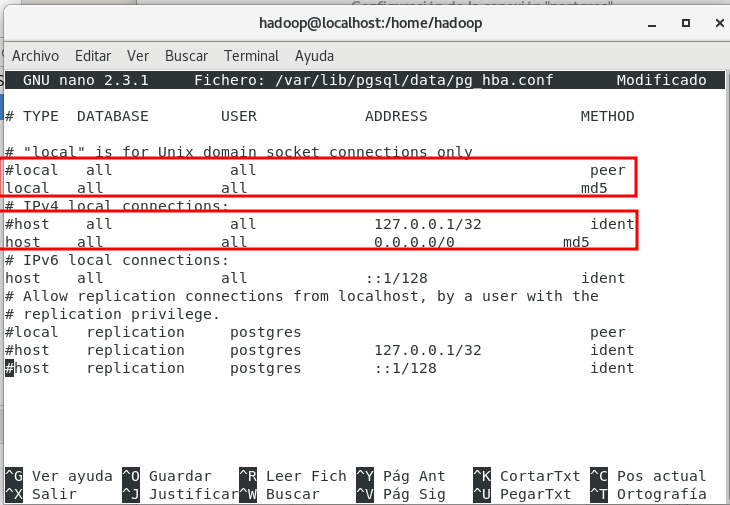

<h1>PostgreSQL</h1>

<div align="center">
    
</div>

<h3>Tabla de contenidos</h3>

- [1. Introducción](#1-introducción)
- [2. Instalación de `PostgreSQL`](#2-instalación-de-postgresql)
	- [2.1. Instalación en *CentOS* (derivados *Red Hat*)](#21-instalación-en-centos-derivados-red-hat)
	- [2.2. Instalación en *Ubuntu* (derivados *Debian*)](#22-instalación-en-ubuntu-derivados-debian)
	- [2.3. Creación y acceso de roles/usuarios y bases de datos](#23-creación-y-acceso-de-rolesusuarios-y-bases-de-datos)
	- [Acceso remoto](#acceso-remoto)
- [3. DBeaver](#3-dbeaver)


# 1. Introducción

`PostgreSQL`, también llamado `Postgres`, es un sistema de gestión de bases de datos relacional orientado a objetos y de código abierto, publicado bajo la licencia PostgreSQL,1​ similar a la BSD o la MIT. 

Los datos de los sistemas de Big Data se pueden guardar de formas diferentes. Para nuestro módulo en concreto, necesitamos una base de datos donde *cargar* (ET**L**) los datos extraídos antes de su tratamiento final, y utilizaremos esta base de datos.

# 2. Instalación de `PostgreSQL`

## 2.1. Instalación en *CentOS* (derivados *Red Hat*)

Para la instalación de `Postgres` en `CentOS` seguiremos el siguiente [Articulo: How to install PostgreSQL on CentOS](https://www.commandprompt.com/education/how-to-install-postgresql-on-centos/)

Sobre esta guía, cabe aconsejar realizar los siguientes cambios en el fichero de configuración `/var/lib/pgsql/data/pg_hba.conf` (el cual debe editarse como `root`)

<div align="center">
    
</div>

Observar en la imagen que se ha cambiado *peer* e *ident* por ***md5*** para las conexiones locales (desde el terminal) o mediante IPv4, de esta forma podremos conectando usando un usuario y contraseña cualquiera que se encuentre en Postgres

Nota: Si este cambio no se realiza, al intentar conectarnos, encontraremos un error del tipo: `PSQLException: FATAL: la autentificación Ident falló para el usuario «sergio»`

## 2.2. Instalación en *Ubuntu* (derivados *Debian*)

En este caso, simplemente realizamos el paso de la instalación y el sistema estará preparado: 

```bash
$ sudo apt install postgresql postgresql-contrib    # instalación
$ sudo postgresql-setup initdb                      # inicialización
```

Como norma general, el sistema se inicia automáticamente, si no, debemos revisar el servicio tal y como se indica en la instalación en *CentOS*.

Debemos tener en cuenta, que el archivo de configuración `pg_hba.conf` en los sistemas *Debian* se encuentran en otra ruta : `/etc/postgresql/<versión>/main/pg_hba.conf` (donde <version> es la version instalada, por ejemplo 14 o 15)

## 2.3. Creación y acceso de roles/usuarios y bases de datos

Por defecto, la autentificación es mediante *roles*. Al principio se asocia un rol a una cuenta existente en nuestro sistema Linux. Esta cuenta tiene el nombre de **postgres** y se crea automáticamente al instalar `PostgreSQL`. 

No hay una contraseña por defecto del rol **postgres**. El modo de autenticación por defecto para `PostgreSQL` está configurado como `ident`, no como sql DB user/password. Lo que realmente significa es que para conectarse correctamente a `PostgreSQL` debe iniciar sesión como el usuario correcto del sistema operativo que se utilizó para instalarlo. Prácticamente se autentifica con el usuario del SO.

Por lo tanto, para comenzar la primera vez en el terminal de la base de datos PostgreSQL, debemos cambiarnos a este usuario **postgres**:

```bash
$ sudo -i -u postgres   # cambiamos al usuario postgres 
```
Una vez estamos dentro de la terminal del usuario postgres, ya tenemos permisos para entrar en la propia terminal de PostgreSQL, mediante el comando `psql`

```bash
postgres@server:~$ psql # para entrar 

postgres=# \q       # para salir

# y ya que estamos
postgres=# \l               # listado de base de datos
postgres=# \d               # listado de tablas de base de datos activa
postgres=# \c <database>    # para cambiar de base de datos
```

El rol de `postgres` es administrador, y aunque nosotros podemos utilizarlo, cabe indicar que no es correcto utilizarlo para acceder al sistema, es mejor crear nuevos roles, e incluso crear un rol para cada base de datos nueva que utilicemos.

Para **crear nuevos roles**, tenemos dos opciones:

1. desde el usuario linux `postgres`:

```bash
postgres@server:~$ createuser --interactive
```
En este caso nos pide el usuario y la contraseña

Una vez creado el usuarios, le debemos asignar una contraseña y darle los permisos necesarios:

```postgres
postgres=# ALTER USER sergio WITH ENCRYPTED PASSWORD 'sergio'; 
postgres=# GRANT ALL PRIVILEGES ON DATABASE <basededatos> to <usuario>; 
```
por supuesto, antes de dar privilegios de acceso a una base de datos, se debe crear desde el usuario `postgres`:

```bash
$ createdb pruebas
```

2. Todo lo anterior lo podemos realizar directamente una vez estamos el el terminal de `postgres`, creamos los roles y la base de datos utilizando sentencias SQL
 
```postgres
postgres=# CREATE ROLE sergio LOGIN PASSWORD 'sergio';
CREATE ROLE
postgres=# CREATE DATABASE pruebas WITH OWNER = sergio;
CREATE DATABASE
```

Nota: Normalmente, si creamos un rol en Postgres, debemos tener un usuario con el mismo nombre en nuestro sistemas Linux, de forma que ambos están ligados.

Para entrar en una base de datos desde el terminal

```bash
psql -d pruebas         # para entrar en la BBDD (si estamos en un usuario autorizado)
su sergio               # para cambiarnos a un usuario autorizada, antes de entrar en la BBDD 

psql -U sergio -d pruebas --password    # para entrar en la base de datos directamente con un usuario determinado.
```

Si el usuario no lo tenemos creado en el sistema, debemos crearlo
```bash
sudo useradd -m sergio          # creamos el usuario
sudo passwd sergio              # le damos contraseña para activarlo.
sudo usermod -aG wheel sergio   # para hacer meter el usuario en el grupo "sudo". Esto no es necesario.
```

Desde aquí, ya podemos crear tablas, y trabajar datos desde este terminal.

## Acceso remoto 

Para permitir el acceso remoto a nuestro servidor `Postgres` debemos realizar un par de cambios en los ficheros de configuración:

1. En primer lugar, debemos establecer un rango de direcciones de confianza a las que permitimos conectar, para ello editamos de nuevo el fichero de configuración `/var/lib/pgsql/data/pg_hba.conf` (para derivados *Red Hat*) o `/etc/postgresql/14/main/pg_hba.conf` (para *Debian* y version 14) y añadimos una nueva línea junto a la modificada en el primer punto. 

```
host    all             all             192.168.0.0/24           trust
```

Tal y como se puede deducir, debemos indicar la red donde nos encontramos o la red en que la que confiemos (***trust***)

2. Posteriormente debemos configurar un nuevo fichero, en este caso llamado `postgresql.conf`, que se encuentra en la misma carpeta que el anterior. En este caso, modificamos una línea que permite a la base de datos atender peticiones de direcciones externas: 

```
listen_addresses = '*'
```

Una vez realizados estos cambios, reiniciamos el servicio de nuevo

``` bash
sudo systemctl restart postgresql.service 
```

3. En caso de no poder acceder, revisamos en firewall. En el caso de *CentOS* sería:

```bash
sudo firewall-cmd --zone=public --add-port=5432/tcp --permanent
firewall-cmd --reload
```

# 3. DBeaver

`DBeaver` es una aplicación de software cliente de SQL y una herramienta de administración de bases de datos muy ligera y sencilla. Es menos pesada que herramientas como `pgAdmin`, y además mediante esta herramienta podemos **instalar los drivers necesarios** para la posterior conexión de `Apache NiFi` a nuestras bases de datos en `PostgreSQL`, por ejemplo, por lo que vamos a hacer uso de esta herramienta.

Para acceder a `PostgreSQL` con `NiFi`, tal y como se ha comentado, necesitamos un *driver* que lo podemos encontrar entre los drivers facilitados por la herramienta en https://dbeaver.com/docs/wiki/Database-drivers/. En este enlace tenemos un tutorial que nos indica como descargar y configurar el driver necesario, en nuestro caso el de Postgres.

Con estos drivers, en `NiFi` configuraremos dentro del correspondiente *Processor* en la propiedad ***DBCPConnectionPool***

Es interesante **probar la conexión** que hemos establecido para verificar que funciona, se podría hacer desde el terminal, mediante el comando `psql`:

```bash
psql -d postgresql://127.0.0.1:5432/pruebasnifi?user=sergio
```
donde especificamos la base de datos y el usuario, en este ejemplo son *pruebasnifi* y *sergio* respectivamente 

Una vez visto cómo descargar los drivers para su uso, también podemos descargar la herramientas que nos sirve como front-end gráfico para gestionar las bases de datos Postgres o cualquier otra. 

Para su **instalación** descargar versión *Comunity* desde : https://dbeaver.io/download/

Por supuesto descargamos el paquete adecuado a nuestro sistemas operativo.

Después, abrimos un terminal y instalamos y ejecutamos (en CentOS):

```bash
sudo rpm -ivh dbeaver-<version>.rpm.    # instalación 
dbeaver &                               # ejecución de dbeaver
```

